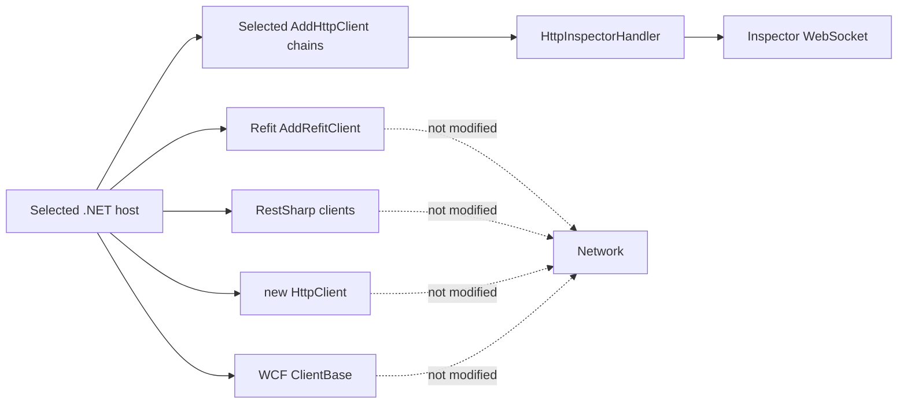
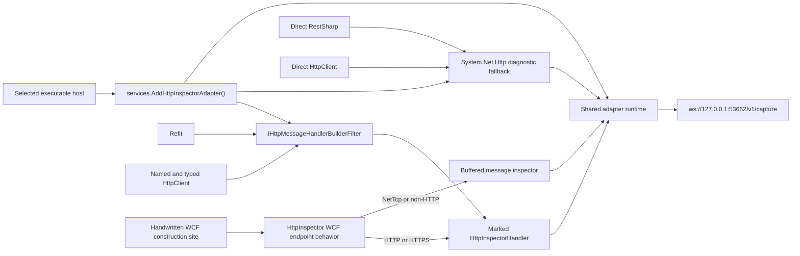
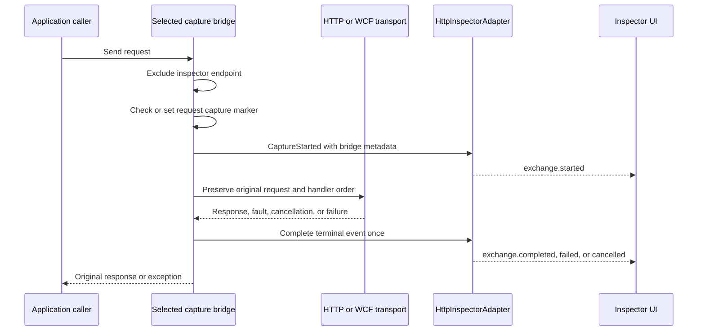

# .NET Multi-Client Capture Implementation Plan

## Outcome

Extend the existing `HttpInspector.Adapter` NuGet package and its reversible Bash integration so one integration of an executable .NET host captures outbound traffic produced by:

- `IHttpClientFactory`, named clients, typed clients, and the existing raw `HttpClient` handler path;
- Refit clients registered with `AddRefitClient`;
- RestSharp clients, including centrally registered clients and direct `new RestClient(...)` construction;
- direct `new HttpClient(...)` construction;
- HTTP/HTTPS WCF SOAP clients;
- non-HTTP WCF clients as logical SOAP exchanges, with their replay limitation made explicit.

The implementation must remain a single local-development adapter distribution. The Tauri application continues to embed one versioned `HttpInspector.Adapter` `.nupkg` plus the adapter-owned Bash pre-run/post-run assets. Integration must not build the package on the target computer, install a global NuGet source, edit individual HTTP request methods, edit generated WCF proxy files, redact headers or bodies, or require an adapter token.

## Fixed Decisions

- Keep one adapter identity and one NuGet package: `HttpInspector.Adapter`.
- Preserve `dotnet-httpclient` as the adapter ID so existing receipts and captured source identities remain readable.
- Release the expanded package as `1.3.1`; the immutable 1.3.0 build was superseded before release after adapter source changed.
- Rename the human-facing adapter label from `.NET HttpClient` to `.NET outbound clients` without changing its stable ID.
- Replace integration strategy `dotnet-ihttpclientfactory-nuget-bash-v3` with `dotnet-multiclient-nuget-bash-v4`.
- Integrate executable hosts, not every project in a solution. A class library's calls are captured when that library runs inside an integrated host process.
- Use one service-level registration in each selected host composition root. Do not append an inspector handler to every `AddHttpClient` chain.
- Cover Refit and all factory-created clients with one package-wide `IHttpMessageHandlerBuilderFilter`.
- Cover direct RestSharp and direct `HttpClient` calls with a process-wide `System.Net.Http` diagnostic fallback.
- Prefer supported, exact message-handler seams over diagnostics whenever one exists. The diagnostic subscriber is the bounded fallback, not the primary path.
- Cover HTTP/HTTPS WCF with a WCF endpoint behavior that wraps the transport handler; cover non-HTTP WCF with a buffered `IClientMessageInspector` logical capture.
- Add WCF behavior only at non-generated client construction sites. Never edit `Reference.cs`, generated service references, generated client operations, or business request methods.
- Preserve every observed request and response header, including authorization, cookies, user agent, SOAP action, and repeated header values. Do not redact or invent missing headers.
- Preserve the existing `ws://127.0.0.1:53662/v1/capture` default endpoint and user-selectable listener port.
- Continue excluding the inspector's own capture endpoint so the adapter cannot capture its WebSocket traffic recursively.
- Keep existing integrations removable using their recorded receipts. New receipts must additionally record every WCF construction file changed by the integration.
- HTTP replay remains available for Refit, RestSharp, raw `HttpClient`, and HTTP WCF captures. Non-HTTP WCF is captured for inspection but is not sent through the HTTP replay engine.
- Do not add per-request application code changes, a proxy certificate flow, security warnings, token pairing, token rotation, redaction, or automatic integration of every solution project.

## Code Findings

### The current integration misses the primary Refit traffic

- The real API registers its primary APIM client with `AddRefitClient<IApimApiRestClient>()` at [Startup.cs](/Users/jovi/Sample.Mobile.API-2/src/Sample.Mobile.API/Sample.Mobile.API/Startup.cs:221). The current integration begins modifying later `AddHttpClient` chains, so the Refit chain never receives `HttpInspectorHandler`.
- The WSPM executable host has the same Refit arrangement at [Startup.cs](/Users/jovi/Sample.Mobile.API-2/src/Sample.Mobile.API/Sample.Mobile.Wspm.API/Startup.cs:214).
- Refit documents that `AddRefitClient` is backed by `IHttpClientFactory` and returns the normal `IHttpClientBuilder`, so a factory-wide builder filter is the correct shared seam rather than a Refit-specific per-request integration: [Refit README](https://github.com/reactiveui/refit/blob/main/README.md#using-httpclientfactory).
- The inspector's current `IServiceCollection` extension only registers the adapter, hosted service, and handler. The handler is attached only when the separate `IHttpClientBuilder` extension is called at [DependencyInjection.cs](/Users/jovi/Documents/ChatGPT/http-inspector/adapters/dotnet/HttpInspector.Adapter/DependencyInjection.cs:38).

### The Bash injector is coupled to `AddHttpClient`

- Composition-root discovery accepts only `Program.cs` or `Startup.cs` files containing `AddHttpClient` at [project-discovery.sh](/Users/jovi/Documents/ChatGPT/http-inspector/adapters/dotnet/HttpInspector.Adapter.Integration/lib/project-discovery.sh:44). A Refit-only, RestSharp-only, raw-`HttpClient`, or WCF host can therefore be rejected even when it is a valid executable host.
- The mutation planner starts only on an `AddHttpClient` token and appends `.AddHttpInspectorAdapter()` to every matching fluent chain at [mutation-planner.sh](/Users/jovi/Documents/ChatGPT/http-inspector/adapters/dotnet/HttpInspector.Adapter.Integration/lib/mutation-planner.sh:130).
- This explains the Windows symptom in which the inspector showed one connected source but zero exchanges: the package and hosted WebSocket lifecycle were active, while the code path that issued the Refit request had no inspector handler.

### RestSharp has both central and direct construction paths

- The API's Autofac module constructs a shared `IRestClient` with `new RestClient(options)` at [ApplicationModule.cs](/Users/jovi/Sample.Mobile.API-2/src/Sample.Mobile.API/Sample.Mobile.API/Infrastructure/AutofacModules/ApplicationModule.cs:98).
- The Function host creates direct RestSharp clients inside its shared helper at [FunctionProcessor.cs](/Users/jovi/Sample.Mobile.API-2/src/Sample.Mobile.API/Sample.Mobile.Function/Services/FunctionProcessor.cs:71).
- `NopSearch` contains several direct `RestClient` instances, including [NopSearch.cs](/Users/jovi/Sample.Mobile.API-2/src/Sample.Mobile.API/Sample.Mobile.Infrastructure/ExternalServices/NopSearch.cs:289).
- RestSharp documents both a custom handler constructor and `RestClientOptions.ConfigureMessageHandler`, confirming that its transport is `HttpClient`-based and supports a message-handler seam: [RestSharp configuration](https://restsharp.dev/docs/v113/advanced/configuration/#using-custom-message-handler).
- Editing every direct RestSharp construction site would pollute application code and still miss future sites. The process-wide `System.Net.Http` fallback therefore covers these calls without changing their request methods or RestSharp options.

### Raw `HttpClient` bypasses the current factory handler

- The real solution constructs `HttpClient` directly in [CATokenProvider.cs](/Users/jovi/Sample.Mobile.API-2/src/Sample.Mobile.API/Sample.Mobile.Infrastructure/Authentication/CATokenProvider.cs:28), [MapService.cs](/Users/jovi/Sample.Mobile.API-2/src/Sample.Mobile.API/Sample.Mobile.Infrastructure/ExternalServices/MapService.cs:17), and [NopSearch.cs](/Users/jovi/Sample.Mobile.API-2/src/Sample.Mobile.API/Sample.Mobile.Infrastructure/ExternalServices/NopSearch.cs:349).
- A direct `new HttpClient()` has no supported process-wide `DelegatingHandler` registration point.
- `DiagnosticListener.AllListeners` is the supported in-process discovery mechanism for rich diagnostic payloads and can expose live request/response objects: [DiagnosticSource and DiagnosticListener](https://learn.microsoft.com/en-us/dotnet/core/diagnostics/diagnosticsource-diagnosticlistener).
- The fallback must treat the exact `System.Net.Http` diagnostic event payload as a runtime compatibility boundary. It must fail open for application traffic and report the bridge as degraded if a future runtime changes an event shape.

### WCF requires a different integration seam

- The solution references WCF HTTP and NetTcp packages at [Sample.Mobile.Infrastructure.csproj](/Users/jovi/Sample.Mobile.API-2/src/Sample.Mobile.API/Sample.Mobile.Infrastructure/Sample.Mobile.Infrastructure.csproj:39).
- Generated WCF clients are constructed in handwritten files such as [WsmSyncService.cs](/Users/jovi/Sample.Mobile.API-2/src/Sample.Mobile.API/Sample.Mobile.Infrastructure/ExternalServices/WsmSyncService.cs:35), [AttachmentSearchWSE.cs](/Users/jovi/Sample.Mobile.API-2/src/Sample.Mobile.API/Sample.Mobile.Infrastructure/ExternalServices/AttachmentSearchWSE.cs:57), [EmployerSearchWSE.cs](/Users/jovi/Sample.Mobile.API-2/src/Sample.Mobile.API/Sample.Mobile.Infrastructure/ExternalServices/EmployerSearchWSE.cs:241), and [WSEImport.cs](/Users/jovi/Sample.Mobile.API-2/src/Sample.Mobile.API/Sample.Mobile.Infrastructure/ExternalServices/WSEImport.cs:72).
- Microsoft documents `IClientMessageInspector` plus `IEndpointBehavior` as the client message-inspection extension point: [Inspect or modify WCF client messages](https://learn.microsoft.com/en-us/dotnet/framework/wcf/extending/how-to-inspect-or-modify-messages-on-the-client).
- The .NET WCF client supports supplying a `Func<HttpClientHandler, HttpMessageHandler>` through endpoint binding parameters, which provides an exact handler seam for HTTP WCF without replacing application authentication or TLS configuration: [dotnet/wcf handler example](https://github.com/dotnet/wcf/issues/3472#issuecomment-474687916).
- WCF messages are forward-only. A logical inspector must call `CreateBufferedCopy` within the configured body limit, restore one copy to WCF, and capture a separate copy. Reading the live message directly would consume or alter the application's SOAP request.
- HTTP/HTTPS WCF can produce an HTTP exchange suitable for existing replay. NetTcp and other non-HTTP bindings do not produce an HTTP request, so they require a logical SOAP record and cannot use the current HTTP replay command.

### The current UI cannot explain which bridge captured an exchange

- The Overview exposes source, adapter, transport, correlation, and fidelity but no capture bridge or replay capability at [ExchangeOverview.tsx](/Users/jovi/Documents/ChatGPT/http-inspector/src/features/inspector/overview/ExchangeOverview.tsx:85).
- The adapter currently emits an empty metadata object in its start message at [HttpInspectorAdapter.cs](/Users/jovi/Documents/ChatGPT/http-inspector/adapters/dotnet/HttpInspector.Adapter/HttpInspectorAdapter.cs:547), even though the v1 contract already accepts metadata.
- The integration preview contains only a strategy string and generic operation strings at [model.rs](/Users/jovi/Documents/ChatGPT/http-inspector/crates/inspector-project-integration/src/model.rs:57). It cannot report that a host contains Refit, RestSharp, raw `HttpClient`, WCF, or an unsupported construction pattern.

### Solution-level integration boundary

- The solution has separate executable hosts: `Sample.Mobile.API`, `Sample.Mobile.Wspm.API`, and `Sample.Mobile.Function`. Its Database, Infrastructure, Logging, Models, and test projects are libraries or tests.
- Integrating `Sample.Mobile.API` captures calls made by referenced libraries while that API process is running. The same library does not need its own service-level registration.
- `Sample.Mobile.Wspm.API` and `Sample.Mobile.Function` need separate integrations only when those executables are launched and expected to publish their own outbound traffic.
- WCF construction-site hooks can live in a referenced library. The receipt for the selected host must therefore track those secondary edits even though the package reference and service registration remain on the executable host project.

## Coverage Contract

### Factory-created HTTP clients

- Capture seam: package-wide `IHttpMessageHandlerBuilderFilter`.
- Covers: `AddHttpClient`, typed clients, named clients, Refit `AddRefitClient`, and other libraries that register through `IHttpClientFactory`.
- Fidelity: exact request method, URL, query, all request headers, replayable request body bytes, status, all response headers, response body bytes as consumed, failure/cancellation, correlation, and timing available at the handler boundary.
- Replay: supported through the existing HTTP replay engine.

### Direct RestSharp and direct `HttpClient`

- Capture seam: the `System.Net.Http` diagnostic fallback.
- Covers: RestSharp-created `HttpClient`, `new HttpClient()`, and SDK traffic that uses the same runtime diagnostic source.
- Fidelity: headers and URL are exact. Bodies are exact only when the observer can replace content with a transparent tee before serialization/consumption. Otherwise the body must be marked `unavailable`; it must never be guessed or consumed destructively.
- Replay: supported when method, URL, headers, and body are available; the editor must retain an explicit fidelity description if a body was unavailable or truncated.

### HTTP/HTTPS WCF SOAP

- Capture seam: adapter WCF endpoint behavior installs `HttpInspectorHandler` around the WCF-provided `HttpClientHandler`.
- Covers: generated `ClientBase<T>` instances to which the Bash integration attaches the behavior before the channel opens.
- Fidelity: the HTTP method, URI, SOAP action and all other headers, encoded XML envelope, response headers, status, and response XML are captured at the actual HTTP transport boundary.
- Replay: supported as an HTTP SOAP request. Existing XML highlighting and Raw views remain applicable.

### Non-HTTP WCF

- Capture seam: buffered `IClientMessageInspector` installed by the same endpoint behavior.
- Covers: NetTcp and any other non-HTTP `ClientBase<T>` endpoint successfully attached before opening.
- Fidelity: logical SOAP version, action, endpoint, message properties, buffered XML request/reply, SOAP faults, and elapsed time. It is not a raw TCP frame capture and must be labeled `adapterReported` rather than `exact` raw HTTP.
- Replay: not supported by the HTTP replay engine. The editor action is disabled with reason `transportReplayUnsupported` while inspection remains available.

### Explicit exclusions

- Incoming ASP.NET requests are outside this adapter's scope.
- Arbitrary non-HTTP SDK transports, gRPC streaming, WebSockets opened by the target project, SQL, Azure Queue wire traffic, and raw TCP sockets are not claimed as captured.
- A third-party library that disables .NET diagnostics and does not expose an HTTP handler seam is reported as unsupported, not silently claimed.
- No attempt is made to intercept business methods, monkey-patch CLR methods, install a machine proxy, or modify generated WCF proxy source.

## Architecture

### Before



### After



### Capture and deduplication sequence



## Target Edit Areas

### Adapter package

- [DependencyInjection.cs](/Users/jovi/Documents/ChatGPT/http-inspector/adapters/dotnet/HttpInspector.Adapter/DependencyInjection.cs:1)
  - Register the global factory filter, diagnostic bridge hosted service, shared capture runtime, and bridge-health contributor exactly once.
  - Preserve the current `IHttpClientBuilder.AddHttpInspectorAdapter` API for source compatibility.
- [HttpClientBridge.cs](/Users/jovi/Documents/ChatGPT/http-inspector/adapters/dotnet/HttpInspector.Adapter/HttpClientBridge.cs:1)
  - Add the request marker, bridge origin, and reusable handler wrapping required by factory and WCF HTTP paths.
- New `HttpClientFactoryBridge.cs`
  - Implement `IHttpMessageHandlerBuilderFilter` and append one inspector handler after existing builder actions.
- New `SystemNetHttpDiagnosticBridge.cs`
  - Own listener discovery, event decoding, request state, transparent body observation, terminal handling, cleanup, and degraded-health reporting.
- New `CaptureOrigin.cs`
  - Define strong bridge, transport, replay-capability, and fidelity-note values instead of scattering string dictionaries.
- New `WcfBridge.cs`
  - Attach a runtime-aware endpoint behavior to generated clients without modifying generated source.
- New `WcfEndpointBehavior.cs`
  - Install the HTTP transport handler factory or non-HTTP message inspector based on the endpoint scheme/binding.
- New `WcfMessageInspector.cs`
  - Buffer logical SOAP messages without consuming them and correlate request/reply pairs.
- [HttpInspectorAdapter.cs](/Users/jovi/Documents/ChatGPT/http-inspector/adapters/dotnet/HttpInspector.Adapter/HttpInspectorAdapter.cs:82)
  - Accept an explicit capture origin, original start time, and monotonic timing seed.
  - Persist exchange metadata through terminal messages and source snapshots.
- [Models.cs](/Users/jovi/Documents/ChatGPT/http-inspector/adapters/dotnet/HttpInspector.Adapter/Models.cs:1)
  - Add internal capture-origin and bridge-health models while preserving the external v1 envelope.
- [HttpInspector.Adapter.csproj](/Users/jovi/Documents/ChatGPT/http-inspector/adapters/dotnet/HttpInspector.Adapter/HttpInspector.Adapter.csproj:1)
  - Bump to `1.3.1`.
  - Add the smallest WCF client dependencies needed by the endpoint behavior, aligned with the package's `net10.0` target.
  - Update package description/tags from `IHttpClientFactory handler` to the actual multi-client scope.

### Adapter contract tests

- [HttpClientBridgeTests.cs](/Users/jovi/Documents/ChatGPT/http-inspector/adapters/dotnet/HttpInspector.Adapter.Tests/HttpClientBridgeTests.cs:1)
  - Extend handler-order and duplicate-suppression coverage.
- [HttpClientNativeBodyCaptureTests.cs](/Users/jovi/Documents/ChatGPT/http-inspector/adapters/dotnet/HttpInspector.Adapter.Tests/HttpClientNativeBodyCaptureTests.cs:1)
  - Reuse native body-fidelity assertions for the diagnostic and WCF HTTP bridges.
- New `HttpClientFactoryBridgeTests.cs`
  - Verify factory-wide registration, Refit-equivalent named clients, and compatibility with the legacy per-builder call.
- New `SystemNetHttpDiagnosticBridgeTests.cs`
  - Verify direct clients, direct RestSharp, body tees, failures, cancellation, exclusion, event-shape degradation, concurrency, and cleanup.
- New `WcfBridgeTests.cs`
  - Verify HTTP handler wrapping, logical message buffering, SOAP faults, scheme selection, and attach-before-open enforcement.
- [SchemaContractTests.cs](/Users/jovi/Documents/ChatGPT/http-inspector/adapters/dotnet/HttpInspector.Adapter.Tests/SchemaContractTests.cs:1)
  - Verify the new metadata values still conform to the unchanged v1 schema.
- [TEST_MANIFEST.md](/Users/jovi/Documents/ChatGPT/http-inspector/adapters/dotnet/HttpInspector.Adapter.Tests/TEST_MANIFEST.md:1)
  - Remove stale references to nonexistent integration test paths and list the actual focused checks.

### Bash integration payload

- [project-discovery.sh](/Users/jovi/Documents/ChatGPT/http-inspector/adapters/dotnet/HttpInspector.Adapter.Integration/lib/project-discovery.sh:1)
  - Detect executable project type and supported composition-root shapes instead of requiring `AddHttpClient`.
  - Inventory Refit, factory clients, RestSharp, raw `HttpClient`, and WCF construction sites for preview.
- [mutation-planner.sh](/Users/jovi/Documents/ChatGPT/http-inspector/adapters/dotnet/HttpInspector.Adapter.Integration/lib/mutation-planner.sh:1)
  - Replace per-chain mutations with one service-level registration.
  - Plan bounded WCF attach statements in handwritten source only.
- [pre-run.sh](/Users/jovi/Documents/ChatGPT/http-inspector/adapters/dotnet/HttpInspector.Adapter.Integration/pre-run.sh:1)
  - Apply the expanded file set atomically after a dry-run preview and hash check.
- [post-run.sh](/Users/jovi/Documents/ChatGPT/http-inspector/adapters/dotnet/HttpInspector.Adapter.Integration/post-run.sh:1)
  - Remove every recorded block and restore all edited files safely.
- [receipt-manager.sh](/Users/jovi/Documents/ChatGPT/http-inspector/adapters/dotnet/HttpInspector.Adapter.Integration/lib/receipt-manager.sh:1)
  - Introduce receipt `4.0.0` with a list of all mutated files and per-file before/after hashes.
  - Continue reading and removing `2.1.0` and `3.0.0` receipts.
- [inspect.sh](/Users/jovi/Documents/ChatGPT/http-inspector/adapters/dotnet/HttpInspector.Adapter.Integration/inspect.sh:1)
  - Return structured coverage findings and exact planned changes.
- [adapter.json](/Users/jovi/Documents/ChatGPT/http-inspector/adapters/dotnet/adapter.json:1)
  - Publish version `1.3.1`, the new display name, new strategy, new package digest, and existing endpoint.

### Native/hosted integration API and UI

- [model.rs](/Users/jovi/Documents/ChatGPT/http-inspector/crates/inspector-project-integration/src/model.rs:1)
  - Add typed coverage findings, warning/deferred reason codes, and planned file mutations to `IntegrationPreview`.
- [service.rs](/Users/jovi/Documents/ChatGPT/http-inspector/crates/inspector-project-integration/src/service.rs:62)
  - Forward the Bash inspection result instead of hardcoding three old operation strings.
  - Hash every planned mutation file so apply refuses a stale preview.
- [model.ts](/Users/jovi/Documents/ChatGPT/http-inspector/src/features/projectIntegration/model.ts:1)
  - Mirror the expanded preview contract.
- [ProjectIntegrationsDialog.tsx](/Users/jovi/Documents/ChatGPT/http-inspector/src/features/projectIntegration/ProjectIntegrationsDialog.tsx:1)
  - Show selected host, detected client families, exact bridge per family, files that will change, unsupported findings, and the package version before Apply.
  - Keep hosted-browser behavior read-only for filesystem integration when the local integration service is unavailable.
- [ExchangeOverview.tsx](/Users/jovi/Documents/ChatGPT/http-inspector/src/features/inspector/overview/ExchangeOverview.tsx:85)
  - Show `Capture bridge`, `Transport kind`, `Replay capability`, and any fidelity note in the existing Overview.
  - Do not restore a Metadata top-level tab.

### Specifications and documentation

- [http_inspector_adapter.spec.md](/Users/jovi/Documents/ChatGPT/http-inspector/http_inspector_adapter.spec.md:1)
  - Define multi-client .NET bridge selection, markers, metadata, WCF rules, and universal adapter behavior.
- [http_inspector_adapter_tdd.spec.md](/Users/jovi/Documents/ChatGPT/http-inspector/http_inspector_adapter_tdd.spec.md:1)
  - Add happy, unhappy, concurrency, fidelity, and edge-case scenarios for all four client families.
- [Adapter README](/Users/jovi/Documents/ChatGPT/http-inspector/adapters/dotnet/HttpInspector.Adapter/README.md:1)
  - Document the one-registration model, coverage limits, WCF attach behavior, and troubleshooting evidence.
- [Integration README](/Users/jovi/Documents/ChatGPT/http-inspector/adapters/dotnet/HttpInspector.Adapter.Integration/README.md:1)
  - Document Bash-only pre/post behavior, supported host patterns, secondary WCF edits, and full rollback.
- [Architecture](/Users/jovi/Documents/ChatGPT/http-inspector/docs/architecture.md:1)
  - Replace the single-handler description with the bridge-selection architecture.
- [README.md](/Users/jovi/Documents/ChatGPT/http-inspector/README.md:1)
  - Explain which project to integrate in a multi-project solution and how to verify each bridge.
- [multi_project_dotnet_integration_plan.md](/Users/jovi/Documents/ChatGPT/http-inspector/multi_project_dotnet_integration_plan.md:1)
  - Mark the per-`AddHttpClient` sections as superseded by this plan after implementation is complete; do not erase historical checkpoints.

## Detailed Implementation

### Phase 1: Normalize capture origin and lifecycle

1. Add an internal `CaptureOrigin` value containing:
   - `bridge`: `httpClientFactory`, `systemNetHttpDiagnostic`, `wcfHttpTransport`, or `wcfMessageInspector`;
   - `transportKind`: `http`, `wcfHttp`, or `wcfNonHttp`;
   - `replayCapability`: `http`, `httpWithExpiringCredentials`, or `unsupported`;
   - optional `fidelityNote` and logical protocol fields.
2. Extend `CaptureStarted` with an internal overload accepting the origin, an original wall-clock start, and a monotonic start value. Preserve the current public overload so existing adapters/tests compile unchanged.
3. Store the origin in `ExchangeState`; emit it in `exchange.started`, every terminal event, and any recovery snapshot.
4. Keep the v1 schema version. Use the existing extensible metadata object instead of creating a second .NET-only contract.
5. Ensure repeated headers remain repeated entries. Never flatten cookies, authorization, or SOAP action values into a lossy dictionary.
6. Retain current body-limit behavior. A bridge reports `captured`, `empty`, `pending`, `truncated`, or `unavailable` honestly.

### Phase 2: Make factory and Refit coverage global

1. Implement `HttpInspectorMessageHandlerBuilderFilter : IHttpMessageHandlerBuilderFilter`.
2. In `Configure`, call the next filter/action first, then inspect `builder.AdditionalHandlers` and append `HttpInspectorHandler` only when one is not already present.
3. Register the filter with `TryAddEnumerable` from the service-level `AddHttpInspectorAdapter` extension.
4. Keep `IHttpClientBuilder.AddHttpInspectorAdapter` working. It continues to call the service-level registration, but duplicate detection prevents two inspector handlers when the global filter runs.
5. Set a private `HttpRequestOptionsKey` marker on the request before body capture/send. The diagnostic fallback checks this marker and does not emit a duplicate exchange.
6. Preserve existing handler ordering. The inspector must be the final additional observer before the primary transport after all application-configured handlers have been built, so it sees the final authorization/cookie/user-agent headers.
7. Add a factory bridge health record at host start with registration state and handler-build count.

### Phase 3: Add the direct RestSharp/raw `HttpClient` fallback

1. Register one hosted diagnostic bridge per process with `TryAddEnumerable` and idempotent start/stop.
2. Subscribe through `DiagnosticListener.AllListeners`; accept only the System.Net.Http listener and the request start/stop/failure events supported by the package's target runtime.
3. Decode diagnostic payloads behind a small compatibility adapter. Do not let reflection or event-shape failures escape into the application's HTTP call.
4. On start:
   - reject inspector endpoint traffic;
   - reject requests carrying the inspector-handler marker;
   - capture URL, method, query, all current request/content headers, activity IDs, and original timing;
   - wrap non-empty request content in the existing replayable/tee content observer without reading it early;
   - key state by `HttpRequestMessage` reference identity, not URL or activity ID.
5. For bodyless requests, emit `exchange.started` immediately. For streaming bodies, retain the original start timestamp but delay the finalized start payload until serialization supplies bytes; if the request fails before that point, emit the start with body `unavailable` and then its terminal event.
6. On response stop, capture status and headers before returning control, replace response content with the existing transparent response observer, and complete only after EOF/disposal/no-body handling.
7. On failure/cancellation, map the runtime event or task status to one terminal state exactly once.
8. Use a reference-equality state map with bounded cleanup. Remove on terminal event; expire orphaned entries conservatively and record a bridge diagnostic without inventing an HTTP failure.
9. Expose counters for observed, skipped-marked, skipped-inspector-endpoint, active, completed, failed, degraded-event-shape, and expired-orphan states.
10. Prove RestSharp through an actual RestSharp client in the adapter test project. Do not add a RestSharp dependency to the production adapter.

### Phase 4: Add WCF support to the same package

1. Add only the WCF client dependencies required for `ClientBase`, endpoint behaviors, message inspectors, HTTP binding parameters, and messages. Keep them in the existing `.nupkg`; do not create a second adapter package.
2. Add a static attach entry point that returns or preserves the concrete generated client and uses the already registered process adapter runtime. It must reject null, already-opened, closing, or closed clients with a clear integration diagnostic rather than altering channel state.
3. Make attachment idempotent by detecting the adapter behavior in `Endpoint.EndpointBehaviors`.
4. At runtime, inspect the endpoint URI scheme/binding:
   - for HTTP/HTTPS, add a binding-parameter handler factory that wraps the WCF-created `HttpClientHandler` with `HttpInspectorHandler`;
   - for non-HTTP, add the buffered `IClientMessageInspector` to `ClientRuntime`.
5. For HTTP WCF, set the same request marker used by the factory bridge. The System.Net.Http diagnostic subscriber then skips the request and produces no duplicate.
6. For non-HTTP WCF request/reply capture:
   - copy the message with `CreateBufferedCopy` under the body limit;
   - restore a fresh copy to WCF;
   - serialize a separate copy for the inspector;
   - retain message version, SOAP action, endpoint, headers/properties that are safe to enumerate without mutation, and correlation state;
   - capture SOAP faults as completed protocol responses rather than transport exceptions;
   - mark raw fidelity `adapterReported` and replay `unsupported`.
7. If `AfterReceiveReply` is not called because transport failed before a reply, leave the exchange incomplete until normal adapter recovery/stop processing. Do not synthesize an exception the WCF extension point did not observe.
8. Do not add a custom HTTP header to correlate or deduplicate WCF. Dedupe is internal through the request options marker installed by the HTTP handler.

### Phase 5: Replace per-client Bash edits with host-level integration

1. Discover `.csproj` files as today, but classify each selected file as Web SDK, executable SDK, Azure Function executable, library, or test.
2. Reject library/test selection with `selectedProjectIsNotExecutable` and list the executable candidates from the same solution/folder.
3. Resolve one supported composition-root pattern in the selected project:
   - `Startup.ConfigureServices(IServiceCollection services)`;
   - minimal hosting using `builder.Services` before `builder.Build()`;
   - generic host/Azure Function `ConfigureServices` registration.
4. Insert one marked service-level call, using the receiver already present in that root:

```csharp
services.AddHttpInspectorAdapter();
```

or:

```csharp
builder.Services.AddHttpInspectorAdapter();
```

5. Preserve the existing package reference, project-scoped private feed, exact package version, and marked `using HttpInspector.Adapter` model.
6. Remove the planner that appends to each `AddHttpClient` chain for new integrations. The `1.3.1` global filter covers those chains automatically.
7. Discover handwritten WCF construction sites by matching types whose generated definitions inherit `ClientBase<T>`, then locate `new <GeneratedClient>(...)` outside generated/`obj`/`bin` files.
8. Support these bounded construction shapes:
   - local declaration followed by ordinary use;
   - `using var` declaration;
   - classic `using (...) { ... }` with a block body.
9. Inject one marked attach statement after construction and before first use/open. Preserve indentation, newline style, encoding/BOM, and the original construction statement.
10. Reject and preview, without changes, unsupported WCF construction shapes such as expression-bodied construction, factory-returned hidden clients, pre-opened clients, or ambiguous generated type names.
11. Never search-and-replace operation calls or generated service-reference code.
12. Run the full planner in a temporary workspace first, validate every expected marker/count, then atomically replace files. If any file fails validation, change no project file and create no active receipt.
13. Receipt `4.0.0` records project file, composition file, every WCF file, marker IDs, original and integrated hashes, package digest, endpoint, bridge inventory, and strategy.
14. Post-run validates owned markers and integrated hashes before removal. It removes only adapter-owned blocks and package/feed changes; it refuses a conflicting file with an actionable path instead of deleting user edits.

### Phase 6: Make preview and runtime status explain coverage

1. Return a structured preview inventory with counts and locations for:
   - Refit factory clients;
   - ordinary factory clients;
   - central and direct RestSharp clients;
   - direct `HttpClient` sites;
   - HTTP/HTTPS WCF construction sites;
   - non-HTTP/unknown WCF construction sites;
   - unsupported or ambiguous sites.
2. For each family, state the chosen bridge and whether source edits beyond the host registration are required.
3. Show exact target files and marker descriptions before Apply.
4. Extend stale-preview hashing to every planned file, not only the project/composition root.
5. Keep Tauri and hosted-local behavior aligned:
   - Tauri uses the native picker and IPC;
   - hosted-local uses the same-origin local integration service and service-local paths;
   - ordinary remote/static hosting reports filesystem integration unavailable without affecting capture/replay.
6. Publish bridge health in source metadata when the adapter connects. The UI must distinguish:
   - adapter socket connected;
   - factory bridge registered;
   - diagnostic fallback subscribed;
   - WCF support available;
   - count of HTTP pipelines built and WCF clients attached.
7. Add exchange-level bridge/transport/replay fields to Overview so a captured request can be traced back to the mechanism that observed it.

### Phase 7: Version, bundle, migrate, and document

1. Bump all adapter/package/integration constants from `1.2.4` to `1.3.1` in one version pass.
2. Pack the deterministic NuGet package once, generate its SHA-256, update `adapter.json`, and keep the `.nupkg` committed/bundled according to the existing repository policy.
3. Rebuild the embedded adapter payload so macOS and Windows standalone artifacts contain the identical `.nupkg` and Bash scripts.
4. Update existing integration handling:
   - `3.0.0` receipts remain listable/removable;
   - removal of a `1.2.x` integration happens through its recorded old markers;
   - reintegration applies the new host-level registration and new receipt;
   - no in-place marker conversion occurs without remove/reapply.
5. Update the adapter spec and TDD spec before declaring the package complete.
6. Document that selecting the main API host is sufficient for referenced library traffic in that process, while WSPM API and Function need their own host integration when run separately.

## Before and After

### Before

- The app connects to the inspector, so the footer can show one source.
- Only `AddHttpClient` chains touched by the Bash injector carry `HttpInspectorHandler`.
- The primary Refit APIM client is outside those modified chains and produces no exchanges.
- Direct RestSharp and direct `HttpClient` instances bypass the factory handler.
- WCF clients have no adapter endpoint behavior.
- Preview says only that a private feed, package reference, and shared factory handler will be added; it does not reveal the missed client families.

### After

- One host-level registration activates all package bridges for the selected process.
- Every factory-created client, including Refit, receives exactly one inspector handler.
- Direct RestSharp and direct `HttpClient` traffic is observed by the diagnostic fallback without editing request methods.
- WCF HTTP requests are captured at their real HTTP handler boundary; non-HTTP WCF requests are captured as buffered logical SOAP.
- Each exchange says which bridge captured it, which transport it represents, and whether the replay engine can execute it.
- Preview lists concrete coverage and exact changes before integration.
- Removing an integration reverses the host registration, WCF attach statements, package/feed entries, and receipt while preserving unrelated project changes.

## Failure and Edge-Case Behavior

- If the selected project is not executable, make no changes and identify executable candidates.
- If no supported composition root is found, make no changes and report the files inspected.
- If more than one supported root exists in the selected project, require a deterministic project/root choice in preview; do not mutate both silently.
- If a request already has the inspector marker, diagnostic fallback skips it.
- If the request targets the inspector endpoint, all bridges skip it.
- If diagnostic payload shape is unknown, application traffic continues; bridge health becomes degraded and no fabricated exchange is emitted.
- If request/response content cannot be wrapped safely, preserve the original content and mark body capture unavailable.
- If the body exceeds the configured limit, preserve transport behavior and mark capture truncated with observed/captured sizes.
- If a WCF client is already opened, do not attach behavior and do not close/reopen it.
- If a WCF message cannot be buffered within the limit, restore the original message path and report unavailable/truncated fidelity without consuming it.
- If WCF construction is in generated code, skip it and report generated-site unsupported.
- If a WCF HTTP request passes through its installed handler, the diagnostic fallback must not duplicate it.
- If the target files change after preview, apply fails as stale and requires a new preview.
- If post-run detects user edits inside an owned block, it refuses that file and reports the conflict; it does not delete surrounding application code.
- If the inspector is not running, every bridge remains fail-open and target HTTP/WCF behavior continues normally while bounded adapter queues follow the existing policy.

## Verification Strategy

Only focused adapter contract/schema tests and integration smoke checks are added. This follows the project's existing testing constraint: no broad unit-test expansion for unrelated UI or application behavior.

### Package tests

- Prove `services.AddHttpInspectorAdapter()` installs one factory handler on named and typed clients.
- Prove a Refit-equivalent named client receives the handler without a per-client extension call.
- Prove legacy `.AddHttpInspectorAdapter()` plus the global filter emits one exchange, not two.
- Prove final auth, cookie, user-agent, repeated, and content headers are captured exactly as presented to the primary handler.
- Prove direct `HttpClient` GET/POST, JSON, XML, empty body, chunked/streamed body, failure, timeout, and cancellation.
- Prove RestSharp GET/POST and response body capture using the real RestSharp test dependency.
- Prove diagnostic exclusion, marker dedupe, event-shape degradation, concurrent requests, orphan cleanup, and stop/dispose behavior.
- Prove WCF HTTP behavior wraps the provided handler without replacing its settings.
- Prove WCF message inspection buffers and restores XML byte-for-byte at the logical-message level and correlates replies/faults.
- Prove non-HTTP WCF metadata disables HTTP replay.
- Prove all new metadata conforms to `contracts/http-inspector.v1.schema.json`.

### Bash integration smoke checks

- Run preview/apply/remove against disposable fixtures for:
  - Startup-based Refit plus `AddHttpClient`;
  - minimal-host Refit-only project;
  - RestSharp-only generic host/Function composition;
  - direct-`HttpClient` executable;
  - WCF `var`, `using var`, and classic `using` construction patterns;
  - multi-project solution selection;
  - ambiguous and unsupported roots.
- Verify dry-run changes no bytes.
- Verify Apply changes only the previewed files and preserves encoding/newlines.
- Verify Remove restores the fixture byte-for-byte.
- Verify legacy `3.0.0` receipt removal still succeeds.
- Keep these smoke scripts outside `HttpInspector.Adapter.Integration/` test folders; the shipped integration payload contains runtime scripts, not a test suite.

### Real-solution proof

1. Work on a disposable copy or clean branch of `/Users/jovi/Sample.Mobile.API-2`; preserve the user's current dirty working tree.
2. Remove the existing `1.2.x` integration through its receipt, then preview `Sample.Mobile.API.csproj` with `1.3.1`.
3. Confirm preview reports the Refit APIM client, ordinary factory clients, RestSharp, raw `HttpClient`, WCF sites, exact files, and bridge choices.
4. Apply and build the selected host.
5. Run HTTP Inspector on port `53662`, start the API, and verify source metadata reports active factory/diagnostic bridges.
6. Invoke a real API route that reaches `IApimApiRestClient`; prove an exchange appears with bridge `httpClientFactory` and final authentication headers.
7. Invoke one direct RestSharp path and one direct `HttpClient` path; prove each appears once with bridge `systemNetHttpDiagnostic`.
8. Invoke one HTTP WCF path; prove it appears once with bridge `wcfHttpTransport`, XML/Raw content, SOAP action, and HTTP replay capability.
9. If an available configured endpoint uses NetTcp, invoke it and prove logical SOAP capture plus disabled HTTP replay.
10. Stop the inspector and repeat one outbound call to prove target behavior remains fail-open.
11. Remove the integration and prove all adapter-owned edits disappear while unrelated project files remain unchanged.

### Release proof

- Run focused `.NET` tests for the adapter and contract suite.
- Run Rust tests for integration model/service/receipt behavior.
- Run the existing frontend type/build check for the expanded preview and Overview fields.
- Run the repository vulnerability scan already used by this project after new WCF test/package dependencies are locked.
- Run `build_app.sh` for the current macOS artifact.
- Run the Windows cross-build path and place both outputs under the repository's consolidated release output convention.
- Inspect each artifact to prove it embeds `HttpInspector.Adapter.1.3.1.nupkg`, the matching digest, and strategy v4 scripts.
- On Windows, prove Git Bash selection/path conversion, project preview, Apply, real capture, and Remove using the packaged EXE.

## Implementation Checkpoints and TODOs

- [x] **MC-001** Record a clean baseline diff/status for HTTP Inspector and preserve unrelated changes. Evidence: only this plan is untracked; `git diff --check` passed; the existing adapter suite passed 67/67 on 2026-08-16.
- [x] **MC-002** Add `CaptureOrigin` with fixed bridge, transport, replay, and fidelity mappings. Bridge-health counters remain deferred to the UI/status phase.
- [x] **MC-003** Extend internal capture start/state APIs with optional original wall-clock and monotonic timing.
- [x] **MC-004** Emit origin metadata in start, terminal metadata patches, and recovery snapshots without changing schema major version.
- [ ] **MC-005** Add schema-contract assertions for bridge, transport, replay, and fidelity metadata.
- [x] **MC-006** Add a private `HttpRequestOptionsKey` capture marker shared by all HTTP bridges.
- [x] **MC-007** Implement the package-wide `IHttpMessageHandlerBuilderFilter`.
- [x] **MC-008** Register the filter exactly once from `IServiceCollection.AddHttpInspectorAdapter`.
- [x] **MC-009** Preserve the legacy `IHttpClientBuilder.AddHttpInspectorAdapter` API.
- [x] **MC-010** Add duplicate-handler protection after all factory builder actions run.
- [x] **MC-011** Verify inspector handler order after existing authentication and application handlers. Evidence: existing `BRG_002` remains green.
- [x] **MC-012** Add focused factory-wide named/typed/Refit-equivalent tests. Evidence: `BRG_015` proves ordinary and Refit-equivalent named clients exactly once.
- [ ] **MC-013** Add bridge-health counters for factory handler builds and captures.
- [x] **MC-014** Implement idempotent System.Net.Http listener discovery/start/stop.
- [x] **MC-015** Add a bounded compatibility decoder for current diagnostic start/stop/failure payloads.
- [x] **MC-016** Skip marked requests and the inspector endpoint in the diagnostic bridge.
- [x] **MC-017** Add reference-identity request state and exact-once terminal arbitration.
- [x] **MC-018** Add transparent request body tee handling with unavailable fallback.
- [x] **MC-019** Add transparent response body observation using the existing content wrapper.
- [x] **MC-020** Preserve original timing when start emission waits for request serialization by taking the bridge timestamp from the adapter clock at diagnostic start.
- [ ] **MC-021** Map failure, timeout, and cancellation without swallowing original exceptions.
- [ ] **MC-022** Add bounded orphan cleanup and degraded bridge-health reporting.
- [ ] **MC-023** Add direct raw `HttpClient` tests for JSON, XML, empty, streaming, failure, and cancellation.
- [x] **MC-024** Add a test-only RestSharp dependency and real RestSharp bridge tests. Evidence: `BRG_019` sends a real RestSharp request through a local HTTP server and asserts one diagnostic-bridge exchange.
- [x] **MC-025** Prove factory/diagnostic deduplication. Evidence: `BRG_018` exercises a real factory client and local HTTP server while the diagnostic bridge is active; exactly one exchange is emitted.
- [x] **MC-026** Add WCF client dependencies to the existing package and document compatibility. Evidence: `System.ServiceModel.Http` and `System.ServiceModel.Primitives` are direct package dependencies; integration and adapter READMEs state the HTTP/non-HTTP boundary.
- [x] **MC-027** Implement idempotent attach-before-open WCF entry point. Evidence: `HttpInspectorWcf.Attach` and `WCF_001`/`WCF_002`.
- [x] **MC-028** Implement scheme/binding selection in the endpoint behavior. Evidence: HTTP/HTTPS endpoints receive the handler factory; other schemes receive the message inspector.
- [x] **MC-029** Implement WCF HTTP handler wrapping while preserving the supplied primary handler. Evidence: the endpoint behavior wraps WCF's supplied `HttpClientHandler` rather than replacing it.
- [x] **MC-030** Implement buffered non-HTTP `IClientMessageInspector` capture. Evidence: `HttpInspectorWcfMessageInspector` uses `CreateBufferedCopy` and restores the host message.
- [x] **MC-031** Capture SOAP actions, message versions, properties, replies, and SOAP faults. Evidence: SOAPAction/To, envelope version, HTTP response properties, and `soapFault` metadata are mapped. A reachable live endpoint is still required for end-to-end proof.
- [x] **MC-032** Label non-HTTP WCF raw fidelity and HTTP replay capability honestly. Evidence: `CaptureOrigin.WcfMessageInspector` is raw-only/non-replayable; `WcfHttpTransport` is HTTP replayable.
- [ ] **MC-033** Add WCF idempotency, handler, message-buffering, and fault tests. Partial evidence only: `WCF_001` and `WCF_002` cover attach idempotency and lifecycle guard; endpoint/message/fault cases remain open.
- [x] **MC-034** Bump package and adapter versions to `1.3.1` in all source constants. Evidence: package, manifest, bundle filename, UI fallback, docs, and integration defaults agree.
- [x] **MC-035** Change the stable strategy to `dotnet-multiclient-nuget-bash-v4`.
- [x] **MC-036** Replace `AddHttpClient`-only composition discovery with executable-host discovery. Evidence: conventional `Program.cs`/`Startup.cs` service-registration discovery supports hosts with no pre-existing `AddHttpClient` call.
- [ ] **MC-037** Add Startup, minimal-host, and generic-host/Azure Function registration planners.
- [x] **MC-038** Replace per-client fluent-chain mutations with one marked service registration.
- [x] **MC-039** Inventory Refit, factory, RestSharp, raw `HttpClient`, and WCF findings during inspection.
- [ ] **MC-040** Resolve generated WCF client types without editing generated files.
- [ ] **MC-041** Plan bounded WCF attach statements for local, `using var`, and classic `using` shapes.
- [ ] **MC-042** Fail closed on ambiguous/unsupported WCF construction shapes.
- [ ] **MC-043** Make multi-file planning atomic and preserve BOM/newline/indentation.
- [x] **MC-044** Add receipt `4.0.0` with all mutation files, markers, hashes, package identity, and bridge inventory. Evidence: the v4 disposable flow created, validated, and cleaned an external receipt containing the serialized coverage inventory.
- [x] **MC-045** Preserve list/status/remove compatibility for receipt `2.1.0` and `3.0.0`.
- [ ] **MC-046** Extend preview stale checks to every planned file.
- [x] **MC-047** Add disposable Bash smoke fixtures outside the shipped integration directory. Evidence: a temporary external `net10.0` project was generated under the operating system temporary directory for the v4 smoke.
- [x] **MC-048** Prove dry-run byte stability, Apply scope, and byte-for-byte Remove. Evidence: 2026-08-16 smoke inspected without mutation, built the injected project, then compared pre/post SHA-256 hashes after removal.
- [x] **MC-049** Extend Rust integration preview models with typed coverage and planned mutations.
- [x] **MC-050** Stop hardcoding old preview operation strings in the Rust service.
- [x] **MC-051** Mirror the preview contract in TypeScript.
- [x] **MC-052** Render client-family coverage, bridge choice, warnings, and exact file changes in the integration dialog.
- [x] **MC-053** Add capture bridge, transport kind, replay capability, and fidelity note to Overview.
- [ ] **MC-054** Expose connected-source bridge health without restoring a Metadata tab.
- [ ] **MC-055** Disable replay editing/execution for non-HTTP WCF with a precise reason.
- [x] **MC-056** Update adapter spec with multi-client and WCF rules.
- [x] **MC-057** Update TDD spec with happy, unhappy, concurrency, fidelity, and edge cases.
- [x] **MC-058** Update adapter, integration, architecture, and root READMEs.
- [ ] **MC-059** Update the existing multi-project plan checkpoint to point to this superseding implementation.
- [x] **MC-060** Correct the stale adapter test manifest.
- [x] **MC-061** Pack `HttpInspector.Adapter.1.3.1.nupkg` deterministically.
- [x] **MC-062** Generate and verify the package SHA-256 and update `adapter.json`. Evidence: SHA-256 `18bb5c99763d452a69352bbc2b863c0d6dc5ccf8073c3d4546a8d9cea6d50493` is in the package, `.sha256`, and manifest.
- [x] **MC-063** Rebuild the embedded payload and verify exact package bytes in native and hosted modes. Evidence: `cargo test -p inspector-project-integration --lib` rebuilt the crate from the 1.3.1 payload and passed. Native/hosted artifact-level validation remains under MC-078.
- [x] **MC-064** Run focused adapter and schema tests. Evidence: 74/74 adapter tests passed on 2026-08-16.
- [x] **MC-065** Run integration crate tests and Bash smoke checks. Evidence: 5/5 crate tests passed; Bash syntax checks and the external pre-run/build/post-run/hash smoke passed.
- [x] **MC-066** Run frontend type/build verification for preview and Overview changes. Evidence: `pnpm exec tsc --noEmit` passed.
- [x] **MC-067** Run the project's vulnerability scan after dependency changes. Evidence: `dotnet list ... package --vulnerable --include-transitive` reported no vulnerable packages for adapter and test projects using current NuGet sources. `cargo-audit` is not installed, so no Rust advisory scan was run.
- [ ] **MC-068** Validate on a disposable copy of `Sample.Mobile.API-2` without touching its current dirty tree.
- [ ] **MC-069** Prove a real Refit APIM call is captured exactly once.
- [ ] **MC-070** Prove a real direct RestSharp call is captured exactly once.
- [ ] **MC-071** Prove a real direct `HttpClient` call is captured exactly once.
- [ ] **MC-072** Prove a real HTTP WCF SOAP call is captured exactly once with XML and Raw views.
- [ ] **MC-073** Prove non-HTTP WCF capture if a reachable endpoint exists; otherwise record the live-verification boundary and retain focused contract proof.
- [ ] **MC-074** Prove fail-open behavior with the inspector stopped.
- [ ] **MC-075** Prove post-run removes all owned edits and preserves unrelated changes.
- [x] **MC-076** Rebuild the current macOS standalone artifact. Evidence: `build_app.sh` completed on 2026-08-16 and staged `releases/macos/HTTP Inspector.app`.
- [x] **MC-077** Rebuild the current Windows portable EXE artifact. Evidence: `build_windows_portable.sh` completed through `cargo-xwin` on 2026-08-16 and staged `releases/windows/HTTP-Inspector-windows-x64-portable.exe`.
- [x] **MC-078** Verify both artifacts embed the identical `1.3.1` package and strategy-v4 payload. Evidence: the current macOS and Windows release Cargo build outputs both contain package version `1.3.1`, file `HttpInspector.Adapter.1.3.1.nupkg`, package SHA-256 `18bb5c99763d452a69352bbc2b863c0d6dc5ccf8073c3d4546a8d9cea6d50493`, payload digest `ab546e6c3b9943dc7e440f63a524a1eecfa0125722d4a45709cfef6d10c1ffd1`, and `cargo:dev=false`.
- [ ] **MC-079** Validate Windows Git Bash selection, path conversion, integration, capture, and removal.
- [x] **MC-080** Review the final diff against this plan and check off only evidence-backed completed items. Evidence: final `git diff --check`, Bash syntax checks, production frontend build, adapter tests, and integration-crate tests passed on 2026-08-16.
