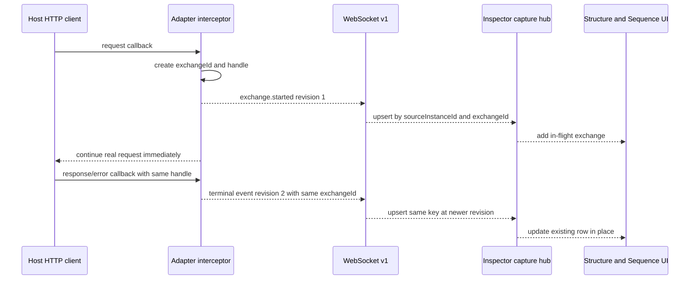

# HTTP Inspector Adapter Specification

Status: normative for adapter protocol v1  
Spec version: 1.12.0
Audience: developers and coding agents implementing an adapter in any language or HTTP client stack

Normative TDD companion: `http_inspector_adapter_tdd.spec.md` 1.5.0

## Agent execution contract

When this file is given to a coding agent inside another project, the agent must:

1. Inspect the project and identify its real HTTP client/interceptor extension point before editing.
2. Use an existing compatible adapter package when one exists. Otherwise implement one reusable in-process adapter for the detected language/runtime and HTTP client stack, then integrate that package at the extension point. Do not create a project-specific capture implementation, proxy, certificate installation, packet capture, or application-wide networking rewrite.
3. Keep inspector transport work off the application's request critical path. Connection, protocol serialization, acknowledgement tracking, heartbeat, and retry work must run independently of the host request. Bounded client-native body copying or pass-through wrapping needed to observe an ordinary finite body is allowed, but it must never wait for inspector I/O or change the bytes, headers, error, cancellation, or streaming behavior seen by the host application.
4. Preserve every captured value exactly. Do not use a header allowlist. Capture every request and response header exposed at the final supported observation seam, including `User-Agent`, `Host` when exposed, `Authorization`, `Proxy-Authorization`, `Cookie`, every `Set-Cookie`, content headers, `Accept*`, `Referer`, `Origin`, `SOAPAction`, tracing/correlation headers, API-key headers, and arbitrary custom headers. Preserve header order, duplicates, name casing, and exact value text. Do not remove, mask, hash, normalize, or replace query values, headers, JSON, XML, SOAP envelopes, bodies, or any other captured value.
5. Use the public API and wire protocol defined below. Follow the target repository's existing naming, dependency-injection, configuration, formatting, and testing conventions where they do not conflict with this protocol.
6. Exclude the inspector WebSocket endpoint itself from capture so the adapter cannot recursively report its own transport.
7. Add concise integration instructions showing the exact registration point and endpoint configuration.
8. Validate emitted JSON against `contracts/http-inspector.v1.schema.json` when that schema is available. In this repository, the generated schema is the field-level authority if this Markdown and the schema disagree.
9. Run the target project's focused checks. Do not introduce an unrelated broad test framework solely for this adapter.
10. Support permanent manual integration and optional temporary integration. Temporary integration must use the reversible pre-run/post-run contract in this specification and must never remove or overwrite developer-owned changes during cleanup.
11. Make the integration surgical. Use one existing global interceptor, middleware, handler-chain, transport-wrapper, client-factory, or bootstrap extension point whenever one exists. Do not add capture calls to individual request methods, repositories, services, controllers, or generated API clients.
12. Keep adapter behavior universal within its declared compatibility target. Project-specific logic is limited to detecting the target stack and applying/removing dependency, registration, and configuration changes; protocol, capture, queueing, retry, and lifecycle behavior belongs in the reusable adapter package.
13. Keep adapter source, integration-tool source, receipts, locks, backups, and portability fixtures outside the consuming project. The consumer may contain only its normal package-manager reference, endpoint configuration, one central registration/import hunk, and an exceptional removable shim when the ecosystem has no package mechanism.
14. Follow `http_inspector_adapter_tdd.spec.md`: translate every applicable test ID into the target ecosystem's native test framework, write each test before its production behavior, and ship a test manifest mapping IDs to passing tests or explicit unsupported observability.
15. Treat ordinary finite request and response bodies as required capture data. Do not use a blanket `unavailable` mapping for every body merely because the client represents content as a stream. Use the target client's safe bounded buffer, clone, replayable-content, or pass-through/tee extension point and prove that the application still receives identical content.

## Goal and non-goals

The adapter observes HTTP exchanges made by its host application and reports them to the local HTTP Inspector desktop application. It does not send the application's HTTP request, change its response, or act as a proxy.

Protocol v1 is capture-only. Request recomposition and replay are executed by the inspector's Rust runtime from the captured method, complete URL, complete ordered header array, and available body. The adapter does not receive or execute replay commands in v1, but its captured request is the authoritative source used to prefill Recompose. The inspector must copy the entire captured header array rather than a curated subset. `User-Agent` is mandatory whenever the adapter's observation seam exposes it.

Replay runs through the inspector's native runtime rather than browser `fetch`. It must attempt to send every captured header with its duplicates, order, casing, and value text intact. If the native HTTP client or selected HTTP protocol owns or refuses a header such as `Host`, `Content-Length`, or `Transfer-Encoding`, the inspector must report the exact header and reason instead of silently dropping, replacing, or claiming an exact replay. Headers created only after the adapter's final supported observation seam may remain unavailable, but the adapter must document that precise limitation and must not invent them.

The adapter must support ordinary REST, JSON, XML, and SOAP traffic without content-specific filtering. Payload type affects only `mediaType`, `charset`, and whether text or base64 body storage is used.

The unit of reuse is a declared compatibility target such as Flutter/Dart with Dio, .NET with `HttpClient`, JavaScript/TypeScript with `fetch`, or another specific runtime/client-stack pair. One implementation is not expected to execute across unrelated languages, but every compatible project must be able to consume the same adapter package without forking its capture logic.

## Required technology

| Concern | Required v1 behavior |
| --- | --- |
| Transport | RFC 6455 WebSocket client |
| Transport profile | `websocket-v1` |
| Endpoint | `ws://<inspector-host>:<port>/v1/capture` |
| Frames | UTF-8 JSON text frames only |
| Field naming | `camelCase` exactly as documented |
| Protocol version | `{ "major": 1, "minor": 0 }` |
| Authentication | None |
| Pairing token | None |
| Compression | Optional WebSocket transport behavior; never alter captured HTTP values |
| HTTP stack impact | Observation only; never await inspector I/O before allowing the real request to proceed |

Do not use the browser-facing UI WebSocket or the development UI API as capture transport. `/v1/capture` is the only adapter ingress endpoint.

## Endpoint and port configuration

The adapter must expose an `endpoint` setting containing the complete WebSocket URL.

Resolution order is:

1. Explicit adapter constructor/configuration value.
2. `HTTP_INSPECTOR_WS` environment variable when the target platform supports environment configuration.
3. A current standalone-listener descriptor supplied by the inspector or integration tool when both processes can read the same local application-state directory.
4. Development fallback `ws://127.0.0.1:53662/v1/capture`.

Port behavior:

- Hosted development defaults to TCP port `53662`. The inspector service can be started on another port with `HTTP_INSPECTOR_PORT`.
- The standalone Tauri application lets the developer select a port. Port `0` asks the operating system to select an available port; the adapter must then use the endpoint displayed by the application.
- Loopback mode binds to `127.0.0.1` and is the normal same-machine mode.
- Optional LAN mode binds the inspector to `0.0.0.0`. An adapter on a simulator, physical device, VM, or another development machine must use the inspector computer's reachable LAN IP and displayed port.
- There is no automatic network discovery in v1. Do not scan ports. Accept the endpoint through configuration.
- When the port is already known, `GET http://<inspector-host>:<port>/api/status` may be used as an optional health probe. It is not a substitute for the WebSocket handshake.

### Native automatic-port checklist

When the standalone Tauri application uses port `0`, each listener start or restart can receive a different operating-system-assigned port. The previous endpoint is stale as soon as that listener stops or restarts; an adapter still configured for it cannot connect, even if an Inspector window remains open.

For a same-machine host application, use this sequence:

1. Start or restart the native listener and copy the complete loopback endpoint displayed in its status bar.
2. Configure that exact value through the adapter's explicit endpoint setting, or through `HTTP_INSPECTOR_WS` when no explicit endpoint is supplied.
3. Start or restart the host application after applying the configuration.
4. Make an HTTP request that reaches the observed client stack. Opening Swagger, a health endpoint, or another route that does not use the observed HTTP client does not create a capture exchange.
5. Confirm `GET http://<inspector-host>:<port>/api/status` reports a connected source and the expected exchange count.

For predictable development configuration, select fixed port `53662` in the standalone listener instead of port `0`. This matches the v1 development fallback. Until the planned listener descriptor exists, do not expect the adapter to discover a newly assigned native-listener port automatically.

An explicit constructor value or `HTTP_INSPECTOR_WS` value is pinned configuration. The adapter must not silently replace it after a failure. A descriptor-derived endpoint may be refreshed after connection refusal, listener restart, or protocol mismatch because port `0` can select a different port on each inspector start.

### Standalone-listener descriptor

Automatic descriptor discovery is a planned inspector feature, not an implemented v1 endpoint. Until the inspector writes this descriptor, adapters must use an explicit endpoint, `HTTP_INSPECTOR_WS`, or the development fallback. Do not scan local ports as a substitute.

When implemented, the standalone app writes `<application-state-root>/listener.json` atomically on listener start/restart and removes it on stop only when the stored `inspectorInstanceId` still belongs to that app instance:

```json
{
  "descriptorVersion": 1,
  "inspectorInstanceId": "11111111-2222-4333-8444-55555555e101",
  "serverVersion": "0.1.0",
  "processId": 1234,
  "startedAt": "2026-08-14T12:00:00.000Z",
  "updatedAt": "2026-08-14T12:00:00.000Z",
  "bindMode": "loopback",
  "bindAddress": "127.0.0.1",
  "port": 54321,
  "loopbackEndpoint": "ws://127.0.0.1:54321/v1/capture",
  "supportedProtocol": {
    "minimum": { "major": 1, "minor": 0 },
    "maximum": { "major": 1, "minor": 0 }
  }
}
```

The descriptor is same-machine discovery only. A simulator, physical device, VM, container, or another computer cannot assume it can read the desktop app's state directory and must receive a reachable endpoint through its normal configuration mechanism.

## Transport profiles and environment compatibility

The capture/lifecycle layer must depend on a small transport port rather than importing WebSocket classes throughout interceptor code:

```text
CaptureTransport.connect(ClientHello) -> NegotiatedSession
CaptureTransport.send(CaptureMessage) -> MessageAcknowledgement
CaptureTransport.flush(duration timeout) -> async result
CaptureTransport.close() -> async result
```

`websocket-v1` is the only required and currently implemented transport profile. It maps one `CaptureMessage` to one UTF-8 JSON WebSocket text frame and correlates acknowledgement replies by `messageId`. Alternative profiles must carry the same protocol objects and lifecycle semantics; they may not invent a different exchange model.

| Profile | Status | Intended use |
| --- | --- | --- |
| `websocket-v1` | Required and implemented | Native/server processes that can reach the inspector listener. |
| `same-origin-relay-v1` | Deferred; no relay endpoint exists yet | HTTPS browser or Flutter Web applications that cannot directly open the inspector's insecure local socket. The relay forwards unchanged protocol messages to `/v1/capture`. |
| `http-batch-v1` | Deferred; no batch endpoint exists yet | Short-lived commands or restricted runtimes that cannot maintain a WebSocket. |

Do not advertise a deferred profile as supported until both the inspector endpoint and adapter transport implementation exist and pass the same conformance fixtures as `websocket-v1`.

Environment rules and known connection caveats:

| Adapter environment | Endpoint rule or limitation |
| --- | --- |
| Same-machine native/server process | Use loopback and the displayed/fixed port. This is the primary v1 path. |
| Android Emulator | Guest `127.0.0.1` is the emulator itself. Use Android's `10.0.2.2` alias for the development machine when the inspector is reachable there. |
| Physical mobile device | Use optional LAN binding plus the inspector computer's reachable LAN IP. The app/platform may require local-network permission. |
| VM or container | Use that runtime's host-gateway/reachable-host address; its own loopback is not the desktop host. |
| HTTP browser development page | The page's Content Security Policy must permit the configured WebSocket through `connect-src`. |
| HTTPS browser or Flutter Web page | An insecure `ws://` connection can be blocked as mixed content. Use a future same-origin `wss://` relay; changing the payload to HTTP POST alone does not bypass mixed-content policy. |

Relevant platform references: [Android Emulator networking](https://developer.android.com/studio/run/emulator-networking-address), [Apple local-network privacy](https://developer.apple.com/documentation/technotes/tn3179-understanding-local-network-privacy), [Content Security Policy `connect-src`](https://www.w3.org/TR/CSP/), and [Mixed Content](https://www.w3.org/TR/mixed-content/).

Adapters should expose connection diagnostics without failing the host request. Stable diagnostic codes should include `portInUse`, `endpointUnreachable`, `connectionRefused`, `handshakeTimeout`, `protocolMismatch`, `localNetworkDenied`, `cleartextBlocked`, `mixedContentBlocked`, `cspBlocked`, `listenerRestarted`, `queueOverloaded`, and `messageRejected`. A diagnostic records the code, effective endpoint, transport profile, human-readable message, timestamp, and whether retry is reasonable. Some browser/platform policy failures cannot be distinguished programmatically; use the closest supported code and retain the native error message.

### Known operational constraints

- A stale inspector process or second inspector instance can own the configured port. The adapter must identify a handshake-compatible listener, not treat any successful TCP connection as the intended inspector. Automatic-port mode remains configuration-driven until the listener descriptor is implemented.
- Capture uses a bounded queue so inspector slowness never creates unbounded host-process memory growth. A burst can therefore be rejected or dropped according to the negotiated/runtime policy; report cumulative drops and retryable overload without delaying the real HTTP call.
- Abrupt host termination can lose telemetry still in the adapter queue. `flush(timeout)` is best effort during orderly shutdown; capture durability must never be obtained by blocking or changing host HTTP behavior.
- Inline bodies and raw representations are limited by `maximumBodyBytes`, and each serialized frame is limited by `maximumMessageBytes`. Attachment-backed overflow storage is not complete, so adapters must report truncation/unavailability honestly rather than splitting one lifecycle object into undocumented frames.
- Streaming responses, server-sent events, upgraded connections, and indefinitely open downloads do not have an ordinary response-end moment. Emit the start when observed and the terminal state only when the supported client exposes completion, cancellation, or failure; do not invent timing or a completed body.
- Interceptor position controls fidelity. Observe after request-mutating authentication/cookie/serialization hooks when the stack permits it, but never consume a one-shot stream or reorder existing middleware merely to improve capture.
- A stream-shaped API is not automatically a one-shot or unavailable body. Standard finite text, JSON, XML/SOAP, form, and byte-array content within the negotiated limit must be captured when the supported client provides bounded buffering, cloning, replayable content, or a pass-through/tee wrapper. `unavailable` is an exceptional observation result, not the default body policy.
- Host HTTP retries/redirects and adapter WebSocket retries are different lifecycles. Apply the retry rules in the correlation section and never create duplicate user-visible exchanges merely because an acknowledgement was lost.

## Required adapter API

Use language-native casing when required by the language, but preserve these operations and semantics. Public names should match these names when the language permits it.

```text
HttpInspectorAdapter.create(AdapterConfig config) -> HttpInspectorAdapter

adapter.start() -> async result
adapter.stop() -> async result
adapter.captureStarted(CapturedRequest request, CaptureContext context?) -> ExchangeHandle
adapter.captureCompleted(ExchangeHandle handle, CapturedResponse response, CompletionData data) -> void
adapter.captureFailed(ExchangeHandle handle, CapturedFailure failure, CapturedResponse? response, CompletionData data) -> void
adapter.captureCancelled(ExchangeHandle handle, string origin, CompletionData data) -> void
adapter.flush(duration timeout) -> async result
```

`AdapterConfig` must contain:

```text
endpoint: string
transportProfile: websocket-v1
applicationName: string
serviceName: string
platform: string
adapterName: string
adapterVersion: string
environment: string | null
deviceName: string | null
processId: unsigned integer | null
buildVersion: string | null
baseUrl: string | null
sourceMetadata: JSON object
queueCapacity: positive integer, default 256
heartbeatInterval: duration, default 15 seconds
```

`ExchangeHandle` must retain the adapter-generated exchange UUID, current revision, monotonic start timestamp, wall-clock UTC start timestamp, and any request state needed to create terminal timing and size data. It must not contain a reference that prevents the host request from being released.

If the target HTTP library has synchronous interceptor callbacks, `captureStarted`, `captureCompleted`, `captureFailed`, and `captureCancelled` must enqueue work and return immediately.

## Universal adapter architecture

The adapter must be distributed as a reusable, versioned package/module/library for its declared language/runtime and HTTP client stack. A target application consumes that artifact; it must not receive a bespoke copy of the adapter implementation.

| Layer | Owns | Must not own |
| --- | --- | --- |
| Protocol core | Lifecycle messages, validation, transport-neutral queueing, heartbeat state, retry policy, and shutdown | Project types, application services, HTTP-client registration, or concrete WebSocket APIs |
| Transport profile | Connection lifecycle, protocol serialization, acknowledgements, and profile-specific retry mechanics | HTTP-client interception, project types, or business rules |
| HTTP-stack bridge | Mapping the supported client's request/response/error callbacks into the protocol core | Business rules, concrete API endpoints, project names, or repository methods |
| Integration strategies | Detecting supported project shapes and adding/removing the package, endpoint configuration, import, and one central registration | Capture/protocol logic or hard-coded assumptions about one application |
| Project delta | A package reference, endpoint configuration, and the smallest registration/import hunk | A copied adapter implementation or changes to per-request code |

Universal-reuse requirements:

- Declare the adapter name/version, supported runtime versions, supported HTTP client and version range, supported integration modes, and known limitations.
- Keep the protocol core and HTTP-stack bridge independent of the host application's modules, names, paths, endpoints, models, dependency-injection container choice, and business behavior.
- Accept application/source identity, endpoint, queue limits, and optional metadata through `AdapterConfig`; never compile project-specific constants into the adapter.
- Expose a normal manual registration API in addition to any automatic pre-run integration. A developer must be able to consume the same package directly without the injector.
- Do not copy the adapter's implementation source into each target project. If an ecosystem cannot consume a package artifact, an owned generated shim may delegate to a shared library, but the shim must contain no protocol/capture implementation and must be removable by post-run.
- Reuse one adapter artifact across independently named projects. Project A and Project B using compatible Dio versions must use the same Dio adapter implementation; compatible .NET projects must use the same `DelegatingHandler` implementation.
- Keep project-shape support extensible through named, versioned integration strategies. Adding support for another project layout must add or update a detector/registration strategy, not fork the protocol core or HTTP-stack bridge.
- Unknown or ambiguous layouts must fail closed: produce a dry-run report and exact manual registration instructions without editing the project. Never generate project-specific capture logic as a fallback.
- A reusable adapter release must prove portability against at least two independent minimal sample/fixture projects for each advertised integration strategy. Each smoke pass must install/inject, capture one completed and one failed/cancelled exchange, run post-run, and confirm that only recorded owned changes were removed.

Example reuse boundaries:

- A Flutter/Dio adapter package owns `HttpInspectorDioInterceptor`, request/response/error mapping, and the shared protocol client. Each Flutter project only adds the package, endpoint configuration, and one interceptor registration.
- A .NET adapter package owns `HttpInspectorHandler : DelegatingHandler` and the shared protocol client. Each .NET project only adds the package, configuration, DI registration, and the handler-chain entry.
- A JavaScript/TypeScript adapter package owns its `fetch`, Axios, or Undici wrapper. An HTML/web project only imports and registers the wrapper at its shared client bootstrap.

## Adapter placement and folder structure

Adapter implementation source belongs in a dedicated adapter repository or in a top-level `adapters/` workspace owned by the HTTP Inspector distribution. Each adapter family must bundle its matching integration CLI, strategies, fixtures, and integration tests inside that adapter family's directory or release repository. Do not place adapter-specific integration tools in a generic product-level `tools/` folder, and never copy them into the consuming application. A separate adapter repository is acceptable when an ecosystem needs an independent release pipeline. Adapter source must not be created under a consuming application's `lib/`, `src/`, `Services/`, `Infrastructure/`, or feature folders.

Published ecosystem packages are preferred. A local adapter development checkout may be referenced by package-manager path only when it is outside the consuming project root. Standard package-manager-managed locations such as a Dart pub cache, NuGet cache, or JavaScript `node_modules` are allowed; they are dependency storage, not project-owned adapter implementation. Do not vendor or copy adapter source into an application merely to make injection easier.

Recommended source layout:

```text
http-inspector/                              # Product repository; unrelated app folders omitted
└── adapters/
    ├── dotnet/
    │   ├── HttpInspector.Adapter/          # Reusable .NET package and protocol/client bridge
    │   ├── HttpInspector.Adapter.Tests/    # Adapter-native TDD suite and manifest
    │   └── HttpInspector.Adapter.Integration/
    │       ├── pre-run.sh                  # Adapter-bundled lifecycle entrypoints
    │       ├── run-with-http-inspector.sh
    │       ├── post-run.sh
    │       ├── recover.sh
    │       ├── status.sh
    │       ├── lib/                        # Bash lifecycle modules sourced by the entrypoints
    │       │   ├── project-discovery.sh
    │       │   ├── mutation-planner.sh
    │       │   ├── receipt-manager.sh
    │       │   └── cleanup-engine.sh
    │       ├── templates/                  # Adapter-owned registration/configuration templates
    │       └── tests/fixtures/             # Independent portability projects for this strategy
    ├── flutter-dio/
    │   ├── package/                        # Reusable Dart adapter
    │   ├── integration/                    # Matching pre/post/run/recover/status implementation
    │   └── tests/fixtures/
    └── javascript/
        ├── packages/                       # Protocol plus fetch/Axios/Undici adapters
        ├── integration/                    # Matching integration strategies and entrypoints
        └── tests/fixtures/
```

The exact ecosystem-native directory names may differ, but these boundaries are normative:

- Public entry-point files only export supported API; implementation stays in internal/private folders.
- Protocol core has no dependency on an HTTP client, integration strategy, sample, or consuming application.
- An HTTP-stack adapter depends inward on protocol core and maps only that stack's request/response lifecycle.
- Integration orchestration is implemented by focused adapter-owned Bash modules. The Bash strategy does not own protocol/capture behavior, which remains in the reusable runtime adapter.
- Fixtures and samples depend on released/package artifacts. Production packages never depend on fixtures or samples.
- Keep one primary responsibility per file/type. Prefer handwritten files below 300 lines and require an explicit architectural reason before exceeding 400 lines.
- A new client stack gets a new adapter package/directory. A new project layout for an existing stack gets a new integration strategy, not a fork of the adapter package.

The normal consuming-project footprint is intentionally small:

```text
consumer-project/
├── <existing package manifest>          # One dependency entry when required
├── <existing lockfile>                  # Package-manager result when required
├── <existing composition root>          # One owned registration/import block
└── <existing development config>        # Endpoint only when environment config is unavailable
```

Do not add an `http_inspector/`, `.http-inspector/`, `adapters/`, generated protocol, receipt, backup, fixture, or integration-tool source directory to the consumer. Temporary mode reverses every consumer-project change listed in its receipt. Permanent mode leaves only the intentionally accepted dependency/configuration/registration changes.

## Integration modes

An implementation must document which of these modes it supports:

| Mode | Source changes | Required cleanup |
| --- | --- | --- |
| `permanent` | Adapter dependency and registration are intentionally committed to the project | Runtime cleanup only |
| `temporary` | A pre-run tool injects adapter dependency/configuration/registration for one development run | Runtime cleanup plus reversible source cleanup |
| `runtimeOnly` | The framework can register an interceptor dynamically without editing source or dependency files | Runtime cleanup only |

Permanent integration is the default when a developer manually installs an adapter. Temporary mode is optional for an adapter implementation, but if offered it must implement every pre-run/post-run rule below.

## Reversible pre-run and post-run API

The source-integration tool is separate from `HttpInspectorAdapter`. Use language-native casing where necessary, while preserving these operations:

```text
HttpInspectorIntegration.preRun(PreRunConfig config) -> IntegrationReceipt
HttpInspectorIntegration.run(PreRunConfig config, ProcessCommand command) -> ProcessResult
HttpInspectorIntegration.postRun(IntegrationReceipt receipt, PostRunReason reason) -> CleanupReport
HttpInspectorIntegration.recover(ProjectRoot projectRoot) -> CleanupReport
HttpInspectorIntegration.status(ProjectRoot projectRoot) -> IntegrationStatus
```

This is a logical API contract, not permission to implement the integration tool in the target language. Every automatic temporary-integration operation in this section must be implemented by the adapter family's Bash `.sh` entrypoints and sourced Bash modules.

The companion CLI, when provided, must expose equivalent commands:

```text
http-inspector-adapter pre-run --project <path> --endpoint <ws-url>
http-inspector-adapter run --project <path> --endpoint <ws-url> -- <normal project command>
http-inspector-adapter post-run --project <path> --run-id <uuid>
http-inspector-adapter recover --project <path>
http-inspector-adapter status --project <path>
```

When one developer-facing integration tool supports multiple ecosystems, these commands must be language-neutral dispatchers. They inspect manifests and bounded composition-root evidence, select one installed strategy, and record that strategy identity in the receipt. Language-specific discovery and mutation remain inside the selected strategy. An unknown, unsupported, or ambiguous project must stop without mutation and explain which reusable adapter/strategy is missing; a generic launcher must never guess by applying another ecosystem's edits.

Every advertised temporary workflow must provide executable adapter-owned `pre-run.sh`, `post-run.sh`, `run-with-http-inspector.sh`, `recover.sh`, and `status.sh` entrypoints. The complete integration lifecycle—project discovery, compatibility checks, planning, backup, receipt journaling, mutation, cleanup, status, and recovery—must be implemented in Bash `.sh` files stored inside that adapter family. Pre-run and post-run must not compile or execute a C#, .NET, Node.js, Python, Java, Dart, or other language-specific integration program. They may invoke the consuming project's normal package manager, build command, or runtime only when applying or running the integration described by the recorded plan; those project commands are not the integration engine.

macOS and Unix-like systems use their installed Bash-compatible environment. Windows support requires Git Bash as an explicit prerequisite and must normalize Windows paths before reading or writing project files. The native host boundary must translate every lifecycle path argument (`--project`, `--state-root`, `--package-file`, `--payload-root`, and any absolute `--project-file` or receipt path) into Git Bash path syntax before invoking a script. It must strip the Windows extended-length `\\?\\` prefix first, preserve UNC semantics, and translate absolute path fields returned in script JSON (`projectRoot`, project/composition/payload/package/feed paths) back to normal native paths before hashing files, persisting catalog values, displaying results, or invoking a later lifecycle command. A host must never pass a raw `\\?\\C:\\...` argument to Git Bash or use a returned `/c/...` path directly with a native filesystem API. PowerShell, a native executable, or a target-language helper is not an alternative implementation of this lifecycle. The Bash modules must use bounded structural evidence, fail closed on unsupported or ambiguous source, and never degrade into unbounded regular-expression rewriting. The reusable capture adapter itself remains native to its declared runtime/client stack and may be shipped as a precompiled package or binary; only the reversible source-integration lifecycle is required to be Bash.

### Standalone and hosted-local UI integration contract

When HTTP Inspector exposes temporary integration from its UI, every adapter family must additionally declare versioned `inspect.sh --json` and `list.sh --json` entrypoints. `inspect` is strictly read-only: it returns the detected runtime/client stack, all candidate project files when a choice is required, exact proposed dependency/import/registration operations, capture endpoint, strategy identity, and packaged payload identity without creating state, receipts, backups, locks, directories, or source changes. `list` reads only the application's external receipt catalog; it must not rediscover integrations by scanning arbitrary source folders.

The host-facing service contract is transport-neutral. It reports runtime (`tauri`, `hostedLocal`, or unavailable), transport (`ipc`, `sameOriginHttp`, or none), folder-selection mode, stable unavailable reason, Bash path/capability, adapter/strategy/protocol version, embedded payload digest, and exact package identity. A selection token is bound to one canonical local directory. A preview token is bound to that selection, selected project file, endpoint, runtime/transport, payload/package identity, and relevant file hashes. Apply must reject expired, stale, or cross-runtime tokens and require a new preview rather than silently recalculating a different mutation.

The standalone application may use a native folder chooser behind typed host commands. The webview must not receive generic filesystem, shell, or dialog access. Hosted integration is disabled by default and may be enabled only on an explicitly configured loopback service. Hosted-local selection accepts an absolute path on the service machine; it is not a browser upload and must reject relative/unsafe paths. Static hosting, remote services, and non-loopback/LAN listeners must not register mutation endpoints. Capture and replay remain operational when project integration is unavailable or Git Bash is missing.

If an adapter is distributed inside the inspector, its reusable runtime artifact, manifest, README, Bash lifecycle, libraries, and templates must be assembled at the inspector's source/artifact build and embedded as exact bytes into every supporting host binary. Runtime integration must hash-verify and atomically materialize those bytes into a versioned application-owned directory outside the target project. The consuming project receives no adapter source, integration scripts, receipts, backups, or tool directory.

For .NET `IHttpClientFactory`, the distribution build runs Release `dotnet pack` once and records the exact immutable package ID, version, filename, and SHA-256. Runtime pre-run must never build, pack, or recompile the adapter. It exports the unchanged `.nupkg` to the versioned application-owned `nuget-feed/`, adds a marked project-scoped `RestoreAdditionalProjectSources` value and exact `PackageReference` with `PrivateAssets="all"`, then adds only the bounded import and final shared handler registration. It must not modify `NuGet.Config`, add a global/user NuGet source, use a remote feed, or place package/tool bytes inside the target repository.

New receipts record adapter/strategy/protocol/payload identity plus exact package ID/version/file/digest/feed. Catalog, remove, and recover must continue to recognize declared legacy receipt versions. Cleanup validates safe recorded paths and owned blocks but must not require a legacy payload DLL/package to still exist. A missing project, missing payload, invalid receipt, or changed owned block remains visible as an attention state; ambiguous developer changes are never overwritten. Payload retention keeps every version referenced by a valid or uncertain receipt and removes only application-owned, current-unreferenced digests after a validated catalog scan.

The adapter-owned Bash modules must implement the logical equivalent of this strategy contract:

```text
IntegrationStrategy.id -> stable string
IntegrationStrategy.version -> semantic version
IntegrationStrategy.adapterKind -> stable language/runtime/client-stack identifier
IntegrationStrategy.detect(ProjectInspection project) -> DetectionResult
IntegrationStrategy.plan(ProjectInspection project, PreRunConfig config) -> MutationPlan
IntegrationStrategy.apply(MutationPlan plan, ReceiptWriter journal) -> IntegrationReceipt
IntegrationStrategy.cleanup(IntegrationReceipt receipt) -> CleanupReport
```

`DetectionResult` must report `supported`, `unsupported`, or `ambiguous`; ordered evidence; detected runtime/client versions; candidate composition roots; expected capture coverage; and any required manual choice. Project name, repository name, developer username, absolute checkout path, or a customer-specific class name must never be a compatibility condition. Automatic mutation is allowed only for `supported` with one deterministic plan. `unsupported` and `ambiguous` return manual package-registration instructions and make no changes.

Strategies may understand common ecosystem layouts, such as a Flutter provider/service locator that constructs Dio, .NET service registration built around `IHttpClientFactory`, or a JavaScript application bootstrap that owns `fetch`/Axios. These strategies remain reusable structural matchers. Project-specific constants, endpoints, model names, and business rules are not strategy inputs.

### Generic pre-run discovery and mutation examples

The examples in this section are normative illustrations of safe generic integration. A strategy may search for client types, handler superclasses, imports, and registration calls, but search results are evidence used to locate a shared composition seam. They are not permission to replace existing handler/interceptor classes.

#### Good generic discovery flow

```text
inspect project manifests with the ecosystem parser
detect runtime and supported HTTP-client package/version
parse source with the language project/AST/semantic API
find shared client construction and registration symbols
find existing handler/interceptor symbols and their registration order
calculate candidate composition roots and expected coverage

if exactly one supported deterministic plan exists:
  plan package dependency change
  plan required import using the language syntax API
  plan one central adapter registration at the final supported observer position
  plan endpoint configuration only when the normal configuration path requires it
  emit dry-run diff and write-ahead receipt operations
else:
  return unsupported/ambiguous with evidence and manual instructions
  change nothing
```

Good strategies match capabilities and symbols, not the literal names from these examples. A .NET strategy identifies the semantic `IHttpClientFactory`/`AddHttpClient` APIs and types assignable to `DelegatingHandler`; a Flutter/Dio strategy identifies the Dio package/type and the shared `Interceptor` registration. Aliases, extension methods, multiline chains, and normal formatting differences must not make the detector silently choose the wrong location.

Package namespaces, registration-extension names, and adapter variable names below are illustrative. A real strategy obtains them from the selected versioned adapter package's declared integration API and records the exact values in its mutation plan.

#### Good C#/.NET automatic integration

The strategy may use MSBuild/Roslyn or an equivalent structured project API to:

1. Load the selected project and package references.
2. Find invocations semantically resolving to `AddHttpClient` and `AddHttpMessageHandler`, including multiline chains and extension-method syntax.
3. Find existing types assignable to `DelegatingHandler` to understand the current pipeline and avoid duplicate registration.
4. Add the reusable adapter package through the project/package mechanism.
5. Add the adapter namespace import only when the syntax/semantic model shows it is required and not already available.
6. Add the adapter service registration once and append its handler entry to each deterministically supported shared pipeline without moving existing entries.
7. Record exact package, import, and registration edits for idempotency and post-run cleanup.

Example supported input:

```csharp
using Microsoft.Extensions.DependencyInjection;

services.AddTransient<AuthHandler>();
services.AddHttpClient<BackendClient>()
    .AddHttpMessageHandler<AuthHandler>();
```

Example planned result; ownership markers are required in temporary mode:

```csharp
// HTTP_INSPECTOR_INJECTION:<runId>:BEGIN
using HttpInspector.Adapter;
// HTTP_INSPECTOR_INJECTION:<runId>:END
using Microsoft.Extensions.DependencyInjection;

services.AddTransient<AuthHandler>();
// HTTP_INSPECTOR_INJECTION:<runId>:BEGIN
services.AddHttpInspectorAdapter(configuration);
services.AddTransient<HttpInspectorHandler>();
// HTTP_INSPECTOR_INJECTION:<runId>:END
services.AddHttpClient<BackendClient>()
    .AddHttpMessageHandler<AuthHandler>()
    // HTTP_INSPECTOR_INJECTION:<runId>:BEGIN
    .AddHttpMessageHandler<HttpInspectorHandler>();
    // HTTP_INSPECTOR_INJECTION:<runId>:END
```

The real strategy must generate language-valid marker placement and preserve the target formatter's conventions. If a C# marker cannot safely divide a fluent expression as illustrated, own one syntactically valid contiguous hunk around the appended call and record its exact before/after bytes.

Bad C# discovery or mutation:

```text
for every *.cs file:
  regex replace "class <anything> : DelegatingHandler"
    with "class <anything> : HttpInspectorHandler"

regex replace every "new HttpClient(" with "CreateInspectedHttpClient("
append imports to every C# file
```

This is forbidden. It changes existing class inheritance and behavior, can break constructor contracts, modifies unrelated clients, misses aliases/generated registrations, duplicates imports, and creates an unsafe cleanup surface. Existing `DelegatingHandler` subclasses may be discovered, but their source, superclass, and registration order remain unchanged.

#### Good Flutter/Dio automatic integration

The strategy may use a YAML parser plus Dart analyzer/AST APIs to:

1. Confirm a compatible Dio dependency.
2. Find the shared Dio construction/provider/service-locator seam and existing interceptor registrations.
3. Require one deterministic supported registration plan or report ambiguity without mutation.
4. Add the reusable adapter package through pub dependency configuration.
5. Add one package import if it is not already resolvable.
6. Append one `HttpInspectorDioInterceptor` after the existing request-mutating interceptors.
7. Record exact dependency, lockfile, import, and registration operations for cleanup.

Example supported input:

```dart
import 'package:dio/dio.dart';

Dio createBackendClient() {
  final dio = Dio(options);
  dio.interceptors.add(AuthInterceptor(credentials));
  return dio;
}
```

Example planned result:

```dart
import 'package:dio/dio.dart';
import 'package:http_inspector_dio/http_inspector_dio.dart';

Dio createBackendClient() {
  final dio = Dio(options);
  dio.interceptors.add(AuthInterceptor(credentials));
  // HTTP_INSPECTOR_INJECTION:<runId>:BEGIN
  dio.interceptors.add(HttpInspectorDioInterceptor(adapter));
  // HTTP_INSPECTOR_INJECTION:<runId>:END
  return dio;
}
```

Bad Flutter discovery or mutation:

```text
regex replace every "Dio(" in lib/** with "createInspectedDio("
insert captureStarted/captureCompleted around every dio.get/dio.post call
rewrite generated API clients
add the adapter import to every Dart file
```

This is forbidden because it duplicates capture behavior, misses other request methods, changes application construction/exception paths, pollutes business code, and cannot be un-injected safely.

#### Bounded textual fallback

When a mature parser/project API is unavailable, a named strategy may use a bounded textual/regular-expression matcher only when all of these conditions hold:

- Manifest/package detection already established the compatible runtime and client stack.
- Search is restricted to pre-identified composition-root candidates, not every source file.
- The matcher is anchored to an exact, versioned structural form and requires exactly one unambiguous match.
- The insertion is a complete syntactically valid import/registration hunk with an idempotency check.
- Dry-run displays the exact before/after hunk, and the write-ahead receipt stores exact bytes/hashes before mutation.
- Zero or multiple matches return `unsupported`/`ambiguous` and make no changes.
- Focused parse/format/build verification must pass after mutation; otherwise the operation rolls back through its receipt.

An unbounded regex over the repository, a replacement of existing superclasses/handlers/interceptors, or a best-guess edit after multiple matches is always a bad implementation.

`run` is the preferred temporary-mode entry point. It must call `preRun`, launch the project's normal command as a child process, forward termination signals where the platform allows it, and invoke `postRun` in a `finally`/defer-equivalent path after the child exits.

`PreRunConfig` contains:

```text
projectRoot: canonical absolute path
endpoint: complete ws:// URL
integrationMode: temporary
launchCommand: optional normal project command
frameworkHint: optional string
httpClientHint: optional string
stateRootOverride: optional canonical absolute directory outside projectRoot, intended for tests or portable tooling
dryRun: boolean
```

`PostRunReason` is one of `normalExit`, `userStopped`, `launchFailed`, `adapterStopped`, `terminationSignal`, or `crashRecovery`.

### Integration receipt and write-ahead journal

Temporary integration must keep its working state outside the consuming project. Resolve one platform-managed state root shared by the standalone application and integration CLI, then key each project by `sha256(canonicalProjectRoot)`:

```text
<httpInspectorStateRoot>/
└── integrations/
    └── <projectKey>/
        ├── integration.lock
        ├── active-run.json
        └── runs/
            └── <runId>/
                ├── integration-receipt.json
                └── backups/
```

Default platform locations are:

- macOS state root: `~/Library/Application Support/HTTP Inspector/`
- Windows state root: `%LOCALAPPDATA%\HTTP Inspector\`
- Linux state root: `${XDG_STATE_HOME:-~/.local/state}/http-inspector/`

Use the operating system's native application-state API rather than manually expanding these example strings. A supplied `stateRootOverride` must be an exact, canonical directory outside `projectRoot`; reject the filesystem root, home directory itself, the consuming project, or any ancestor/descendant overlap with the consuming project. Tests should use a newly created temporary directory. The store must contain the atomically updated receipt and an exclusive project lock while pre-run, post-run, or recovery mutates the project.

The receipt is a write-ahead cleanup journal. Record the pre-change state before each mutation, then atomically mark that operation applied after it succeeds. It must contain:

```text
specVersion: 1.9.1
runId: UUID
state: preparing | active | cleaning | cleanupRequired | clean
projectRoot: canonical absolute path
projectKey: lowercase SHA-256 of canonical projectRoot
stateDirectory: canonical external run-state directory
endpoint: complete WebSocket URL
adapterKind: stable language/runtime/client-stack identifier
adapterVersion: semantic version
strategyId: stable integration-strategy identifier
strategyVersion: semantic version
createdAt: RFC 3339 UTC
updatedAt: RFC 3339 UTC
operations: ordered list of IntegrationOperation
diagnostics: ordered list of strings
```

Each `IntegrationOperation` records an operation ID, kind, target path/package, status, and enough pre-change data to reverse only that operation:

```text
createFile { path, sha256After, ownedMarker }
modifyFile { path, sha256Before, sha256After, originalBytesBackup, ownedMarker }
dependencyChange { manifestPath, lockfilePaths, packageName, previousDeclaration, appliedDeclaration, beforeHashes, afterHashes }
configChange { path, key, previousPresence, previousValue, appliedValue, beforeHash, afterHash }
generatedArtifact { path, sha256After, ownedMarker }
```

Backups must be stored below the external run directory's `backups/`, retain exact bytes and file mode where supported, and never contain captured HTTP traffic. The receipt may contain endpoint/configuration values, but it must not copy captured authorization values, cookies, API keys, request bodies, or response bodies. Never place receipts or backups in the consumer merely because its path is convenient.

### Multi-project solution selection

The initial folder may be a repository or solution containing several `.csproj` files. Discovery must require an explicit project-file choice in that case; it must not infer a target from project name, directory order, or the first `AddHttpClient` match. Once a `.csproj` is chosen, that file's canonical directory becomes the integration root. Composition-root discovery, deterministic-plan validation, locks, external receipt/project key, backups, artifact cleanup, catalog identity, and post-run recovery must be scoped to that integration root. Sibling application projects in the same solution are independent and may be integrated at the same time. A multiple-composition-root error is valid only when the conflicting roots are within the chosen project's own directory.

### Pre-run behavior

`preRun` must:

1. Resolve and validate the exact project root. Never use the home directory, filesystem root, unresolved environment variables, or a broad parent directory as an injection target.
2. Resolve the external state root and project key, then acquire that project's external integration lock. If another active run owns it, stop with a precise diagnostic.
3. Detect an existing non-clean receipt in the external state store. Run safe recovery first; if developer-modified conflicts remain, stop without applying another injection.
4. Inspect project manifests and source to identify the real HTTP client, dependency-injection/bootstrap seam, and normal launch command. Select a compatible reusable adapter and a named, versioned integration strategy by runtime/client capabilities and project structure, never by a hard-coded project name or absolute path. Prefer project/AST APIs over unbounded textual search-and-replace.
5. Produce an explicit mutation plan containing the selected adapter artifact/version, strategy ID/version, detection evidence, expected capture coverage, and exact files/hunks. With `dryRun: true`, report the plan and change nothing. If detection is ambiguous or unsupported, make no changes and return manual instructions using the reusable adapter's public registration API.
6. Write the receipt and pre-change journal record before every mutation.
7. Apply the smallest integration: adapter dependency, one central registration point, endpoint configuration, and owned support files only. When a shared HTTP interception seam exists, do not edit per-request call sites or existing interceptor/handler implementations.
8. Make injection idempotent. Re-running pre-run for the same active `runId` must not duplicate dependencies, registrations, handlers, imports, or configuration.
9. Mark injected source blocks with language-appropriate comments containing `HTTP_INSPECTOR_INJECTION:<runId>:BEGIN` and `HTTP_INSPECTOR_INJECTION:<runId>:END` when comments are legal. Generated/created files must include an equivalent ownership marker.
10. Confirm no receipt, backup, integration-tool source, fixture, or copied adapter implementation was created inside the consuming project.
11. Run only focused dependency resolution/format/build checks required by the touched integration seam, then mark the external receipt `active`.

The pre-run tool must preserve existing formatting outside owned hunks. It must not run `git reset`, `git checkout`, clean the worktree, rewrite entire files for convenience, or treat Git as the restoration source. Existing uncommitted changes belong to the developer.

`preRun` must not synthesize a new capture implementation inside the target project. It installs/references the reusable adapter artifact and adds only its configuration and central registration. The same pre-run command and strategy must work for another compatible project without changing protocol or capture source code.

### Runtime shutdown cleanup

Intentional application shutdown calls `adapter.stop()` before source cleanup. `stop()` must be idempotent and must:

1. Stop accepting new capture events.
2. Attempt a bounded `flush` using the caller's timeout.
3. Stop heartbeat and reconnect timers.
4. Unregister dynamically registered interceptors/listeners when the host framework supports removal.
5. Close the WebSocket and cancel the connection worker.
6. Release pending acknowledgement maps, queued messages, retained request/response body buffers, exchange handles, and recovery snapshots.
7. Return control even when the inspector is unavailable.

An unexpected WebSocket disconnect is not a post-run signal. It triggers the normal reconnect state machine while the host process is still running. Source cleanup begins only after explicit post-run, wrapper child-process exit, intentional adapter shutdown tied to run termination, or later crash recovery.

Runtime cleanup does not clear the inspector's global capture session. The inspector session may contain other adapters and remains until the user clears it or closes the inspector. A temporary adapter must not call the global `/api/clear` endpoint during post-run.

### Post-run source cleanup

`postRun` must be safe to call repeatedly. It must:

1. Resolve the external project-key directory, acquire its integration lock, and confirm the receipt belongs to the exact canonical project root and requested `runId`.
2. Set receipt state to `cleaning` atomically.
3. Reverse applied operations in strict reverse order.
4. Remove an owned created/generated file only when its current hash equals the recorded post-injection hash and its ownership marker still matches.
5. Restore a modified file byte-for-byte only when its current hash equals the recorded post-injection hash. If the file changed after injection, remove only an exact owned marker block when that operation is unambiguous; otherwise preserve the file and report a conflict.
6. Reverse dependency/configuration changes only when their current declaration still equals the applied declaration. Preserve developer edits and report any unresolved operation.
7. Restore lockfiles using the recorded exact pre-change bytes only when their post-injection hashes still match. Otherwise run the project's package manager only if it can remove the owned dependency without rewriting unrelated developer changes; if not, retain the conflict for manual cleanup.
8. Remove empty adapter-owned directories and temporary build artifacts recorded in the receipt. Never remove normal package-manager caches shared with other projects.
9. Delete the external run backup/receipt directory and `active-run.json` only after every operation is clean, then remove the external project-key directory if empty. If any operation cannot be safely reversed, retain the external receipt/backups, set state `cleanupRequired`, and print exact paths and next actions.
10. Release the integration lock even when cleanup is incomplete.

Cleanup must never overwrite a file changed by the developer after pre-run, remove a dependency the project now uses independently, delete unrecorded files, or erase application/backend data.

`postRun` must use the adapter/strategy identity and recorded operations in the receipt; it must not depend on the original project's name or rediscover the project from brittle line numbers. A newer integration-tool release must either retain cleanup compatibility for prior receipt strategy versions or invoke the matching bundled cleanup strategy recorded by the receipt.

### Crash and forced-termination recovery

Normal `finally`/defer handlers do not run after power loss, process kill, or host crash. Therefore:

- Every later `preRun`, `run`, `postRun`, `recover`, and `status` invocation must inspect the receipt before doing other work.
- A stale lock whose owning process no longer exists may be recovered, but the event must be recorded in diagnostics.
- `recover` applies the same reverse-order/hash/ownership rules as post-run and uses reason `crashRecovery`.
- If safe automatic cleanup is impossible, recovery stops before new injection and leaves a precise `cleanupRequired` report.
- The integration tool should print the explicit recovery command immediately after successful pre-run so the developer can clean up manually if the wrapper is interrupted.

### Cleanup report

`CleanupReport` contains:

```text
runId: UUID
state: clean | cleanupRequired | noActiveIntegration
restoredPaths: ordered path list
removedPaths: ordered path list
preservedDeveloperChanges: ordered path list
unresolvedOperations: ordered operation/diagnostic list
runtimeDisposed: boolean
```

## Process lifetime and source identity

- Create one `source.instanceId` UUID when the adapter process starts. Reuse it for all WebSocket reconnects during that process run.
- Create one WebSocket connection per adapter process, not one connection per HTTP request.
- Create one `exchangeId` UUID per host HTTP exchange.
- Create one `messageId` UUID per emitted protocol message.
- The `sourceInstanceId` on every message must equal the `source.instanceId` sent in the accepted hello.
- Use revision `1` for the normal `exchange.started` message and revision `2` for its terminal message. Every later correction or recovery snapshot must use a strictly greater revision.

## Request-response correlation and live UI updates

The WebSocket does not infer which response belongs to which request, and message arrival order is not a correlation mechanism. The adapter establishes identity before the host sends the HTTP request:

1. The request interceptor creates a new UUID `exchangeId` and an `ExchangeHandle`.
2. It queues `exchange.started` revision `1` with that `exchangeId`, then allows the host request to proceed immediately.
3. The adapter retains the handle in request-scoped state that the HTTP client returns to its response/error callback.
4. That callback queues exactly one terminal lifecycle message with the same `exchangeId` and a higher revision, normally revision `2`.
5. The inspector addresses the exchange by `(sessionId, sourceInstanceId, exchangeId)`. Within one active session, its stored key is `(sourceInstanceId, exchangeId)`.
6. The UI receives an upsert for that key. Revision `1` creates the in-flight row; revision `2` updates that same row to completed, failed, or cancelled without creating a second request.



Correlation requirements:

- Never correlate by URL, method, timing, response order, a global "last request", or a FIFO queue. Two concurrent requests may have identical URLs and may complete in the opposite order.
- `messageId` identifies one emitted protocol message and matches only its `message.accepted`/`message.error` acknowledgement. It does not associate an HTTP response with a request.
- Store the `ExchangeHandle` using the HTTP stack's request-scoped mechanism: for example, a namespaced `RequestOptions.extra` entry in Dio, a local handle around the awaited `base.SendAsync` call in a .NET `DelegatingHandler`, or the closure created by a JavaScript `fetch` wrapper. Remove the handle after its terminal event is queued.
- Never serialize adapter-only handle state into the real outbound HTTP request, headers, query, or body.
- Emit at most one normal terminal event per handle. If a later correction is required, use a strictly higher revision; the capture hub ignores stale or duplicate revisions.
- A terminal event received without its start creates a recoverable missing-start placeholder. A late lower-revision start must never regress an already terminal exchange.
- Preserve the same `sourceInstanceId` and pending `exchangeId` values across WebSocket reconnects during one process run. Send recovery snapshots with a sufficiently newer revision as defined below.

Retry and redirect boundaries depend on what the supported HTTP stack can actually observe:

- When the interceptor observes each real network attempt, allocate a distinct `exchangeId` for each attempt. Relate them with `correlation.operationId` and adapter metadata such as `retry.attempt` and `retry.parentExchangeId`.
- When the stack exposes only one logical request around its internal retries or redirects, report one exchange and record the observable retry/redirect information in metadata. Do not fabricate attempts the adapter did not observe.
- Adapter transport retries resend telemetry for the same exchange/revision; they are unrelated to host HTTP retries and must not allocate a new `exchangeId`.

## Connection state machine

```text
stopped
  -> connecting
  -> awaitingHello
  -> connected
  -> reconnectWaiting
  -> connecting

Any state -> stopped when adapter.stop() is called.
```

Connection rules:

1. Open the configured WebSocket.
2. Send `ClientHello` as the first text frame within three seconds.
3. Do not send capture messages until `hello.accepted` is received.
4. Store `connectionId`, `sessionId`, `maximumMessageBytes`, and `maximumBodyBytes` from the acceptance.
5. Send queued capture messages and wait for a matching `message.accepted` or `message.error` by `messageId`.
6. Treat a socket close, I/O error, or retryable server error as a reconnect condition. Use bounded exponential backoff with jitter; recommended delays are approximately 250 ms, 500 ms, 1 s, 2 s, then 5 s maximum.
7. Do not automatically retry a `hello.error` with `retryable: false` until endpoint or adapter configuration changes.
8. The inspector marks remaining in-flight exchanges incomplete when the source disconnects. After reconnect, send a complete `exchange.snapshot` for locally retained exchanges using a revision greater than every previously sent revision. Because disconnect recovery advances inspector state, increment the last adapter revision by at least two before the first recovery snapshot.

## Handshake

`ClientHello` has no `type` field. This exact shape is required:

```json
{
  "schemaVersion": { "major": 1, "minor": 0 },
  "supportedProtocol": {
    "minimum": { "major": 1, "minor": 0 },
    "maximum": { "major": 1, "minor": 0 }
  },
  "source": {
    "instanceId": "11111111-2222-4333-8444-55555555b101",
    "applicationName": "Example Application",
    "serviceName": "example-service",
    "platform": "dotnet",
    "adapterName": "example-http-inspector-adapter",
    "adapterVersion": "1.0.0",
    "protocolVersion": { "major": 1, "minor": 0 },
    "environment": "development",
    "deviceName": null,
    "processId": 1234,
    "buildVersion": null,
    "baseUrl": "https://api.example.test",
    "metadata": {}
  }
}
```

The server accepts with:

```json
{
  "type": "hello.accepted",
  "value": {
    "schemaVersion": { "major": 1, "minor": 0 },
    "connectionId": "11111111-2222-4333-8444-55555555d101",
    "sessionId": "11111111-2222-4333-8444-55555555a101",
    "maximumMessageBytes": 4194304,
    "maximumBodyBytes": 1048576
  }
}
```

Handshake failure shape:

```json
{
  "type": "hello.error",
  "value": {
    "code": "hello.rejected",
    "message": "protocol major version is not supported",
    "retryable": false
  }
}
```

Current hello error codes are `hello.timeout`, `hello.invalid`, and `hello.rejected`. The server closes the connection after sending one.

## Server acknowledgements and errors

Every valid post-handshake message receives:

```json
{
  "type": "message.accepted",
  "messageId": "11111111-2222-4333-8444-55555555c101"
}
```

Rejected message shape:

```json
{
  "type": "message.error",
  "messageId": "11111111-2222-4333-8444-55555555c101",
  "error": {
    "code": "message.rejected",
    "message": "captured body exceeds the negotiated maximum body size",
    "retryable": true
  }
}
```

`messageId` is `null` when the server could not deserialize enough of the payload to identify it. Three consecutive invalid/rejected messages close the connection. Queue overload and unavailable processing also close the connection after a retryable error.

## Lifecycle messages

### Normal request flow

For each host request:

1. Call `captureStarted` before the real HTTP client sends the request.
2. Emit `exchange.started` with revision `1`.
3. Allow the real HTTP request to continue without waiting for inspector acknowledgement.
4. Emit exactly one normal terminal event:
   - `exchange.completed` when any HTTP response was received, including 4xx and 5xx.
   - `exchange.failed` when transport, connection, timeout, serialization, interceptor, or capture failure prevented normal completion.
   - `exchange.cancelled` when cancellation ended the request.
5. Use revision `2` for the normal terminal event.

The server accepts stale or duplicate revisions as no-op acknowledgements. A later revision may update missing data but a late start cannot regress a terminal lifecycle state.

### `exchange.started`

```json
{
  "type": "exchange.started",
  "schemaVersion": { "major": 1, "minor": 0 },
  "messageId": "11111111-2222-4333-8444-55555555c101",
  "exchangeId": "11111111-2222-4333-8444-55555555f101",
  "sourceInstanceId": "11111111-2222-4333-8444-55555555b101",
  "revision": 1,
  "sentAt": "2026-08-14T12:00:00.000Z",
  "request": {
    "method": "POST",
    "originalMethod": null,
    "url": "https://api.example.test/v1/documents?id=42&id=43",
    "scheme": "https",
    "host": "api.example.test",
    "port": null,
    "path": "/v1/documents",
    "pathSegments": ["v1", "documents"],
    "fragment": null,
    "query": [
      { "name": "id", "value": "42", "provenance": "exact" },
      { "name": "id", "value": "43", "provenance": "exact" }
    ],
    "protocol": "HTTP/2",
    "headers": [
      { "name": "Content-Type", "value": "application/json", "provenance": "exact" },
      { "name": "Authorization", "value": "Bearer captured-value", "provenance": "exact" },
      { "name": "X-Trace", "value": "one", "provenance": "exact" },
      { "name": "X-Trace", "value": "two", "provenance": "exact" }
    ],
    "body": {
      "availability": "captured",
      "mediaType": "application/json",
      "charset": "utf-8",
      "contentEncoding": null,
      "declaredByteLength": 9,
      "observedByteLength": 9,
      "capturedByteLength": 9,
      "sha256": null,
      "content": { "kind": "inlineText", "value": "{\"id\":42}" },
      "truncationReason": null
    },
    "raw": null,
    "remoteAddress": null,
    "localAddress": null
  },
  "timing": {
    "requestHeadersSentMs": 1,
    "requestBodyFinishedMs": 2,
    "responseHeadersReceivedMs": null,
    "responseBodyFinishedMs": null,
    "exchangeEndedMs": null,
    "dns": { "milliseconds": null, "provenance": "unavailable" },
    "connect": { "milliseconds": null, "provenance": "unavailable" },
    "tls": { "milliseconds": null, "provenance": "unavailable" },
    "queue": { "milliseconds": null, "provenance": "unavailable" },
    "requestWrite": { "milliseconds": 2, "provenance": "measured" },
    "serverWait": { "milliseconds": null, "provenance": "unavailable" },
    "responseRead": { "milliseconds": null, "provenance": "unavailable" },
    "total": { "milliseconds": null, "provenance": "unavailable" }
  },
  "tags": [],
  "correlation": null,
  "metadata": {}
}
```

### `exchange.completed`

```json
{
  "type": "exchange.completed",
  "schemaVersion": { "major": 1, "minor": 0 },
  "messageId": "11111111-2222-4333-8444-55555555c102",
  "exchangeId": "11111111-2222-4333-8444-55555555f101",
  "sourceInstanceId": "11111111-2222-4333-8444-55555555b101",
  "revision": 2,
  "sentAt": "2026-08-14T12:00:00.040Z",
  "response": {
    "statusCode": 200,
    "reasonPhrase": "OK",
    "protocol": "HTTP/2",
    "headers": [
      { "name": "Content-Type", "value": "application/json; charset=utf-8", "provenance": "exact" },
      { "name": "Set-Cookie", "value": "session=one", "provenance": "exact" },
      { "name": "Set-Cookie", "value": "theme=dark", "provenance": "exact" }
    ],
    "body": {
      "availability": "captured",
      "mediaType": "application/json",
      "charset": "utf-8",
      "contentEncoding": null,
      "declaredByteLength": 11,
      "observedByteLength": 11,
      "capturedByteLength": 11,
      "sha256": null,
      "content": { "kind": "inlineText", "value": "{\"ok\":true}" },
      "truncationReason": null
    },
    "raw": null
  },
  "timing": {
    "requestHeadersSentMs": 1,
    "requestBodyFinishedMs": 2,
    "responseHeadersReceivedMs": 35,
    "responseBodyFinishedMs": 40,
    "exchangeEndedMs": 40,
    "dns": { "milliseconds": null, "provenance": "unavailable" },
    "connect": { "milliseconds": null, "provenance": "unavailable" },
    "tls": { "milliseconds": null, "provenance": "unavailable" },
    "queue": { "milliseconds": null, "provenance": "unavailable" },
    "requestWrite": { "milliseconds": 2, "provenance": "measured" },
    "serverWait": { "milliseconds": 33, "provenance": "measured" },
    "responseRead": { "milliseconds": 5, "provenance": "measured" },
    "total": { "milliseconds": 40, "provenance": "measured" }
  },
  "sizes": {
    "requestHeaders": { "bytes": 100, "provenance": "adapterReported" },
    "requestBody": { "bytes": 9, "provenance": "exact" },
    "responseHeaders": { "bytes": 100, "provenance": "adapterReported" },
    "responseBody": { "bytes": 11, "provenance": "exact" },
    "total": { "bytes": 220, "provenance": "adapterReported" }
  },
  "capture": {
    "requestHeaders": "exact",
    "responseHeaders": "exact",
    "requestBody": "exact",
    "responseBody": "exact",
    "timing": "measured",
    "sizes": "adapterReported",
    "requestRaw": "unavailable",
    "responseRaw": "unavailable"
  },
  "metadataPatch": null
}
```

### Other message payloads

All fields listed below are required unless typed as nullable. Reuse the same `ExchangeTiming`, `ExchangeSizes`, `CaptureFidelity`, and optional response structures shown above.

```text
exchange.failed {
  type, schemaVersion, messageId, exchangeId, sourceInstanceId, revision, sentAt,
  failure: { category, message, retryable, code: string | null },
  response: HttpResponse | null,
  timing, sizes, capture,
  metadataPatch: JSON object | null
}

exchange.cancelled {
  type, schemaVersion, messageId, exchangeId, sourceInstanceId, revision, sentAt,
  origin: string,
  timing, sizes, capture
}

exchange.snapshot {
  type, schemaVersion, messageId, exchangeId, sourceInstanceId, revision, sentAt,
  exchange: HttpExchange
}

heartbeat {
  type, schemaVersion, messageId, sourceInstanceId, sentAt,
  queuedCount: unsigned integer,
  droppedCount: cumulative unsigned integer
}
```

Valid failure categories are `transport`, `serialization`, `interceptor`, `connection`, `timeout`, `cancelled`, and `capture`.

Use `exchange.snapshot` when the target library exposes a complete exchange only after completion, or for reconnect recovery. In a snapshot:

- `exchange.id` must equal the message `exchangeId`.
- `exchange.source.instanceId` should equal `sourceInstanceId`.
- Use the accepted `sessionId` and any positive `arrivalSequence`; the inspector replaces source, session, revision, arrival sequence, and inspector receipt timestamps with canonical values.
- The full exchange must still satisfy all model invariants below.

## Shared value contracts

### Headers and query

- Headers are ordered arrays of `{ name, value, provenance }`. Never serialize them as a map or dictionary because that loses duplicates and order.
- Do not use a known-header allowlist. Include every request and response header exposed by the host HTTP stack at the final supported observation seam.
- Replay-critical request headers explicitly include `User-Agent`, `Host` when exposed, `Authorization`, `Proxy-Authorization`, `Cookie`, `Content-Type`, `Content-Length`, `Content-Encoding`, `Transfer-Encoding`, `Accept`, `Accept-Encoding`, `Accept-Language`, `Referer`, `Origin`, `SOAPAction`, trace/correlation headers, API-key headers, and arbitrary custom headers. Response capture likewise includes every exposed header, including each `Set-Cookie` as a separate ordered entry.
- Preserve header order, duplicate entries, name casing, and exact value text as exposed by the host HTTP stack. Never combine duplicate values into one comma-delimited field unless the host stack itself exposes only that combined representation.
- Query is an ordered array. Preserve repeated names.
- Use `value: null` for a name with no equals sign, such as `?debug`; use `value: ""` for an explicitly empty value, such as `?debug=`.
- The complete original URL remains authoritative even when parsed fields are unavailable.

### Provenance

Valid values are:

| Value | Meaning |
| --- | --- |
| `exact` | Captured directly and retained unchanged |
| `adapterReported` | Supplied by the host HTTP stack but not independently measured |
| `measured` | Measured by the adapter |
| `derived` | Calculated from other values |
| `reconstructed` | Rebuilt rather than captured byte-for-byte |
| `truncated` | Only an explicitly identified prefix/subset was captured |
| `unavailable` | Not observable from this adapter |

Do not label DNS, connect, TLS, raw wire bytes, or addresses `exact` when the target interceptor cannot observe them.

### Bodies

```text
HttpBody {
  availability: notApplicable | pending | captured | empty | omitted | truncated | unavailable
  mediaType: string | null
  charset: string | null
  contentEncoding: string | null
  declaredByteLength: unsigned integer | null
  observedByteLength: unsigned integer | null
  capturedByteLength: unsigned integer | null
  sha256: string | null
  content: { kind: inlineText, value: string }
         | { kind: inlineBase64, value: standard-base64 string }
         | { kind: attachmentRef, attachmentId: string }
         | null
  truncationReason: string | null
}
```

Rules:

- Use `inlineText` only when the captured bytes can be represented as the declared charset without changing them. JSON, XML, SOAP, form data, and ordinary text are normally `inlineText`.
- Use standard padded base64 in `inlineBase64` for binary bytes.
- Measure byte fields in bytes, not characters. For UTF-8 strings, use UTF-8 encoded byte length.
- `captured` requires non-null content.
- `truncated` requires non-null content and a non-empty `truncationReason`.
- `pending`, `empty`, `notApplicable`, `omitted`, and `unavailable` must have `content: null`.
- Only `truncated` may have a truncation reason.
- `capturedByteLength` cannot exceed `observedByteLength` when both are known.
- `unavailable` means the adapter exhausted the supported client's safe observation seams and could not preserve host behavior while observing that particular body. It must not be used as a blanket policy for all non-empty content in an otherwise body-capable HTTP stack.
- A declared `Content-Length` without captured content is not body capture. For an ordinary finite body within the negotiated limit, emit the original bytes as `inlineText` or `inlineBase64`, set observed/captured byte lengths, and set body capture provenance according to how those bytes were observed.
- Safe body observation must leave the host-visible body bytes, ordered content headers, response object/error, cancellation, disposal, and read behavior unchanged. If the adapter replaces or wraps a native content object internally, the application must still read the exact original bytes and headers.
- Respect `maximumBodyBytes` from `hello.accepted` independently for request body, request raw, response body, and response raw.
- `attachmentRef` is reserved but external attachment upload/read-back is not complete in v1. Third-party adapters must use inline content within the negotiated maximum or explicitly report omitted, truncated, or unavailable content.
- Preserve `Content-Type`, `Content-Encoding`, SOAP action, charset, and body bytes independently. Never parse and reserialize JSON or XML for capture.

### Raw request and response

`request.raw` and `response.raw` use `HttpBody`. Populate them only if the host stack exposes raw HTTP text/bytes. Do not reconstruct raw data inside the adapter and call it exact. If useful, a reconstructed value may be sent with corresponding `reconstructed` fidelity; otherwise use `null` and `unavailable` fidelity.

### Timing

All phase fields are nullable unsigned millisecond offsets from the request start. Known phase offsets must be non-decreasing:

```text
requestHeadersSentMs
requestBodyFinishedMs
responseHeadersReceivedMs
responseBodyFinishedMs
exchangeEndedMs
```

Durations `dns`, `connect`, `tls`, `queue`, `requestWrite`, `serverWait`, `responseRead`, and `total` have `{ milliseconds, provenance }`. A null duration must use `unavailable` provenance. If both are known, `total.milliseconds` cannot be less than `exchangeEndedMs`.

Use a monotonic clock for duration calculations and an RFC 3339 UTC wall clock for `sentAt` and lifecycle start timestamps.

### Sizes

`requestHeaders`, `requestBody`, `responseHeaders`, `responseBody`, and `total` each use `{ bytes, provenance }`. A null byte count must use `unavailable` provenance. A known total cannot be smaller than the sum of known parts.

### Metadata and correlation

- Use typed fields for standard HTTP data. Use metadata only for platform-, framework-, or application-specific values.
- Metadata values must be JSON null, boolean, number, string, array, or object values.
- Default limits are 8 nested levels, 128 nested object keys, 16 KiB per metadata string, 64 KiB serialized metadata, and 64 non-empty tags.
- Correlation fields are nullable strings: `traceId`, `spanId`, `parentSpanId`, `operationId`, and `parentExchangeId`.

## Full exchange invariants

Any `HttpExchange` sent in a snapshot must meet these rules:

- `schemaVersion.major` and `source.protocolVersion.major` are `1`.
- Exchange ID, session ID, and source instance ID are UUIDs.
- Revision and arrival sequence are positive.
- Source application name, service name, platform, adapter name, and adapter version are non-empty.
- Lifecycle timestamps are RFC 3339 UTC. `lastUpdatedAt` cannot precede `receivedAt`.
- Request method and URL are non-empty.
- Response status is between 100 and 599.
- `completed` requires a response.
- `failed` requires failure details.
- Only `failed` may contain failure details.
- HTTP 4xx and 5xx exchanges are `completed`, not `failed`.
- Timing, size, body, tag, and metadata constraints above apply.

## Queueing, acknowledgements, and host isolation

The adapter must own a bounded outbound queue. Default capacity is 256 messages and should be configurable.

- Never block, fail, delay, cancel, or alter the host application's request because the inspector is stopped, disconnected, slow, or rejecting telemetry.
- Track queued messages by `messageId` until accepted, rejected, superseded by a newer exchange snapshot, or discarded by the bounded policy.
- On local queue overflow, increment a cumulative `droppedCount` and drop capture telemetry without affecting the host request. Prefer dropping an entire not-yet-sent exchange over deliberately emitting a known partial lifecycle.
- Send `heartbeat` approximately every 15 seconds while connected, including current `queuedCount` and cumulative `droppedCount`.
- The inspector server queue holds 512 messages. If it reports overload, reconnect with backoff rather than retrying in a tight loop.
- Keep only bounded recovery state. Release terminal exchange data after acknowledgement unless it is retained briefly for reconnect recovery.

## HTTP stack integration requirements

The implementing agent must select the narrowest native interception point. Use this priority order and stop at the first viable option:

1. Register the observer dynamically through an existing runtime plugin/interceptor API without editing source.
2. Append one observer to the project's existing global interceptor, middleware, handler-chain, or transport pipeline.
3. Add one new adapter-owned interceptor/handler/wrapper class and register it at the existing composition root.
4. Wrap the project's shared client factory or shared client construction in one place.
5. Only when no shared seam exists, add the smallest centralized wrapper that can provide useful coverage and document the uncovered clients. Do not fall back to editing every request method.

The integration must obey these surgical-edit rules:

- Inspect the real client construction and registration flow before editing. Reuse the project's existing dependency injection, factory, module, provider, and configuration patterns.
- Add observation as a cross-cutting concern. Do not place capture calls in business methods, repositories, controllers, generated clients, or individual `get`/`post`/`send` call sites.
- Prefer one reusable package-provided adapter type plus one central registration hunk. A manifest/configuration edit is allowed only when required for that package or endpoint. Do not copy that type's implementation into the host project.
- Do not modify existing authentication, cookie, retry, tracing, caching, serialization, or error handlers merely to add capture behavior.
- Do not introduce a new common base class and migrate existing handlers/interceptors to it. If the project already owns a suitable handler base class, derive the new inspector handler from that base; otherwise derive only the new inspector handler from the HTTP library's native base type.
- Do not replace the project's HTTP client, change its lifetime, reorder existing handlers, or change request/response semantics.
- Place the inspector at the last supported outbound observation position, after existing request-mutating interceptors such as authentication, cookie, correlation, and serialization hooks, and immediately before the transport when the stack exposes that position. Append the inspector without reordering the existing pipeline.
- Snapshot the request only after earlier request mutations have run. Snapshot the returned response/error at the corresponding observer callback. If the framework cannot expose both final request and final response representations from one safe hook, document the observation boundary and report unavailable fields honestly rather than adding invasive hooks.
- The observer must call the next handler exactly once and return the original response or error unchanged. Capture failures must remain isolated from host HTTP behavior.
- For generated API clients, integrate at their shared underlying client/transport registration. Never edit generated request methods or generated output.

### Flutter/Dart surgical example

For Dio, create one `Interceptor` and append it after the project's existing interceptors so its request callback observes their final mutations. Preserve the existing order. The exact composition root varies by project; this is the intended shape:

```dart
final dio = Dio(options);
dio.interceptors.add(AuthInterceptor(credentials));
dio.interceptors.add(CorrelationInterceptor());
dio.interceptors.add(HttpInspectorDioInterceptor(adapter)); // Last observer before transport.
return dio;
```

`HttpInspectorDioInterceptor` observes `onRequest`, `onResponse`, and `onError`, enqueues immutable snapshots, and then calls the supplied Dio handler without changing the request, response, or error. If the project already centralizes interceptor registration in a list/module, add only the inspector entry at the bottom of that existing registration.

Good Flutter integration:

- Adds the reusable Dio adapter package and one registration of its package-provided interceptor at the shared Dio construction point.
- Appends the inspector after existing request-mutating interceptors without moving them.
- Covers generated clients by observing their shared Dio instance.
- Leaves every repository and request method untouched and does not copy adapter source into the project.

Bad Flutter integration:

```dart
Future<User> loadUser(String id) async {
  inspector.captureStarted('GET', '/users/$id');
  final response = await dio.get('/users/$id');
  inspector.captureCompleted(response);
  return User.fromJson(response.data);
}
```

Do not repeat this pattern across request methods. It couples business code to diagnostics, misses unedited requests, changes exception/cancellation paths, and creates a large cleanup surface. Also do not replace every `Dio` call, rewrite generated clients, or move existing interceptors merely to install the adapter.

### C#/.NET surgical example

For `IHttpClientFactory`, add one adapter-owned `DelegatingHandler` and register it in the existing outgoing handler pipeline. Register it after existing request-mutating handlers so it is closest to the primary transport without reordering those handlers:

```csharp
internal sealed class HttpInspectorHandler : DelegatingHandler
{
    private readonly HttpInspectorAdapter _adapter;

    public HttpInspectorHandler(HttpInspectorAdapter adapter)
    {
        _adapter = adapter;
    }

    protected override async Task<HttpResponseMessage> SendAsync(
        HttpRequestMessage request,
        CancellationToken cancellationToken)
    {
        var capturedRequest = await HttpClientCaptureMapper.ToCapturedRequestAsync(request, cancellationToken);
        var handle = _adapter.CaptureStarted(capturedRequest);
        try
        {
            var response = await base.SendAsync(request, cancellationToken);
            var capturedResponse = await HttpClientCaptureMapper.ToCapturedResponseAsync(response, cancellationToken);
            _adapter.CaptureCompleted(handle, capturedResponse);
            return response;
        }
        catch (Exception exception)
        {
            _adapter.CaptureFailed(handle, exception);
            throw;
        }
    }
}

services.AddTransient<HttpInspectorHandler>();
services.AddHttpClient<BackendClient>()
    .AddHttpMessageHandler<AuthHandler>()
    .AddHttpMessageHandler<CorrelationHandler>()
    .AddHttpMessageHandler<HttpInspectorHandler>(); // Last observer before transport.
```

The real handler must also distinguish cancellation and keep inspector WebSocket work off the request path as required elsewhere in this specification. The mapper calls above are adapter-owned, bounded body-observation helpers; they never perform inspector I/O. If the project already defines a common outbound-handler superclass, the new `HttpInspectorHandler` should derive from that existing superclass. If it does not, derive the inspector handler directly from `DelegatingHandler`; do not create a new superclass and change existing handlers to inherit it.

For .NET `HttpClient`, the reusable package must satisfy all of these body rules:

- Capture ordinary finite `StringContent`, `ByteArrayContent`, `FormUrlEncodedContent`, JSON, XML/SOAP, and equivalent response content within the negotiated limit. Mapping every non-null `HttpContent` to `unavailable` is non-conforming.
- Preserve the original response object and make its content readable by the caller with the same bytes and content headers after capture. A bounded buffer plus replayable replacement, or a transparent content/stream tee, are acceptable implementation strategies when their native behavior passes the TDD companion.
- Do not eagerly drain an indefinitely streaming response or silently change `ResponseHeadersRead`-style behavior into full buffering. A pass-through/tee may finalize capture when the consumer reaches EOF. If safe observation truly is unavailable, leave the stream untouched, report unavailable honestly, and document the exact unsupported case rather than disabling all body capture.
- A non-seekable one-shot request body may remain unavailable when pre-reading it would change the outbound request. That narrow exception does not apply to ordinary replayable request content or finite responses that the adapter can safely buffer, clone, or observe while read.
- Preserve content encodings and bytes as observed. Do not decompress, parse, prettify, or reserialize JSON/XML merely to create the capture payload.
- Run a native `HttpClient` integration test against a local HTTP server, not only a fake terminal handler. The test must prove that a finite JSON response reaches both the inspector payload and the application unchanged.

The minimum .NET observation boundary is explicit:

| Field group | Required `HttpClient` adapter result |
| --- | --- |
| Method, complete URL, path, ordered query | Capture from the final supported `HttpRequestMessage`. |
| Request headers | Capture every value visible across `HttpRequestMessage.Headers` and `HttpRequestMessage.Content.Headers` at the final `DelegatingHandler`, without an allowlist. This explicitly includes the full `User-Agent`, authorization, proxy authorization, cookies, content headers, accept headers, SOAP action, tracing, API-key, and arbitrary custom values. Preserve duplicates, order, name casing, and exact value text as exposed. Headers generated later inside the primary transport may remain unavailable and must not be invented; document that exact limitation. |
| Ordinary finite request body | Capture exact application-visible bytes when replayable/safely duplicable; preserve the transport's bytes and content headers. |
| Response status, version, reason, ordered headers | Capture from the returned `HttpResponseMessage`. |
| Ordinary finite response body | Capture exact application-visible bytes and leave them readable by the caller. This is mandatory, not an optional fidelity enhancement. |
| Raw wire request/response | Report unavailable unless a native lower-level hook exposes exact bytes. UI reconstruction is not exact wire capture. |
| DNS, connect, TLS, socket addresses | Report unavailable unless supplemental native diagnostics expose them for the same exchange without guesswork. |

Good C# integration:

- Adds the reusable .NET adapter package and one centralized DI/factory registration of its package-provided handler.
- Joins the existing handler chain and calls `base.SendAsync` exactly once.
- Leaves existing authentication, retry, cookie, and application handlers unchanged.
- Keeps typed clients, generated clients, and individual `HttpClient` calls unchanged when they already use the shared factory/pipeline, without copying handler implementation into the project.

Bad C# integration:

```csharp
public async Task<Customer> GetCustomer(Guid id)
{
    _inspector.Start("GET", $"/customers/{id}");
    var response = await _httpClient.GetAsync($"/customers/{id}");
    _inspector.Complete(response);
    return await ReadCustomer(response);
}
```

Do not add this pattern to every service method. Do not edit every existing handler's `SendAsync`, make existing handlers inherit a new inspector base class, replace `IHttpClientFactory`, or construct a new `HttpClient` per request. When multiple independently configured client pipelines exist, register the same inspector handler with each pipeline at their shared composition root; do not alter their request methods.

Preferred native seams include:

- .NET: `DelegatingHandler` around `HttpClient`.
- Flutter/Dart: Dio `Interceptor` or a wrapper around `dart:io HttpClient`.
- Java/Kotlin: OkHttp `Interceptor`/`EventListener` or the project's existing client extension.
- Swift: `URLProtocol` where appropriate or the project's `URLSession` delegate/wrapper.
- JavaScript/TypeScript: wrapper/interceptor for the actual client (`fetch`, Axios, Undici, etc.).
- Python: transport hook/adapter for the actual client (`httpx`, `requests`, `aiohttp`, etc.).
- Go: `http.RoundTripper` wrapper.
- Rust: middleware/service around the actual HTTP client.

The adapter must avoid consuming a one-shot request or response stream in a way that changes application behavior. First use the supported client's safe bounded clone, buffer, replayable-content, or pass-through/tee seam; only a body that still cannot be observed safely may be reported unavailable. Do not generalize that exception to ordinary finite content. If the host stack exposes decompressed content, report the observed bytes and record content encoding/provenance honestly.

Informative platform references: [Dio interceptors](https://pub.dev/packages/dio#interceptors) and [.NET outgoing request middleware with `IHttpClientFactory`](https://learn.microsoft.com/en-us/aspnet/core/fundamentals/http-requests#use-outgoing-request-middleware).

## REST, JSON, XML, and SOAP requirements

- Capture all formats through the same `HttpBody` contract.
- For JSON, preserve original source text; do not prettify before capture.
- For XML/SOAP, preserve the original envelope, namespaces, whitespace, declaration, and encoding as observed.
- Preserve `SOAPAction` as a normal ordered header.
- Set XML media types exactly as observed, including `text/xml`, `application/xml`, `application/soap+xml`, and vendor `+xml` values.
- The inspector chooses its JSON or XML highlighted viewer from `mediaType`; the adapter should populate it even when the header list also includes `Content-Type`.
- Captured method, complete URL, complete ordered request-header array, and body are the source used by Recompose. Complete capture is therefore required for faithful playback; never prefill replay from a header allowlist. `User-Agent`, authentication, cookies, content headers, SOAP action, tracing, API-key, and arbitrary custom headers must all be present whenever the host stack exposes them.

## Adapter implementation outline

```text
create(config):
  validate endpoint and required source fields
  create sourceInstanceId for this process run
  create bounded queue and connection worker
  return adapter

start():
  start connection worker
  connect WebSocket
  send ClientHello within 3 seconds
  wait for hello.accepted
  store negotiated session and limits
  drain queue asynchronously

captureStarted(request, context):
  create exchangeId and monotonic start marker
  snapshot exact request fields without mutating request
  enqueue exchange.started revision 1
  return handle immediately

captureCompleted(handle, response, data):
  snapshot exact response fields
  calculate available timing and sizes
  enqueue exchange.completed at handle.nextRevision()

captureFailed(handle, failure, response, data):
  classify failure
  include partial response only when available
  enqueue exchange.failed at handle.nextRevision()

captureCancelled(handle, origin, data):
  enqueue exchange.cancelled at handle.nextRevision()

connectionWorker():
  serialize one JSON text frame per message
  correlate replies by messageId
  update bounded pending/recovery state
  heartbeat while connected
  reconnect with bounded backoff
  never propagate inspector failure into host HTTP execution

stop():
  stop accepting new telemetry
  attempt bounded flush
  stop reconnect and heartbeat workers
  unregister removable runtime hooks
  close WebSocket
  release queued body data

preRun(config) when temporary mode is supported:
  recover or block on any prior non-clean receipt
  inspect the project and produce a bounded mutation plan
  write pre-change journal entries before mutations
  inject dependency, registration, endpoint, and owned support files idempotently
  record hashes/ownership and mark receipt active

postRun(receipt, reason) when temporary mode is active:
  stop and dispose runtime adapter
  reverse journal operations in strict reverse order
  restore only unchanged post-injection targets
  preserve and report developer-modified conflicts
  mark clean only after all owned changes are removed
```

## Required delivery from an implementation agent

The completed adapter change must include:

- A reusable, versioned language-native package/module implementing the required API for a declared runtime and HTTP client compatibility range, with no imports from a consuming project.
- A transport-neutral capture core plus the required `websocket-v1` transport implementation; any advertised alternative profile must be implemented by the inspector and proven with the same conformance fixtures.
- Adapter source and adapter-owned Bash integration entrypoints/modules organized outside consumer projects using the boundaries above.
- A single connection/queue worker shared by requests.
- Integration at the project's actual HTTP extension point.
- A manual registration API plus named/versioned pre-run and post-run integration strategies that can be reused across independently named compatible projects.
- A surgical-integration note identifying the selected shared seam, the registration order, every touched file, and why no per-request edits were required. If no shared seam exists, document the bounded fallback and uncovered clients.
- Endpoint configuration with the resolution order in this spec.
- Exact ordered capture of every request and response header and query entry exposed by the host stack, without a header allowlist. This includes full `User-Agent`, authentication, cookies, content headers, SOAP action, tracing, API-key, and arbitrary custom headers whenever observable.
- Request, response, failure, cancellation, JSON, XML/SOAP, binary, empty-body, and genuinely unavailable-body handling. Ordinary finite request and response bodies must have native-pipeline evidence that captured bytes remain identical and readable by the host application.
- Hello, acknowledgement, error, heartbeat, retry, stop, and reconnect-recovery handling.
- A concurrency smoke showing two identical requests complete in reverse order while each terminal event updates its own pending exchange.
- Environment-specific endpoint instructions and actionable connection diagnostics for every advertised runtime target.
- A short usage example and removal/disable instructions.
- For temporary mode, a `preRun`/`run`/`postRun`/`recover` entry point, write-ahead integration receipt, exact ownership markers, crash recovery, and conflict-safe cleanup report.
- For a multi-ecosystem integration tool, stable language-neutral Bash entrypoints that dispatch to the receipt-recorded named Bash strategy; unsupported ecosystems fail without mutation. Every supported platform ships the executable pre-run/post-run/run/recover/status `.sh` entrypoints; Windows declares Git Bash as a prerequisite and does not substitute PowerShell, a native launcher, or a target-language integration engine.
- Portability smoke evidence from at least two independent sample/fixture projects per advertised automatic integration strategy, including successful post-run restoration.
- Focused verification that serialization matches protocol v1 and inspector unavailability cannot break the host request.
- Native TDD tests and a completed test manifest covering every applicable ID in `http_inspector_adapter_tdd.spec.md`; unit tests use fake ports while listener tests use an ephemeral loopback port.
- A list of any fields the target HTTP stack cannot observe, with those fields emitted as null/unavailable rather than invented.

## Acceptance checklist

- [ ] Adapter connects to the configured `/v1/capture` WebSocket and sends hello within three seconds.
- [ ] Adapter waits for `hello.accepted` and respects negotiated message/body limits.
- [ ] Adapter uses one process-stable source UUID and one exchange UUID per request.
- [ ] The response/error callback receives request-scoped handle state and emits its terminal event with the exact same `exchangeId`; URL, method, FIFO position, and `messageId` are never used as substitutes.
- [ ] Two concurrent identical requests completing in reverse order update their own existing in-flight rows without cross-association or duplicate rows.
- [ ] Lifecycle revisions strictly increase and use exactly one normal terminal event.
- [ ] Every request and response header exposed at the final supported observation seam is captured without an allowlist; full `User-Agent`, authentication, cookies, content headers, SOAP action, tracing, API-key, and arbitrary custom headers are present whenever observable.
- [ ] Header/query order, duplicates, name casing, and exact value text are preserved.
- [ ] Authorization, cookies, API keys, JSON, XML, SOAP, and all other values are transmitted unchanged.
- [ ] Recompose copies the complete captured request-header array. Any header the native replay transport cannot send is identified by exact name and reason; no header is silently omitted or replaced while replay is described as exact.
- [ ] Text byte counts use encoded bytes, not character count.
- [ ] Ordinary finite request and response bodies within the negotiated limit are captured with content and byte counts; a declared length alone is never treated as capture.
- [ ] Body observation leaves the host-visible bytes and content headers unchanged, and the application can still consume the native response after capture.
- [ ] Streaming or truly one-shot content retains native read/cancellation behavior; any unavailable result is limited to the exact unsupported case rather than applied to every body.
- [ ] Unknown values are null with unavailable provenance.
- [ ] 4xx/5xx responses are completed exchanges.
- [ ] Inspector failures never affect host HTTP behavior.
- [ ] Queueing is bounded and local drops are reported by heartbeat.
- [ ] Reconnect performs a new hello and recovery snapshots use a sufficiently newer revision.
- [ ] Inspector WebSocket traffic is excluded from capture recursion.
- [ ] Integration and endpoint configuration are documented.
- [ ] Same-machine, emulator/device, VM/container, and browser connectivity requirements are documented for the advertised target; unsupported environments fail capture observably without affecting host HTTP behavior.
- [ ] The adapter advertises only implemented transport profiles and does not treat deferred relay/batch profiles or listener-descriptor discovery as available.
- [ ] The adapter is a reusable versioned artifact for a declared runtime/client-stack range and contains no consuming-project names, paths, endpoints, models, or business imports.
- [ ] Adapter source, integration-tool source, portability fixtures, receipts, locks, and backups remain outside the consuming project; the consumer contains only recorded dependency/configuration/central-registration changes.
- [ ] External integration state uses the canonical-project-path hash, persists for crash recovery, and is removed after complete cleanup while unresolved state remains recoverable.
- [ ] Two independently named compatible sample/fixture projects consume the same adapter artifact without forking or copying its protocol/capture implementation.
- [ ] Pre-run selects a named/versioned capability-based strategy, installs the reusable artifact, and limits project changes to configuration/import/central registration; unsupported or ambiguous layouts remain unmodified and receive manual instructions.
- [ ] Post-run uses the recorded adapter/strategy versions and operation journal to uninject safely from any compatible project without project-name assumptions.
- [ ] A shared interception seam was used when available; no repository, controller, generated client, or per-request method was edited for capture.
- [ ] Existing handlers/interceptors retain their relative order and implementations; the observer is appended at the final supported outbound observation point.
- [ ] Flutter/Dio integration uses one package-provided interceptor at the shared registration point; C# integration uses one package-provided handler in the existing handler chain, deriving from an existing project handler base only when one already exists.
- [ ] The observer advances the native chain exactly once and returns/rethrows the original response/error without changing application behavior.
- [ ] `adapter.stop()` removes runtime hooks, timers, queues, retained bodies, and the WebSocket without clearing the inspector's global session.
- [ ] Temporary pre-run is dry-run capable, journalled before mutation, idempotent, and scoped to the exact project root.
- [ ] Temporary post-run restores only owned unchanged edits, preserves later developer changes, and reports unresolved conflicts.
- [ ] Temporary pre-run/post-run/run/recover/status and their full integration lifecycle are implemented in adapter-owned Bash `.sh` files; Windows declares Git Bash, and no target-language integration executable is compiled or invoked.
- [ ] Wrapper/process exit invokes post-run; transient WebSocket disconnect invokes reconnect and does not remove source integration.
- [ ] Crash recovery runs before any later injection and blocks new injection while cleanup remains unresolved.
- [ ] Generic entrypoints select only an installed compatible strategy; unsupported/ambiguous projects remain byte-for-byte unchanged, and cleanup follows the strategy ID/version in the receipt.
- [ ] Focused serializer/lifecycle checks and an end-to-end local smoke capture pass.
- [ ] Every applicable adapter TDD ID maps to a field-asserting native test; unit, contract, listener-integration, and advertised portability lanes pass without skipped or weakened normative cases.

## Canonical references in the HTTP Inspector repository

- Machine-readable contract: `contracts/http-inspector.v1.schema.json`
- Rust wire types: `crates/inspector-core/src/domain/capture_message.rs`
- Rust exchange model: `crates/inspector-core/src/domain/http_exchange.rs`
- Semantic validation: `crates/inspector-core/src/domain/validation.rs`
- Receiver behavior: `crates/inspector-server/src/ingress/capture_socket.rs`
- Valid complete exchange: `fixtures/captures/valid-completed.json`
- Normative adapter TDD cases and fixed values: `http_inspector_adapter_tdd.spec.md`
- Human overview and Node smoke adapter: `README.md`

If implementation behavior changes, update the generated schema, fixtures, this specification, and the TDD companion together.

## .NET multi-client capture capability contract

The reusable `HttpInspector.Adapter` `1.3.2` package supports a host-wide .NET registration, not project-specific request edits. `services.AddHttpInspectorAdapter()` or `builder.Services.AddHttpInspectorAdapter()` must install the following bridges exactly once:

- `IHttpClientFactory` and Refit: an `IHttpMessageHandlerBuilderFilter` appends the package handler after all application builder actions. The handler preserves existing handlers and captures the final observable request headers/body. A private request option marker prevents the diagnostic fallback from duplicating that exchange.
- Direct `HttpClient` and direct RestSharp: one process-wide `System.Net.Http` diagnostic subscriber observes unmarked requests. It must be fail-open, keyed by `HttpRequestMessage` reference identity, and use the original request-start timing even when bounded request-body observation finishes later.
- HTTP/HTTPS WCF: the underlying HTTP diagnostic bridge is the automatic capture path. An explicit `HttpInspectorWcf.Attach` behavior may wrap WCF's supplied HTTP handler without replacing its configured primary handler, and must identify successful capture as `wcfHttpTransport`.
- Non-HTTP WCF: attach the package behavior before the `ClientBase<T>` client is opened. It may use a bounded `IClientMessageInspector` copy to capture logical XML/SOAP. Its metadata must state `captureBridge: wcfMessageInspector`, `transportKind: soap`, `replayCapability: unsupported`, and a fidelity note. SOAP faults are protocol replies, not invented transport failures.

Every bridge emits `captureBridge`, `transportKind`, `replayCapability`, and optional `fidelityNote` in metadata. These values are explanatory metadata only; the v1 exchange schema and lifecycle identity remain unchanged. Non-HTTP SOAP requests must disable HTTP replay in the UI with the exact reason supplied by the adapter.

The `dotnet-multiclient-nuget-bash-v4` temporary strategy uses one marked host-service registration, an exact private package feed/reference, and a `4.0.0` receipt. It inventories Refit, factory, RestSharp, direct `HttpClient`, and WCF evidence for the preview but must not edit individual request methods, existing handlers, generated client files, or WCF construction sites. WCF construction sites are manual-review findings unless a future strategy can prove one bounded, pre-open construction shape and record every affected file/hash in its receipt. A solution may contain several executable hosts; integrate each host only when that host process needs capture.
