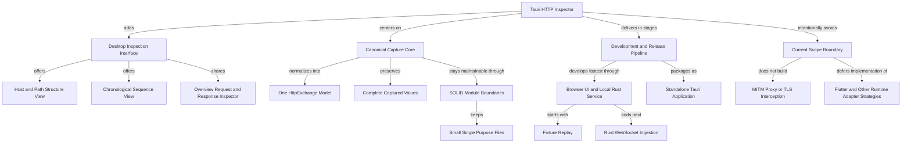
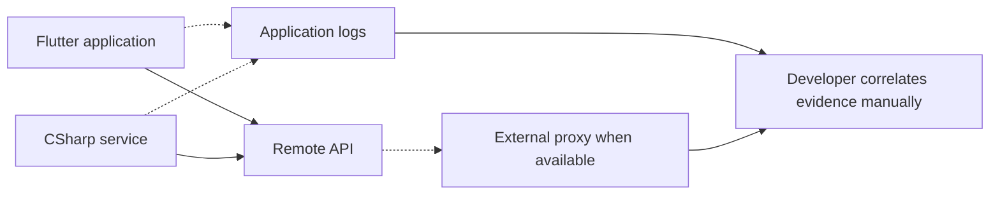
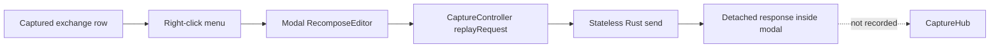
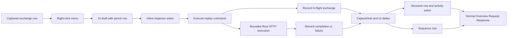

# Tauri HTTP Inspector Implementation Plan

## Objective

Build a desktop HTTP inspection application inspired by the useful information architecture in the supplied Charles screenshots, without building a man-in-the-middle proxy. The application will accept HTTP telemetry emitted by code-level adapters, normalize it into one application-owned `HttpExchange` domain object, and expose two synchronized ways to inspect a capture session:

- `Structure`: a collapsible host and URL-path hierarchy with live activity pulses and aggregate summaries.
- `Sequence`: a chronological, filterable request list with shared request and response details.

The first implementation pass is frontend-first: create the domain contract, fixture-driven capture source, state projections, Structure view, Sequence view, and inspector panes through a browser-hosted Vite development environment. A separately runnable local Rust service becomes the default development backend after the fixture-only UI is usable. The same Rust crates and compiled frontend assets are then embedded into Tauri for native-boundary checks and final standalone packaging. Flutter and other runtime adapters remain deferred; the .NET `IHttpClientFactory` adapter and the first language-neutral reversible integration runner were authorized and implemented as follow-on increments under the portable adapter specification.

## Implementation at a Glance



## Success Definition

The first usable milestone is complete when a developer can launch the Tauri desktop app, replay representative fixture traffic, and:

- Watch new requests appear in both Structure and Sequence views.
- Read the Structure hierarchy at a glance through aligned disclosure triangles, a globe host icon, large blue folder path icons, and consistently indented request leaves.
- See an amber activity pulse fade on the request leaf and its ancestor folders.
- Distinguish in-flight, successful, redirect, client-error, server-error, cancelled, and transport-failed exchanges.
- Select an exchange from either view and inspect Overview, Request, and Response without a separate Metadata tab.
- Inspect ordered headers, authentication values, formatted JSON/XML, original body text, hexadecimal bytes, and a raw/reconstructed HTTP representation when the captured data supports each mode.
- View valid JSON with deterministic two-space indentation, line numbers, folding, bracket matching, and Charles-inspired semantic syntax colors while retaining the untouched original payload.
- Select a host or path group and see aggregate request counts, timing, and size information.
- Filter captures without destroying the underlying session.
- Right-click a captured exchange, create an inline pencil-marked editable draft inside the Structure workspace, edit URL/query/header/authentication/body/raw representations, and use Cancel, Revert, or Execute without opening a modal window.
- See every executed replay enter the same capture session immediately as an in-flight exchange, then update in place to completed or failed in both Structure and Sequence.
- Use the same UI unchanged when the fixture source is later replaced by the Tauri capture source.
- Validate representative domain fixtures against the versioned model; no general UI unit-test suite is introduced in this phase.
- Run the normal development loop in a browser against Vite and a local Rust service, using Tauri development mode only for native-boundary verification.
- Produce installable standalone artifacts whose frontend assets, capture core, WebSocket receiver, and session runtime are contained in the Tauri application rather than requiring a separately hosted service or Node.js runtime.
- Establish the agreed frontend and Rust folder structure before feature work, with enforced dependency directions, small single-purpose modules, and no oversized catch-all files.

## Scope Boundaries

### Included in this plan

- Tauri 2 desktop scaffold for macOS, Windows, and Linux.
- React, TypeScript, and Vite frontend.
- Browser-hosted development mode backed by a separately runnable local Rust capture service.
- Standalone Tauri release bundles: macOS `.app` and `.dmg`, Windows NSIS `-setup.exe` and WiX `.msi`, and Linux `.AppImage` and `.deb`.
- Rust-owned canonical capture contract and generated TypeScript bindings.
- Versioned capture-message protocol definition for future adapters.
- Agent-ready adapter specification covering permanent/manual integration plus reversible temporary pre-run/post-run injection and crash cleanup requirements.
- Language-neutral pre-run/post-run/run/recover/status shell entrypoints with external receipts and a bounded reversible .NET `IHttpClientFactory` strategy.
- Fixture replay source that simulates realistic request lifecycle updates.
- Capture session store and incremental indexes.
- Charles-inspired Structure, Sequence, Overview, Request, Response, and raw-data workflows, with the Request/Response representation selector docked at the bottom of the detail pane.
- Request recomposition and replay: right-click a captured exchange to create a pencil-marked draft row, edit the request in the normal inspector workspace, execute it through the local Rust runtime, and record its full in-flight/terminal lifecycle in the same Structure and Sequence session.
- Search, filtering, selection synchronization, resizeable panes, status indicators, activity animation, empty states, and degraded-data states.
- App-side WebSocket ingestion service and Tauri bridge after frontend acceptance.
- Full-fidelity capture behavior, message limits, bounded queues, and capture limits.
- Contract/model conformity tests plus manual interface verification.
- High-priority SOLID project structure, import-boundary enforcement, circular-dependency detection, and handwritten-file size budgets.

### Explicitly excluded from this plan

- Forward proxying, system proxy configuration, TLS interception, certificate installation, packet capture, or CONNECT tunnelling.
- Charles features such as breakpoints, rewrite, map-local, throttling, bulk repeat/flood tools, charts, and notes. Single edited request execution and recording are explicitly included.
- Flutter/Dio, Dart `HttpClient`, JavaScript/fetch/Axios, Java/JVM, and other platform adapter strategies not explicitly implemented below.
- Any universal best-guess source rewriter. The generic entrypoints dispatch only to installed capability-specific strategies; unsupported or ambiguous projects remain unmodified.
- Same-origin browser relay and HTTP batch ingestion; `websocket-v1` is the only implemented capture transport. Their compatibility profiles are documented but remain deferred until matching inspector endpoints exist.
- Exact byte-for-byte wire capture when an application interceptor cannot observe it.
- Durable session database, import/export, cloud sync, team sharing, or remote collection over the public internet.
- A broad frontend component-test or end-to-end test suite.
- App Store/Microsoft Store publication, release certificates, signing identities, and notarization credentials; bundle configuration remains signing-ready.

### Full-fidelity capture decision

- The inspector performs no redaction, masking, filtering, or value substitution.
- Authorization headers, cookies, API keys, query values, request/response bodies, metadata, and raw representations are preserved and displayed exactly as supplied by the adapter, subject only to explicitly reported capture truncation or unavailability.
- Recompose never invents a missing `User-Agent` or any other application header. A captured header is copied exactly; an exactly captured absence remains absent; transport-owned headers remain explicitly outside the application-level fidelity claim.
- Safe rendering remains mandatory: captured values are treated as untrusted text/bytes and are never executed or interpreted as HTML. Safe rendering changes presentation mechanics, not captured content.
- Full-fidelity handling is unconditional and does not add recording confirmations, disclosure banners, or sensitive-data warnings.

## Code Findings and Gaps

- The repository is currently empty and has no commits, application scaffold, package manifest, Rust crate, source files, tests, or design system.
- There is no existing model to preserve. The domain contract and its versioning rules must therefore be established before UI components or adapter work.
- There is no current capture source. The frontend must not depend directly on WebSocket APIs or Tauri commands; it needs a replaceable `CaptureDataSource` boundary so fixture replay can support the interface-first phase.
- The screenshots show two projections over one session, not two datasets. Structure and Sequence must share entities, filters, and selection state.
- The screenshots contain fields available to a proxy, including DNS, connect, TLS, client address, remote address, and exact raw data. Code-level interceptors may not observe these. The model must represent missing and reconstructed values honestly instead of fabricating them.
- The screenshots show JSON, text, headers, hex, cookies, authentication, JavaScript, and raw modes. The implemented selector provides Headers, Authentication, type-aware structured and original-text modes, Hex, and Raw; JavaScript execution/rendering remains intentionally excluded. Authentication values are derived from the ordered captured headers and displayed unchanged rather than hidden inside the general Headers view.
- The latest screenshot makes JSON presentation a first-class requirement: valid JSON must be prettified and semantically color-coded, with property names/string values, numbers, booleans, `null`, and punctuation visually distinct in both light and dark themes.
- The screenshot labelled Sequence is a chronological grid, not a UML-style sequence diagram. The v1 Sequence view will follow that behavior. Trace-correlated service lanes can be added later because the model will preserve correlation identifiers.
- The previous plan implied Vite development and cross-platform Tauri output but did not explicitly separate the quickest browser/service loop from the final embedded runtime or name the required installer artifacts. This revision makes both paths explicit.
- Because the repository is empty, folder ownership can be established before implementation rather than recovered after features accumulate. The scaffold must define dependency direction, public module surfaces, naming rules, and file-size checks before the first vertical feature slice.

### Baseline Recompose Code Findings — resolved by the 2026-08-15 increment

The findings below record the pre-implementation baseline used to drive Milestone 8. The implementation-tracking evidence and checked TODOs near the bottom of this document are the current authority.

- [RecomposeEditor](/Users/jovi/Documents/ChatGPT/http-inspector/src/features/recompose/RecomposeEditor.tsx:16) is a fixed modal overlay. It keeps method, URL, headers, body, pending state, and the replay response inside one component, so it cannot behave like the Charles editor occupying the normal inspector pane.
- [App](/Users/jovi/Documents/ChatGPT/http-inspector/src/app/App.tsx:30) owns transient context-menu and modal exchange state outside the shared store. There is no draft identity, dirty/revert snapshot, draft selection, or session-reset behavior.
- [createRecomposeDraft](/Users/jovi/Documents/ChatGPT/http-inspector/src/features/recompose/recomposeDraft.ts:10) copies only method, the complete URL, headers, and body. It has no separately editable ordered query rows, protocol preference, stable row IDs, raw-editor synchronization, origin key, or last-execution receipt.
- [CaptureController](/Users/jovi/Documents/ChatGPT/http-inspector/src/data/ports/CaptureController.ts:11) models replay as request-in/response-out. Its response has no generated exchange key because current replay never enters the capture repository.
- [send](/Users/jovi/Documents/ChatGPT/http-inspector/crates/inspector-server/src/replay.rs:46) is stateless: it builds a fresh `reqwest::Client`, sends the request, reads the complete response into memory, and returns a detached response object. It does not publish start/completion/failure lifecycle messages, apply capture limits, or link the execution back to the source exchange.
- [dev_api::replay](/Users/jovi/Documents/ChatGPT/http-inspector/crates/inspector-server/src/dev_api.rs:65) and [replay_request](/Users/jovi/Documents/ChatGPT/http-inspector/src-tauri/src/lib.rs:86) both bypass [CaptureHub](/Users/jovi/Documents/ChatGPT/http-inspector/crates/inspector-core/src/application/capture_hub.rs:44), which is why executed replays never appear in Structure or Sequence.
- [StructureVisibleRow](/Users/jovi/Documents/ChatGPT/http-inspector/src/state/structure/treeSelectors.ts:3) supports only captured groups and exchanges, and [StructureFileIcon](/Users/jovi/Documents/ChatGPT/http-inspector/src/features/structure/StructureTreeIcons.tsx:29) has no pencil draft icon.
- [Inspector](/Users/jovi/Documents/ChatGPT/http-inspector/src/features/inspector/Inspector.tsx:12) can render only captured exchanges or groups; it has no selected-draft branch that can replace Overview/Request/Response with the inline recompose workspace.
- [BrowserCaptureDataSource](/Users/jovi/Documents/ChatGPT/http-inspector/src/data/adapters/browser/BrowserCaptureDataSource.ts:140) and [TauriCaptureDataSource](/Users/jovi/Documents/ChatGPT/http-inspector/src/data/adapters/tauri/TauriCaptureDataSource.ts:91) already translate hub deltas into the same frontend store. Once replay execution is recorded through the hub, both modes can display it without a replay-specific frontend insertion path.

## Requirements Derived From the Screenshots

### Shared session behavior

- One active session owns all exchanges from all attached source instances.
- Structure and Sequence are switchable primary views and preserve their own scroll position, column state, and expansion state.
- Selection is shared: selecting an exchange in either view opens the same inspector state.
- Recording state, connected-source count, rejected-message count, dropped-message count, visible count, and total count remain visible in the application chrome.
- Clear Session is separate from Stop Recording. Clearing requires confirmation only when the session is non-empty.

### Structure view

- Default grouping is `scheme and host -> decoded parent path segments -> endpoint exchange leaves`.
- Requests to the same leaf path remain separate exchange leaves in arrival order; they are not overwritten.
- Query parameters do not create folders because high-cardinality queries would explode the tree. They remain visible in Overview and Request.
- A host or path selection opens a group summary rather than pretending the group is a request.
- Each group summary includes completed, incomplete, HTTP-error, transport-failed, and cancelled counts; first and last activity; minimum, maximum, and mean duration; request bytes; response bytes; and combined bytes.
- In-flight requests use a persistent live indicator. Every new or updated exchange produces a short amber pulse that fades independently of semantic status color.
- Ancestors pulse when a descendant changes so a collapsed branch still shows activity.
- Invalid or relative URLs are retained under an `<invalid-url>` group and show their parse error in Metadata.

### Sequence view

- Default order is stable arrival order, newest at the bottom, with optional newest-first mode.
- Columns are indicator, response code, method, source, host, path, request start, response start, duration, total size, lifecycle status, and info.
- Sortable columns never change the canonical arrival sequence stored on an exchange.
- The list is virtualized and supports keyboard row navigation.
- Selecting a row shows the same detail inspector below the list, matching the screenshots' split layout.
- Filter input supports free text plus structured tokens such as `method:POST`, `status:400-499`, `host:api.example.com`, `source:mobile`, `state:in_flight`, and `duration:>500ms`.
- A Focused toggle limits visible results to the currently selected Structure subtree without changing the global session.

### Detail inspector

- Exchange tabs are Overview, Request, and Response. Source, transport, correlation, capture-fidelity, and failure facts that matter to normal inspection remain in Overview; there is no separate Metadata tab.
- Group selections expose Overview only and clearly label the selected group.
- Request and Response each expose a bottom-docked representation selector. Headers, Authentication, and Raw remain available even when no body was captured. JSON bodies add JSON and JSON Text; XML/SOAP bodies add XML and XML Text; other textual bodies add Text; binary-capable messages retain Hex. Request additionally exposes Query when ordered query parameters are present.
- Resolve body presentation through a content-type-aware viewer registry rather than hard-coding JSON into the inspector shell. JSON and XML are registered non-executing structured-data renderers; unsupported HTML, JavaScript, CSS, and vendor formats remain safely viewable as Text/Raw until a renderer is registered.
- Valid JSON is syntax highlighted and pretty-printed; malformed JSON remains available in the JSON tab as untouched source with best-effort highlighting and parser diagnostics, while Text and Raw remain available.
- Pretty JSON uses deterministic two-space indentation and syntax tokens for property names, string values, numbers, booleans, `null`, and punctuation. It includes line numbers, object/array folding, bracket matching, selection, search, and read-only copy controls.
- `application/json` and any media type ending in `+json` enable JSON mode. A missing/non-JSON media type may also enable it when strict parsing succeeds.
- `application/xml`, `text/xml`, SOAP XML media types, and media types ending in `+xml` enable XML mode. XML is always presented as inert source text with syntax highlighting; it is never rendered as markup or executed.
- A JSON-labelled body that fails strict parsing keeps its JSON tab, displays the untouched source with best-effort syntax highlighting and parser diagnostics, and never auto-repairs or rewrites the payload.
- Copy Original returns the exact captured text. Copy Pretty returns the derived formatted text only when strict parsing succeeds.
- Raw mode displays exact adapter-supplied raw text when available. Otherwise it displays a deterministic reconstruction with a `Reconstructed` badge: a standards-shaped request/status line, every captured header in original order and casing, one CRLF header/body separator, and the captured inline body unchanged when available. A reconstructed request uses the URL's path and query as its request target and derives a Host line only when no captured Host header exists; it never invents unavailable body content.
- Header names retain original casing and duplicate headers retain original order.
- Empty, omitted, truncated, binary, unavailable, and not-yet-received bodies are visually distinct states.
- All captured values, including credentials and cookies, are rendered unchanged through read-only text/byte viewers and never through HTML injection.

## Architecture Decisions

### Selected stack

- Use the current stable Tauri 2 release at implementation time, then pin resolved Rust and npm versions in `Cargo.lock` and `pnpm-lock.yaml`. The [Tauri repository](https://github.com/tauri-apps/tauri) describes the Rust backend and system-webview architecture, and the official scaffold supports React with TypeScript.
- Use React with TypeScript and Vite. Tauri is frontend-agnostic and explicitly supports React templates, while its [Vite guide](https://v2.tauri.app/start/frontend/vite/) documents the expected dev server and `frontendDist` integration.
- Use `pnpm` for frontend dependency management.
- Use Zustand for normalized application state and selector-based subscriptions.
- Use TanStack Virtual for the flattened Structure tree and Sequence rows, and TanStack Table for column definitions, sorting, visibility, and resizing.
- Use CodeMirror 6 with `@codemirror/lang-json` and `@codemirror/lang-xml` in read-only mode for structured viewers so large payloads do not become thousands of individually rendered React nodes. Use `jsonc-parser` for strict validation and edit-based formatting so large numeric lexemes are not coerced through JavaScript numbers.
- Use `react-resizable-panels` for the horizontal Structure layout and vertical Sequence layout.
- Use Radix primitives only where they materially improve accessible tabs, tooltips, menus, and dialogs; do not adopt a large visual component kit.
- Use CSS Modules plus global design tokens. Avoid copying Charles assets or visual styling exactly; reproduce the information hierarchy and interactions with an original desktop design.

### Hosted-first development and standalone release strategy

- Make `pnpm dev` the fastest default loop. It starts Vite on `127.0.0.1:5173` and the Rust development service on `127.0.0.1:53662` concurrently with coordinated shutdown.
- Configure Vite to proxy browser `/api` and `/ws` requests to the Rust development service. The browser sees one origin, so normal development does not require permissive CORS rules.
- The Rust workspace contains reusable `inspector-core` and `inspector-server` crates plus a thin `inspector-dev-server` binary. The development binary exposes capture control/detail HTTP endpoints, a UI-delta WebSocket, and the adapter-ingress WebSocket.
- Use `BrowserCaptureDataSource` for the normal hosted browser loop. It maps the service's HTTP/WebSocket endpoints into the same `CaptureDataSource` interface as fixtures and Tauri.
- Use `pnpm tauri dev` only when verifying native window behavior, Tauri permissions, command/channel wiring, lifecycle shutdown, or packaging-specific behavior. Tauri points at the same Vite dev URL documented by the official [Tauri Vite integration](https://v2.tauri.app/start/frontend/vite/).
- The final Tauri binary links the same `inspector-core` and `inspector-server` crates in process, packages Vite's compiled `dist` assets, and selects `TauriCaptureDataSource`. It does not spawn or require the development-server executable, a Node.js runtime, or a separately installed service.
- The embedded Axum listener remains part of the standalone application because external adapters need an ingress endpoint. Its lifecycle is owned by the Tauri process.
- Configure native targets following Tauri's [distribution tooling](https://v2.tauri.app/distribute/): macOS `.app` and `.dmg`, Windows NSIS `-setup.exe` and WiX `.msi`, and Linux `.AppImage` and `.deb`.
- Build each native artifact on its matching operating system in CI. In particular, generate WiX `.msi` on Windows, macOS bundles on macOS, and Linux packages on the chosen oldest supported Linux baseline.
- A release is standalone when installing/launching the artifact starts the inspector UI, capture core, local session repository, and adapter listener without any manually started companion service.

### Ownership boundaries

- Rust owns authoritative exchange objects, ingestion validation, lifecycle merging, arrival sequence, capture limits, and later persistence.
- `inspector-core` and `inspector-server` own this Rust behavior once; the development service and Tauri host are composition roots, not duplicate implementations.
- React owns view state: selected item, expanded groups, active tab, filters, sort order, column sizes, pane sizes, and transient activity presentation.
- Generated TypeScript contract files mirror Rust types and are never edited by hand.
- Structure nodes, Sequence rows, group aggregates, and formatted raw/JSON views are projections. They are not alternative authoritative request models.
- The frontend receives small `CaptureUiDelta` batches containing summaries and invalidation information. It fetches the selected full `HttpExchange` and body chunks on demand.

### Project structure and SOLID guardrails

- Use a hybrid structure: organize user-facing React code by feature, keep cross-feature application/data ports in explicit top-level folders, and keep reusable visual primitives separate from domain behavior. Do not create a flat `components` or `services` dumping ground.
- Enforce this frontend dependency direction: `app -> features -> state/application ports -> domain/generated contracts`. Infrastructure adapters under `data` implement ports and may depend on generated contracts, but domain/presentation logic must not import React, Zustand, browser APIs, or Tauri APIs.
- Compose dependencies once in `src/app/bootstrap.ts`: select fixture, browser, or Tauri adapters there and inject the composed `CaptureDataSource`. Feature components and stores never branch on runtime platform.
- Apply Interface Segregation by defining `CaptureReader`, `CaptureSubscription`, and `CaptureController` capabilities, then composing them into `CaptureDataSource`. Consumers accept only the capability they use.
- Apply Open/Closed design at actual extension seams: capture transports implement the data-source ports, body viewers register through `BodyRenderer`, and status/filter formatting uses typed registries. Adding an adapter or renderer must not require editing unrelated feature components.
- Apply Liskov Substitution through shared contract fixtures: Fixture, Browser, and Tauri data sources must expose the same ordering, error, cancellation, paging, and reset semantics.
- Apply Single Responsibility to files and modules: components render one interaction area, hooks coordinate one behavior, reducers perform state transitions, selectors derive state, ports define contracts, and adapters perform I/O. A file must not combine transport, domain normalization, store mutation, and rendering.
- Keep Rust dependency direction equally strict: `inspector-core` has no Axum, Tauri, or UI dependencies; `inspector-server` depends on `inspector-core`; the development binary and Tauri host are composition roots. Domain modules contain types/invariants, application modules contain use cases/state, and transport modules translate external messages.
- Avoid generic files or folders named `utils`, `helpers`, `common`, `misc`, or `manager`. Name modules after the responsibility they own, such as `formatByteCount`, `captureDeltaReducer`, or `listenerLifecycle`.
- Keep `index.ts` and Rust `mod.rs` files as narrow public export surfaces with no business logic. Cross-feature imports use the owning feature's public API; imports into another feature's internal folders fail the architecture check.
- Treat file length as a design signal, not a formatting target. React components/hooks should normally stay at or below 200 handwritten lines, TypeScript state/adapters and Rust modules at or below 300, and no handwritten source file may exceed 400 lines without a documented temporary exception and an immediate split TODO. Generated contracts, lockfiles, schemas, and fixture data are excluded.
- Keep functions focused and generally below 50 lines. Extract only when the extracted unit has a clear responsibility or reusable contract; do not create one-line abstraction layers solely to satisfy a metric.
- Add a deterministic `check:architecture` command that composes ESLint restricted imports, dependency-cruiser cycle/public-boundary rules, a handwritten-file budget/naming check, and a Cargo dependency check. Run it locally and in CI before build/package jobs.
- Do not introduce abstractions speculatively. A shared component is promoted only after a second real use or when it represents a deliberate application-wide contract such as status language, body rendering, or capture data access.

### Why WebSocket ingestion belongs in Rust

- The monitored Flutter or C# application needs to connect to the desktop application, making the inspector a WebSocket server rather than a WebSocket client.
- Tauri's WebSocket plugin opens client connections from JavaScript; it does not provide the listener needed here. The official [WebSocket plugin documentation](https://v2.tauri.app/plugin/websocket/) confirms that client role.
- The embedded listener should therefore be an Axum WebSocket route hosted by the Rust process. Axum exposes message and frame size controls through [`WebSocketUpgrade`](https://docs.rs/axum/latest/axum/extract/ws/struct.WebSocketUpgrade.html).
- The webview will never open the adapter WebSocket directly. This avoids CSP expansion, keeps protocol validation out of browser code, and creates one controlled ingress path.

### Tauri IPC strategy

- Use Tauri commands for request/response actions such as `get_capture_status`, `subscribe_capture`, `get_exchange`, `get_body_chunk`, `start_recording`, `stop_recording`, and `clear_session`.
- Use a Tauri `Channel<CaptureUiEvent>` returned through `subscribe_capture` for ordered, batched live updates. The official [Rust-to-frontend guide](https://v2.tauri.app/develop/calling-frontend/) states that global events are not intended for low-latency or high-throughput data and that channels are ordered and optimized for streaming.
- Do not emit one global Tauri event for every HTTP lifecycle message.
- Do not include large bodies in hot-path channel events. Tauri's [command documentation](https://v2.tauri.app/develop/calling-rust/) notes the serialization cost for large JSON values and provides binary response support; body reads should use paged text or byte responses.
- Mirror these operations through development-only HTTP/UI-WebSocket routes in `inspector-server`; keep route-to-core adapters thin so browser and Tauri modes execute the same domain behavior.

## Before

Today there is no application or shared capture model. A developer can use an external proxy or scattered logs, but code-integrated request activity is not assembled into a synchronized inspection session.



## After

Adapters report versioned lifecycle messages. The shared Rust core validates, normalizes, and merges those messages into canonical exchanges. Browser development reaches that core through development-only HTTP/WebSocket routes; the standalone Tauri application reaches the same core through commands and an ordered channel.

```mermaid
flowchart LR
    subgraph monitoredApps [Monitored applications]
        flutterApp[Flutter application]
        csharpApp[CSharp service]
        futureApp[Future platform]
    end

    flutterApp --> flutterAdapter[Flutter adapter]
    csharpApp --> csharpAdapter[CSharp adapter]
    futureApp --> customAdapter[Custom adapter]

    flutterAdapter -->|"WebSocket capture messages"| ingress[Axum ingress]
    csharpAdapter -->|"WebSocket capture messages"| ingress
    customAdapter -->|"WebSocket capture messages"| ingress

    ingress --> validator[Protocol and invariant validation]
    validator --> merger[Lifecycle merger]
    merger --> hub[Rust capture hub]
    hub --> repository[Bounded session repository]
    hub -->|"Hosted development"| devApi[HTTP and UI WebSocket]
    hub -->|"Standalone application"| channel[Tauri command and channel]
    devApi --> browserSource[Browser data source]
    channel --> tauriSource[Tauri data source]
    browserSource --> uiStore[Normalized React store]
    tauriSource --> uiStore

    uiStore --> structure[Structure projection]
    uiStore --> sequence[Sequence projection]
    structure --> selection[Shared selection]
    sequence --> selection
    selection -->|"Get selected exchange"| activeSource[Active data source]
    activeSource --> repository
    repository --> inspector[Overview and payload inspector]
```



## Canonical Domain Model

### Source of truth

- Define the canonical model as Rust structs in `crates/inspector-core/src/domain/` so hosted development and Tauri packaging use the same implementation.
- Derive Serde serialization, JSON Schema generation, and TypeScript bindings from the same structs.
- Generate and commit `contracts/http-inspector.v1.schema.json` for adapter authors and `src/generated/contracts.ts` for the UI.
- Add a deterministic `generate-contracts` binary and `pnpm contracts:generate` command. Generated output must be reproducible and reviewed like code.
- Use camelCase JSON names, RFC 3339 UTC timestamps, UUID strings, finite non-negative millisecond durations, and byte counts represented as non-negative integers.
- Reserve `schemaVersion.major` for breaking changes and `schemaVersion.minor` for additive compatible fields.

### Core `HttpExchange` shape

The exact syntax can follow Rust conventions, but the generated TypeScript contract should be equivalent to this proposed shape:

```typescript
type HttpExchange = {
  schemaVersion: { major: 1; minor: number };
  id: string;
  sessionId: string;
  revision: number;
  arrivalSequence: number;
  source: CaptureSource;
  correlation?: CorrelationContext;
  lifecycle: ExchangeLifecycle;
  request: HttpRequest;
  response?: HttpResponse;
  timing: ExchangeTiming;
  sizes: ExchangeSizes;
  transport?: TransportDetails;
  failure?: ExchangeFailure;
  capture: CaptureFidelity;
  tags: string[];
  metadata: Record<string, JsonValue>;
};
```

### Required identity and lifecycle fields

- `id`: adapter-generated exchange UUID. The repository key is the pair of `source.instanceId` and `id`, preventing collisions between processes.
- `sessionId`: assigned by the inspector when the message is accepted; adapters do not choose it.
- `revision`: monotonically increases for every accepted mutation of the exchange.
- `arrivalSequence`: monotonically increases inside the inspector session and provides a stable tie-breaker independent of source clock skew.
- `lifecycle.state`: `inFlight`, `completed`, `failed`, `cancelled`, or `incomplete`.
- `lifecycle.startedAt`: source-reported RFC 3339 UTC timestamp.
- `lifecycle.receivedAt`: inspector timestamp for the first accepted event.
- `lifecycle.lastUpdatedAt`: inspector timestamp for the latest accepted revision.
- HTTP 4xx and 5xx responses are `completed`, not `failed`. `failed` is reserved for transport, serialization, interceptor, or connection failures that prevented a complete HTTP response.
- `incomplete` is assigned by the inspector when a source disconnects, capture stops, or a timeout expires before a terminal event arrives.

### `CaptureSource`

- `instanceId`: regenerated whenever the monitored process starts.
- `applicationName`: human-readable app/service name.
- `serviceName`: stable logical service identifier.
- `platform`: controlled string such as `flutter`, `dotnet`, `node`, or `custom`.
- `adapterName`, `adapterVersion`, and `protocolVersion`.
- Optional `environment`, `deviceName`, `processId`, `buildVersion`, and `baseUrl`.
- Arbitrary platform-specific data belongs in namespaced source metadata, for example `flutter.isolate` or `dotnet.activitySource`.

### `HttpRequest`

- `method`: normalized uppercase for display while preserving `originalMethod` when an adapter reports unusual casing.
- `url`: original logical URL string.
- Parsed `scheme`, `host`, optional `port`, `path`, ordered `pathSegments`, fragment, and ordered query entries.
- `protocol`: optional `HTTP/1.1`, `HTTP/2`, `HTTP/3`, or adapter-specific value.
- `headers`: ordered `HeaderEntry[]`; never use a string map because duplicate headers and original casing matter.
- `body`: optional `HttpBody` descriptor.
- Optional `remoteAddress` and `localAddress`, explicitly marked with provenance.

### `HttpResponse`

- `statusCode`: integer when a response exists.
- `reasonPhrase`: optional because HTTP/2 and HTTP/3 do not require one.
- `protocol`, ordered headers, and optional body descriptor.
- Redirect details remain normal response data; adapters may create separate exchanges for followed redirects and connect them through correlation metadata.

### `HttpBody`

- `availability`: `notApplicable`, `pending`, `captured`, `empty`, `omitted`, `truncated`, or `unavailable`.
- `mediaType`, `charset`, `contentEncoding`, `declaredByteLength`, `observedByteLength`, `capturedByteLength`, and optional SHA-256.
- `content`: discriminated storage value of `inlineText`, `inlineBase64`, or `attachmentRef`.
- `attachmentRef` is an inspector-owned opaque identifier, never a filesystem path exposed to the webview.
- `truncationReason` explains why content is incomplete.
- JSON is derived from text on demand and is not stored as a second authoritative body.
- Exact wire compression, transfer framing, and encrypted bytes are not implied by a code-level capture.

### Headers, query values, and metadata

- `HeaderEntry` contains `name`, `value`, and optional provenance. It retains duplicates and order, and its value is never masked by the inspector.
- `QueryEntry` contains `name`, optional `value`, and optional provenance. It also retains duplicates and order, and its value is never masked by the inspector.
- `metadata` accepts JSON-safe scalar, array, and object values only, with a maximum nesting depth, key count, string length, and total serialized size.
- Promote stable, broadly useful HTTP fields into typed properties. Use `metadata` only for adapter- or application-specific extensions.
- Encourage namespaced metadata keys to avoid collisions, such as `flutter.dio.extra`, `dotnet.activity.tags`, and `application.userAction`.

### Timing and size semantics

- Use source-reported wall time only for the starting timestamp.
- Store request and response phases as offsets from start where available: request headers sent, request body finished, response headers received, response body finished, and exchange ended.
- Store optional DNS, connect, TLS, queue, request-write, server-wait, response-read, and total durations with a provenance of `measured`, `adapterReported`, `derived`, or `unavailable`.
- Never infer DNS, connect, TLS, or remote address data from the URL.
- `ExchangeSizes` separates request headers, request body, response headers, response body, and total. Each value includes logical/wire provenance where needed.
- Group aggregates ignore unavailable values instead of treating them as zero.

### Correlation

- Preserve optional `traceId`, `spanId`, `parentSpanId`, `operationId`, and `parentExchangeId`.
- Keep correlation in the model now even though v1 only displays it in Metadata and filters.
- Future service-lane visualization can use these fields without changing the capture contract.
- Do not claim precise cross-process ordering from wall clocks alone; `arrivalSequence` remains the stable inspector ordering.

### Capture fidelity

- `CaptureFidelity` records whether headers, body, timing, sizes, and raw representations are `exact`, `adapterReported`, `reconstructed`, `truncated`, or `unavailable`.
- Overview and Raw must surface this status with concise badges and tooltips.
- A raw request reconstructed from method, URL, headers, and body must be labelled `Reconstructed`; it must never be presented as byte-for-byte network traffic.

## Adapter-to-Inspector Wire Protocol

The adapter protocol is specified now so the UI model does not need to be redesigned later, but no platform adapter is implemented in this plan.

### Connection and handshake

- Primary endpoint: `ws://<inspector-host>:<port>/v1/capture`.
- The Rust listener binds to `127.0.0.1:53662` by default and reports the selected endpoint to the UI; developers may explicitly override the port through listener controls or `HTTP_INSPECTOR_PORT` during hosted development.
- An Enable LAN Capture setting may bind to a selected interface for simulators or physical devices without adding warning banners or confirmation dialogs.
- The listener is open to local-development adapters and does not authenticate them.
- The first client message must be `hello` within three seconds and include the supported protocol range and `CaptureSource` information. No capture event is processed before acceptance.
- The server responds with `hello.accepted` containing the negotiated protocol, assigned connection ID, active session ID, maximum text-message size, and maximum body capture size.
- Incompatible major versions or malformed hello messages close with a protocol error and increment a visible rejected-connection counter.

### Lifecycle messages

- `exchange.started`: full request, start timestamp, initial timing, tags, correlation, and metadata.
- `exchange.completed`: response, final timing, sizes, capture fidelity, and optional metadata patch.
- `exchange.failed`: typed failure, final timing, sizes known so far, and optional partial response.
- `exchange.cancelled`: cancellation origin and final timing.
- `exchange.snapshot`: complete current `HttpExchange` used for reconnect recovery or adapters that cannot emit phases.
- `heartbeat`: liveness and adapter queue/drop counters; it does not create an exchange.
- Every message contains `messageId`, `exchangeId`, `sourceInstanceId`, `revision`, `sentAt`, and protocol version.

### Idempotency and ordering

- Deduplicate by `messageId` within a bounded recent-message window.
- Accept a terminal event when the start event was missed by constructing an exchange with explicit missing request fields and `capture` warnings.
- Ignore stale revisions while recording a diagnostic counter.
- A late start may fill missing fields on an already-terminal snapshot but may never regress the lifecycle state.
- Repeated terminal messages with the same or older revision are no-ops.
- When a source disconnects, wait for a short grace period and then mark its remaining in-flight exchanges `incomplete`; a reconnect snapshot can resolve them later.

### Limits and backpressure

- Accept text JSON frames only in v1; reserve binary frames for a future body-upload extension.
- Configure a four MiB maximum WebSocket message and a one MiB default captured-body limit per request or response side.
- Reject structurally invalid messages with a machine-readable error response and a safe UI diagnostic; never panic or terminate capture.
- Feed accepted messages into a bounded Tokio queue. When saturated, stop accepting capture payloads, report overload, and close the source with a retryable code rather than growing memory without limit.
- Batch UI summary updates for at most one animation frame or 200 deltas, whichever comes first.
- Track adapter-reported and inspector-dropped counts visibly so missing telemetry is never silent.

## Frontend Data Source Boundary

Define one application-facing interface with three implementations:

```typescript
interface CaptureDataSource {
  getStatus(): Promise<CaptureStatus>;
  subscribe(onBatch: (batch: CaptureUiDelta[]) => void): Promise<Unsubscribe>;
  getExchange(key: ExchangeKey): Promise<HttpExchange | null>;
  getBodyChunk(request: BodyChunkRequest): Promise<BodyChunk>;
  startRecording(): Promise<void>;
  stopRecording(): Promise<void>;
  clearSession(): Promise<void>;
}
```

- `FixtureCaptureDataSource` is implemented first. It replays valid domain fixtures at configurable speed and emits start/completion/failure transitions through the same callback shape as production.
- `BrowserCaptureDataSource` becomes the normal development implementation after the local Rust service exists. It maps proxied HTTP control/detail operations and the UI-delta WebSocket to the same interface.
- `TauriCaptureDataSource` maps embedded Tauri commands and the ordered channel to the same interface for native development and packaged applications.
- Select the source explicitly through dependency injection in application bootstrap. Do not scatter `isTauri` checks through components.
- Components and Zustand actions depend only on `CaptureDataSource` and generated contracts.

## Frontend State and Projections

### Normalized store

- `exchangeSummariesByKey`: lightweight summary entities only.
- `arrivalOrder`: stable exchange keys ordered by `arrivalSequence`.
- `selectedExchangeKey` and `selectedTreeNodeId`: mutually consistent selection state.
- `selectedExchangeDetail`: one full object plus loading/error/revision state.
- `treeNodesById`, `treeRootIds`, and `exchangeToTreePath`: incremental Structure index.
- `groupAggregatesByNodeId`: incremental counts, timing, and sizes.
- `expandedNodeIds`, `activePrimaryView`, `detailTab`, `payloadModeBySide`, filter AST, sort descriptors, focused subtree, and pane sizes.
- `activityRevisionByNodeId`: integer used to restart CSS pulse animation without storing per-frame opacity.
- `captureStatus`: recording, listener endpoints, source connections, rejected count, dropped count, total count, visible count, and retention warnings.

### Delta reduction

- Apply each batch in one Zustand transaction.
- Insert new summaries into entity and arrival indexes.
- On updates, subtract the previous summary's aggregate contribution and add the new contribution along its stable tree path.
- If URL grouping fields change between revisions, remove the exchange from the old tree path and insert it into the new one.
- Increment activity revisions for the leaf and every ancestor affected by the delta.
- Recompute only the filtered visible key list when filter inputs or relevant summary fields change.
- If the selected exchange revision changes, refresh its detail lazily without clearing the current viewer and scroll position.
- If retention evicts the selected exchange, show an explicit Evicted state and clear selection only after acknowledgement or a new selection.

### Structure projection rules

- Parse URLs in Rust and carry normalized grouping fields in the summary; do not rely on inconsistent browser URL parsing for untrusted inputs.
- Stable node IDs are derived from source-independent scheme, normalized host/port, and exact decoded path prefix. Escape separators before concatenation.
- Preserve the original URL for display and raw reconstruction.
- Use one node for `/` and one `<invalid-url>` root for parse failures.
- Do not template numeric/UUID path segments in v1. Endpoint templating is a later optional grouping mode.
- Flatten only expanded visible nodes before passing them to the virtualizer.
- Retain expansion state when filtering; filtered results temporarily expose matching ancestor paths without mutating the saved expansion set.

### Sequence projection rules

- Use lightweight summary fields only.
- Keep sort and filter computations memoized by summary revision and filter AST.
- Status-code ranges, methods, lifecycle, host, source, duration, and free text operate on normalized summary fields.
- Free text searches method, URL, host, path, source name, status, and info text; it does not scan full request/response bodies in v1.
- Keep the currently selected row mounted or restore its selection after resorting/filtering when it remains visible.

## UI Information Architecture

### Application chrome

- Top toolbar: recording toggle, active-session title, clear action, fixture/live source selector in development builds, search/filter affordance, connected-source count, listener status, and settings.
- Bottom status bar: recording state, selected endpoint, total/visible exchange counts, dropped/rejected diagnostics, and retention warning.
- Use native-feeling keyboard shortcuts: Space or a configurable shortcut for recording, Command/Ctrl+K for filter focus, Command/Ctrl+Backspace for clear with confirmation, and Command/Ctrl+1 or 2 for Structure/Sequence.
- Avoid icon-only controls without labels or tooltips.

### Structure layout

- Horizontal resizeable split: tree on the left, detail region on the right.
- Primary segmented control above the content switches Structure and Sequence.
- Tree row contents: expander, group/HTTP status icon, label, optional count, source badge when useful, and activity pulse layer.
- Detail region keeps the tab strip pinned while content scrolls.
- A group Overview uses collapsible key/value sections analogous to the screenshots: Identity, Requests, Timing, Size, Sources, and Capture Diagnostics.

### Sequence layout

- Vertical resizeable split: virtualized grid on top, shared detail inspector below.
- Sticky column headers and an always-visible filter bar.
- Horizontal scrolling for narrow windows; do not compress path or info columns into unreadable widths.
- Column preferences persist locally, but session data does not in v1.
- Auto-follow remains enabled only when the user is already at the live edge. Manual scrolling disables auto-follow until the user clicks Resume Live.

### Detail layout

- Overview uses semantic property lists with collapsible Timing, Size, Transport, Source, Correlation, Capture Fidelity, and Failure sections.
- Request and Response show a compact start/status line and a secondary mode selector docked at the bottom of the available detail height.
- Headers viewer uses a virtualized two-column list and includes Copy Name, Copy Value, and Copy All actions over the original captured values.
- Authentication viewer filters the same ordered captured-header collection to authentication/session headers and retains the original casing, ordering, and values without parsing, masking, or normalization.
- Request Query uses a separate ordered Name/Value table; it is not rendered as JSON and does not change Structure grouping or endpoint labels.
- Recompose is available from the native right-click menu on a request in either Structure or Sequence. It creates a separate UI-owned draft copied from the selected exchange; it never mutates the stored exchange and never filters headers through an allowlist.
- The draft appears under the same Structure endpoint as a selected pencil-marked row. Selecting it replaces the normal Overview/Request/Response inspector with the editor; no backdrop, modal, or detached replay-response panel is used.
- Recompose/replay uses a narrow `CaptureController` operation implemented by Browser and Tauri adapters. The Rust runtime sends the application-level request rather than the browser, preserving every observable captured header—including an existing `User-Agent`, host when supported, cookies, authorization, content, accept, SOAP action, tracing, API-key, arbitrary custom, and duplicate headers—plus locally available body content. It never fabricates a missing `User-Agent`.
- Execute records the replay through the canonical capture hub. The new exchange is published as in-flight before network I/O, appears in both Structure and Sequence, and receives a completion or failure revision through the same delta pipeline used by adapters. Execute never removes, closes, replaces, or resets the editable pencil draft; its current values remain available under the source endpoint for another iteration until the developer explicitly chooses Cancel or the capture session is cleared.
- Captured Request/Response JSON/XML documents remain read-only. Inside the Recompose draft only, Text and Raw are large editable multiline text fields, while JSON and XML/SOAP are large editable CodeMirror documents with syntax highlighting and diagnostics. All draft body modes edit the same underlying value. Hex remains a read-only virtualized byte-offset, hex, and ASCII representation.
- `MessageInspector` asks a MIME-aware body-viewer registry which optional views are available. A renderer declares detection, language support, formatting capability, diagnostics, and copy behavior; it receives immutable captured content and cannot execute or render it as active HTML/script.
- Body toolbar shows media type, charset, captured/declared sizes, truncation state, fidelity, copy action, and load-next-chunk action when content is paged.
- Metadata uses a safe recursive JSON viewer with depth limits and copy support; it never executes scripts or turns arbitrary strings into clickable HTML.

### Inline Recompose Workspace Contract

- Right-clicking a captured request and choosing Recompose creates a session-scoped draft with its own UUID, immutable original snapshot, editable working snapshot, source exchange key, and selected bottom mode. Drafts are frontend state, not `HttpExchange` records, and therefore never appear in Sequence, counts, aggregates, filters, or retention.
- A draft is projected into Structure only under the source exchange's current endpoint leaf. It uses a dedicated pencil icon, the same endpoint label as the source request, normal tree indentation, keyboard selection, and `aria-label` text identifying it as an editable replay draft.
- The first increment supports one active draft. Recompose on another exchange replaces only a pristine draft; if the current draft is dirty or has been executed, the existing draft remains selected until Cancel or Revert. Execute never removes or resets the draft and must not permit silent replacement. This keeps the interaction deterministic without introducing a tab manager.
- Selecting the draft renders the editor in the normal inspector panel. Switching Structure/Sequence does not discard it; returning to Structure shows the pencil row again. A capture-session reset closes the draft because its origin belongs to the cleared session.
- The top request bar contains an HTTP method control, URL-without-query field, and protocol preference. Method supports common methods plus a custom token. Protocol offers Auto, HTTP/1.1, and HTTP/2; the runtime reports the actual response protocol and never labels a negotiated protocol as forced when the transport cannot guarantee it.
- The bottom mode selector remains docked and contains URL, Headers, Authentication, content-aware Body views, and Raw. JavaScript execution is not added. JSON and XML receive editable syntax highlighting, but no automatic formatting rewrites the body merely because a tab was opened.
- URL mode displays ordered query rows separately from the URL field. Add appends a blank row, Remove deletes the selected row, duplicate names retain order, and absent values remain distinct from empty values. Untouched rows retain their original percent-encoded spelling; an edited/new component is percent-encoded exactly once when the final URL is assembled.
- Headers mode edits one ordered row collection with stable row IDs. Add/Remove operate on the selected row; duplicate names, original casing, values, and order are preserved. Empty names block Execute with a row-specific validation message rather than being silently dropped.
- Authentication mode is a filtered projection over that same header collection. Editing `Authorization`, `Cookie`, proxy-authentication, or API-key/session entries updates the corresponding header row by ID; it never stores a second token value that can diverge from Headers.
- Text and JSON Text/XML Text render as a full-height monospace multiline text field with normal selection, typing, paste, undo/redo, and scrolling. JSON and XML/SOAP render as full-height editable CodeMirror documents with syntax highlighting and parse diagnostics. These modes all edit one shared body value; switching modes must preserve unsaved typing and must not parse into an object, reorder properties/elements, normalize whitespace, resolve XML entities, or alter the payload.
- Raw mode is a full-height editable monospace text editor containing the complete request start line, ordered headers, blank-line separator, and body. Structured fields remain canonical until the user enters Raw edit mode; applying Raw parses it transactionally into method, target, protocol preference, headers, and body. Invalid Raw syntax leaves the previous structured draft untouched and blocks Execute with a line-specific error while preserving the raw text for correction.
- Revert restores method, base URL, query rows, protocol, headers, body, raw state, active mode, and validation to the immutable snapshot copied at draft creation. Cancel removes the draft and returns selection to the original exchange without executing it.
- Execute validates the complete draft, disables duplicate submits only while scheduling the replay, and returns a generated exchange key. The editor and pencil row stay open with every current edit after scheduling, completion, or failure; selecting the recorded exchange and returning to the draft restores the same editor state. The draft shows a compact latest-execution link/status while each real request remains independently inspectable from its recorded Structure/Sequence row.
- A captured request body that is unavailable, omitted, or truncated is not silently replayed as complete. Execute remains blocked until the user supplies or explicitly clears the body; once changed, the execution is marked as edited rather than exact.
- If the listener/runtime is stopped, Execute is disabled with an actionable start-listener state because there is no active capture hub in which to record the replay. Browser development and Tauri use the same execution service and lifecycle semantics.
- Header fidelity follows the agreed rule: copy a captured `User-Agent` exactly; when exact request-header capture contains no `User-Agent`, leave it absent; when header fidelity is partial/unavailable, do not synthesize one. Protocol-owned/refused headers are reported by exact name and reason.

### Inline Recompose Flow — Before



### Inline Recompose Flow — After



### JSON Pretty presentation contract

- Treat `application/json` and all `application/*+json` media types as JSON candidates. When the media type is absent or different, enable JSON mode only if strict validation succeeds.
- Validate without coercing values. Use `jsonc-parser` with comments and trailing commas disabled so large integer lexemes, exponent notation, escape sequences, key order, and duplicate-key text are not rewritten through JavaScript's numeric/object semantics.
- Produce Pretty JSON through edit-based whitespace formatting with two spaces per nesting level, LF display line endings, one property/array item per formatted line where appropriate, and a final newline only in the derived editor document.
- Keep original captured text immutable. Text and Raw always show the original; Copy Original copies it byte-for-byte at the captured-text level, while Copy Pretty is available only for a successfully validated formatted document.
- Use CodeMirror's JSON parser for highlighting, bracket matching, search, selection, line numbers, and fold gutters. The editor is read-only and does not expose auto-completion or mutation commands.
- Define named theme tokens rather than hardcoded component colors. Every application, panel, table, toolbar, mode selector, raw/text/hex viewer, CodeMirror editor/gutter, form control, diagnostic, and overlay surface consumes those tokens so explicit Light, explicit Dark, and System cannot mix palettes in Safari/WebKit. Declare the matching CSS `color-scheme` for native controls. In the Charles-inspired light theme, property names and string values use warm orange, numbers use olive, booleans use blue, `null` uses violet, and braces/brackets/commas/colons use neutral foreground. Dark theme uses contrast-adjusted equivalents with the same semantic mapping.
- Keep selection background, current match, parser diagnostic, and active bracket colors separate from JSON token colors. Every token must meet the chosen theme's readable contrast target.
- When a JSON-labelled payload is invalid, retain the JSON tab, show original text with best-effort coloring and inline parser diagnostics, disable Copy Pretty, and leave Text/Raw available. Never auto-correct commas, quotes, escapes, or braces.
- Format lazily on first JSON-tab activation and cache by exchange key, side, body revision, and chunk identity.
- For captured text above 256 KiB, run strict validation and formatting in `jsonFormat.worker.ts`; show the original text immediately with a Formatting indicator and replace only the derived Pretty document when the worker completes.
- Preserve the current editor scroll position, selection, folded ranges, and search query when the selected exchange receives a metadata-only revision. Reset them only when the body revision changes.

### XML and SOAP presentation contract

- Treat `application/xml`, `text/xml`, SOAP XML content types, and `application/*+xml` as XML candidates. XML selection depends on the content type and never guesses from arbitrary text.
- Present XML and SOAP envelopes as an immutable CodeMirror document with line numbers, folding, bracket matching, search, and semantic colors for element names, attribute names, quoted values, comments, and syntax punctuation.
- Do not pretty-print, canonicalize, parse into an object, render markup, resolve entities, or execute embedded content. Copy Original and Recompose always retain the supplied XML text exactly.
- Recompose uses the existing body transport unchanged for XML: the captured `Content-Type`, SOAP action, ordered headers, complete URL, and XML body are copied into the editor and sent by the local Rust runtime without browser header restrictions.

### Activity animation

- Amber means recent activity only; it is not an HTTP status color.
- On insertion/update, bump `activityRevision` for the leaf and ancestors and key a pseudo-element animation from quick fade-in to a two-second fade-out.
- A new update during the fade restarts the animation.
- In-flight state retains a small non-flashing progress dot after the pulse finishes.
- Respect `prefers-reduced-motion` by replacing the fade with a brief static highlight.
- Do not use JavaScript timers to update opacity every frame.

### Status language

- In-flight: neutral blue progress indicator.
- 2xx: success indicator.
- 3xx: redirect indicator.
- 4xx: amber warning indicator.
- 5xx: red server-error indicator.
- Transport failure/cancelled: distinct red or neutral failure icon plus text; never encode meaning with color alone.
- Unknown status: neutral document icon.

## Target Areas

All paths below are proposed because the repository is empty.

### Proposed folder structure

```text
http-inspector/
├── src/
│   ├── app/                         # bootstrap, dependency composition, shell
│   ├── domain/                      # pure UI-side presentation rules
│   │   ├── body-presentation/
│   │   ├── display/
│   │   └── raw-representation/
│   ├── data/
│   │   ├── ports/                   # capability interfaces used by state/features
│   │   └── adapters/
│   │       ├── fixture/
│   │       ├── browser/
│   │       └── tauri/
│   ├── state/
│   │   ├── capture/                 # store composition, entity slices, delta reducer
│   │   ├── structure/               # hierarchy index and aggregate selectors
│   │   └── sequence/                # filtering, ordering, and live-edge selectors
│   ├── features/
│   │   ├── capture/
│   │   ├── structure/
│   │   ├── sequence/
│   │   └── inspector/
│   │       ├── overview/
│   │       ├── headers/
│   │       ├── body/
│   │       └── metadata/
│   ├── components/ui/               # genuinely shared visual primitives only
│   ├── generated/                   # generated contract; never hand edited
│   ├── workers/
│   └── styles/
├── crates/
│   ├── inspector-core/
│   │   └── src/{domain,application}/
│   └── inspector-server/
│       └── src/{ingress,dev_api}/
├── src-tauri/src/{commands,runtime}/ # native composition root
├── contracts/
├── fixtures/captures/
└── scripts/                          # architecture and contract checks
```

- Folder comments above describe ownership, not literal README text that must be copied into the scaffold.
- Each feature exposes only its supported entry points through a narrow `index.ts`; internal components, hooks, and view models remain private to the feature.
- Co-locate a component's CSS Module and feature-specific types with that component. Keep only global tokens/reset/editor themes under `src/styles`.

### Project and tooling

- `package.json`: `dev`, `dev:ui`, `dev:service`, Tauri, build, bundle, contract generation/check commands, and pinned dependencies.
- `eslint.config.js` and `.dependency-cruiser.cjs`: correctness, frontend dependency direction, private cross-feature import, and cycle enforcement.
- `scripts/check-file-budgets.mjs`: handwritten TypeScript/React/Rust line ceilings, forbidden dumping-ground names, explicit exclusions, and temporary-exception expiry checks.
- `scripts/check-rust-boundaries.mjs`: Cargo metadata verification that core, server, development binary, and Tauri host retain the allowed dependency direction.
- `docs/architecture.md`: short source-controlled ownership map, dependency direction, extension seams, file budgets, and exception process kept consistent with the scaffold.
- `pnpm-lock.yaml`: deterministic frontend dependency graph.
- `tsconfig.json`, `tsconfig.app.json`, and `vite.config.ts`: strict TypeScript, fixed Vite port, local Rust-service proxy, and Tauri-compatible build settings.
- `index.html` and `src/main.tsx`: minimal local-only application bootstrap.
- `Cargo.toml` and `Cargo.lock`: Rust workspace containing the reusable core/server crates, development-service binary, and Tauri host.
- `src-tauri/Cargo.toml`: thin Tauri host dependencies on the shared Rust crates.
- `src-tauri/tauri.conf.json`: product identifier, window defaults, Vite dev/build hooks, CSP, embedded frontend assets, and per-platform bundle targets.
- `src-tauri/capabilities/main.json` and `src-tauri/permissions/capture.toml`: least-privilege frontend command access.

### Canonical contracts and fixtures

- `crates/inspector-core/src/domain/mod.rs`: domain exports and common validation entry points.
- `crates/inspector-core/src/domain/http_exchange.rs`: canonical `HttpExchange` and nested HTTP types.
- `crates/inspector-core/src/domain/capture_message.rs`: handshake and lifecycle protocol messages.
- `crates/inspector-core/src/domain/validation.rs`: invariants, limits, normalization, and safe error types.
- `crates/inspector-core/src/bin/generate_contracts.rs`: deterministic JSON Schema and TypeScript export.
- `contracts/http-inspector.v1.schema.json`: committed adapter contract.
- `src/generated/contracts.ts`: committed generated UI types.
- `fixtures/captures/*.json`: valid, incomplete, malformed-body, credential-bearing, truncated, duplicate-header, large-body, and out-of-order scenarios.
- `crates/inspector-core/tests/contract_conformance.rs` and `src/generated/contracts.conformance.test.ts`: model-only conformance checks kept beside the generated frontend contract boundary.

### Frontend application and data layer

- `src/app/bootstrap.ts`: the only runtime-mode selection and dependency-composition point.
- `src/app/App.tsx`: application root using already-composed dependencies.
- `src/app/AppShell.tsx`: toolbar, primary view switch, content region, and status bar.
- `src/app/useKeyboardShortcuts.ts`: scoped desktop shortcuts.
- `src/data/ports/CaptureReader.ts`, `CaptureSubscription.ts`, and `CaptureController.ts`: segregated capabilities composed by `CaptureDataSource.ts`.
- `src/data/adapters/fixture/FixtureCaptureDataSource.ts`: replayable interface-first source.
- `src/data/adapters/browser/BrowserCaptureDataSource.ts`: default hosted-development HTTP/UI-WebSocket implementation.
- `src/data/adapters/tauri/TauriCaptureDataSource.ts`: embedded command/channel implementation.
- `src/state/capture/captureStore.ts`: thin Zustand composition root only.
- `src/state/capture/captureEntitiesSlice.ts`, `captureSelectionSlice.ts`, `capturePreferencesSlice.ts`, and `captureDeltaReducer.ts`: focused state ownership and transitions.
- `src/state/structure/treeIndex.ts`, `treeAggregates.ts`, and `treeSelectors.ts`: stable Structure indexing and incremental projections.
- `src/state/sequence/filterParser.ts`, `filterSelectors.ts`, and `sequenceSelectors.ts`: filter AST, memoized filtering, ordering, and focused mode.
- `src/domain/display/statusPresentation.ts`, `timingPresentation.ts`, `bytePresentation.ts`, and `urlPresentation.ts`: small pure display policies instead of a catch-all formatter file.
- `src/domain/raw-representation/buildRawRequest.ts` and `buildRawResponse.ts`: deterministic representations sharing narrow protocol-line helpers.
- `src/domain/body-presentation/bodyRendererRegistry.ts`: content-type normalization and extensible, non-executing renderer registration.
- `src/domain/body-presentation/jsonPresentation.ts`: strict JSON detection, lossless two-space formatting, diagnostics, and Copy Original/Copy Pretty results.
- `src/workers/jsonFormat.worker.ts`: off-main-thread validation/formatting for large JSON bodies.

### Frontend views and components

- `src/features/capture/CaptureToolbar.tsx` and `CaptureStatusBar.tsx`: session controls and diagnostics.
- `src/features/structure/StructureView.tsx`, `StructureTree.tsx`, `StructureRow.tsx`, and `GroupOverview.tsx`: hierarchical projection and group details.
- `src/features/sequence/SequenceView.tsx`, `SequenceGrid.tsx`, `SequenceRow.tsx`, and `SequenceFilterBar.tsx`: chronological projection and filter workflow.
- `src/features/inspector/Inspector.tsx` and `MessageInspector.tsx`: inspector composition without body parsing or state mutation logic.
- `src/features/inspector/overview/ExchangeOverview.tsx`, `headers/HeadersViewer.tsx`, `body/CodeBodyViewer.tsx`, `body/JsonBodyViewer.tsx`, `body/XmlBodyViewer.tsx`, `body/HexBodyViewer.tsx`, and `metadata/MetadataViewer.tsx`: focused inspector sub-features.
- `src/components/ui/ResizableWorkspace.tsx`, `SegmentedControl.tsx`, `StatusIcon.tsx`, `ActivityPulse.tsx`, `CopyButton.tsx`, `EmptyState.tsx`, and `ErrorBoundary.tsx`: genuinely reusable shell primitives.
- `src/styles/tokens.css`, `src/styles/code-theme.css`, `src/styles/global.css`, and feature-local CSS Modules: desktop tokens, JSON semantic colors, density, status language, focus states, and reduced motion.

### Shared Rust core, hosted service, and Tauri host

- `crates/inspector-core/src/application/capture_hub.rs`: canonical repository and broadcast/subscription orchestration.
- `crates/inspector-core/src/application/session_repository.rs`: bounded in-memory session storage and indexes.
- `crates/inspector-core/src/application/lifecycle_merger.rs`: idempotent phase-to-exchange assembly.
- `crates/inspector-core/src/application/capture_policy.rs`: full-fidelity capture policy, size limits, and capture-completeness reporting without value redaction.
- `crates/inspector-server/src/lib.rs`: public exports only.
- `crates/inspector-server/src/ingress/server.rs`, `handshake.rs`, `connection.rs`, and `backpressure.rs`: focused Axum adapter-ingress responsibilities.
- `crates/inspector-server/src/dev_api.rs`: browser-development status/control/detail HTTP routes and ordered UI-delta WebSocket.
- `crates/inspector-server/src/bin/inspector-dev-server.rs`: separately runnable local development composition root.
- `crates/inspector-server/src/config.rs`: validated capture limits, bind mode, development ports, and route configuration.
- `src-tauri/src/lib.rs`: thin managed-state composition of the shared core/server, command registration, startup, and shutdown.
- `src-tauri/src/commands/capture.rs`: status, subscription, controls, selected detail, and body chunk commands.

### Inline Recompose Workspace Target Areas — Current Code

- [App](/Users/jovi/Documents/ChatGPT/http-inspector/src/app/App.tsx:29): retain context-menu positioning only; replace modal exchange state with store actions that create/select/cancel a draft and let the normal inspector own the editor.
- [CaptureStore](/Users/jovi/Documents/ChatGPT/http-inspector/src/state/capture/captureStore.ts:8) and [CaptureStore types](/Users/jovi/Documents/ChatGPT/http-inspector/src/state/capture/captureStoreTypes.ts:9): compose a focused recompose slice without adding draft fields to captured entity or display-preference slices.
- New `src/state/recompose/recomposeSlice.ts` and `recomposeTypes.ts`: own the active draft, immutable baseline, dirty state, selected mode, selected query/header row, last execution key, validation state, and session-reset cleanup.
- [createRecomposeDraft](/Users/jovi/Documents/ChatGPT/http-inspector/src/features/recompose/recomposeDraft.ts:10): split URL/query without normalization, assign stable row IDs, copy protocol/header/body/origin fidelity, and build the immutable baseline used by Revert.
- New `src/features/recompose/recomposeUrl.ts` and `recomposeRaw.ts`: pure parse/assemble functions for raw encoded query components and transactional raw-request editing; keep them independent of React and transport APIs.
- [RecomposeEditor](/Users/jovi/Documents/ChatGPT/http-inspector/src/features/recompose/RecomposeEditor.tsx:16): remove modal/backdrop/result ownership and become the inline workspace shell. Split request bar, URL/query, header, authentication, body, raw, validation, and action controls into single-purpose feature-local components before the file-budget threshold.
- [Inspector](/Users/jovi/Documents/ChatGPT/http-inspector/src/features/inspector/Inspector.tsx:12): render the selected draft editor before group/exchange branches while preserving the current captured inspector unchanged.
- [Structure tree selectors](/Users/jovi/Documents/ChatGPT/http-inspector/src/state/structure/treeSelectors.ts:23), [StructureTree](/Users/jovi/Documents/ChatGPT/http-inspector/src/features/structure/StructureTree.tsx:21), and [StructureRows](/Users/jovi/Documents/ChatGPT/http-inspector/src/features/structure/StructureRows.tsx:44): merge the active draft into the visible row projection only, support keyboard selection, and keep it out of canonical indexes and aggregates.
- [StructureTreeIcons](/Users/jovi/Documents/ChatGPT/http-inspector/src/features/structure/StructureTreeIcons.tsx:29): add a tokenized vector pencil icon with the same size/alignment contract as request file icons.
- [CaptureController](/Users/jovi/Documents/ChatGPT/http-inspector/src/data/ports/CaptureController.ts:11): replace detached `ReplayResponse` with an execution command containing origin context/protocol preference and returning `ReplayExecutionReceipt` with the new exchange key.
- [BrowserCaptureDataSource](/Users/jovi/Documents/ChatGPT/http-inspector/src/data/adapters/browser/BrowserCaptureDataSource.ts:128) and [TauriCaptureDataSource](/Users/jovi/Documents/ChatGPT/http-inspector/src/data/adapters/tauri/TauriCaptureDataSource.ts:87): map the revised command/receipt only; do not insert replay exchanges locally because normal hub deltas remain authoritative.
- [CaptureHub](/Users/jovi/Documents/ChatGPT/http-inspector/crates/inspector-core/src/application/capture_hub.rs:44): add an explicit local-execution ingestion path that reuses lifecycle merging/retention but is not discarded when adapter recording is paused; ordinary adapter ingestion continues to honor recording state.
- [replay.rs](/Users/jovi/Documents/ChatGPT/http-inspector/crates/inspector-server/src/replay.rs:8): replace detached send/response DTOs with a reusable replay service. Split model, validation, request mapping, bounded response capture, and lifecycle publication into `crates/inspector-server/src/replay/` modules so no new catch-all file exceeds project budgets.
- [RunningServer](/Users/jovi/Documents/ChatGPT/http-inspector/crates/inspector-server/src/ingress/server.rs:30): construct the replay service with a stable per-session replay source, hub, UI broadcaster, client, and configured body limits; expose a cloneable handle that can outlive the server mutex during async execution.
- [development replay route](/Users/jovi/Documents/ChatGPT/http-inspector/crates/inspector-server/src/dev_api.rs:65) and [Tauri replay command](/Users/jovi/Documents/ChatGPT/http-inspector/src-tauri/src/lib.rs:86): schedule the same replay service and return the same receipt; validation errors reject before recording, while network failures become terminal captured exchanges rather than detached command failures.
- [Lifecycle merger](/Users/jovi/Documents/ChatGPT/http-inspector/crates/inspector-core/src/application/lifecycle_merger.rs:22) and [model-conformance tests](/Users/jovi/Documents/ChatGPT/http-inspector/crates/inspector-core/tests/contract_conformance.rs:22): reuse existing started/completed/failed semantics and add only model/application tests for locally recorded replay lifecycle, origin linkage, fidelity, and paused-recording behavior. No broad React component or end-to-end test suite is introduced.
- [app.css](/Users/jovi/Documents/ChatGPT/http-inspector/src/styles/app.css:104), [inspector.css](/Users/jovi/Documents/ChatGPT/http-inspector/src/styles/inspector.css:1), and [tokens.css](/Users/jovi/Documents/ChatGPT/http-inspector/src/styles/tokens.css:1): remove modal-only rules and add tokenized inline editor, striped row, pencil selection, docked tabs, validation, disabled, pending, light/dark, Safari/WKWebView, and reduced-motion states.

## Changes

### 1. Scaffold the greenfield desktop application

- Initialize a Tauri 2 React/TypeScript/Vite project in the existing repository rather than creating a nested project directory.
- Initialize a root Cargo workspace with shared `inspector-core` and `inspector-server` crates, a runnable development-service binary, and a thin `src-tauri` host.
- Set a stable product name, bundle identifier, minimum window size, default window size, and development/build commands.
- Make `pnpm dev` start the Vite UI and Rust development service together; add separate `dev:ui`, `dev:service`, and `tauri dev` commands for focused work.
- Proxy browser API/WebSocket routes through Vite and select `BrowserCaptureDataSource` in hosted mode without adding runtime checks throughout the component tree.
- Add strict TypeScript settings, ESLint correctness/import-boundary rules, Rust formatting/lints, architecture checks, and lockfiles.
- Keep all frontend assets local; do not load fonts, scripts, icons, or editor workers from a CDN.
- Establish path aliases only for stable top-level boundaries such as `app`, `domain`, `data`, `state`, `features`, `components`, and `generated`.

### 2. Lock the maintainable folder and dependency structure

- Create the proposed folders and minimal public entry points before implementing feature behavior; do not add empty placeholder directories that have no owner or planned file.
- Record the dependency map and module responsibilities in `docs/architecture.md`, including concrete examples of allowed and rejected imports.
- Split capture access into reader, subscription, and controller ports, then compose them at the application bootstrap so all three runtime adapters remain substitutable.
- Split the Zustand store into entity, selection, preference, and delta-transition units; keep `captureStore.ts` limited to slice composition and public actions.
- Split the inspector into overview, headers, body, and metadata sub-features and keep CodeMirror configuration out of the inspector shell.
- Keep Rust domain/application/transport boundaries aligned with crate dependencies; prohibit Tauri or Axum types from appearing in `inspector-core` public APIs.
- Add `check:architecture`, restricted-import lint rules, dependency-cruiser configuration, file-budget checks, and Cargo-boundary checks before the first feature pull request. Fail on cycles, private cross-feature imports, reversed Rust dependencies, generic dumping-ground modules, or handwritten files over 400 lines.
- Treat 200-line React and 300-line TypeScript/Rust targets as review triggers. Split by responsibility before continuing feature work, and document any temporary hard-ceiling exception next to a follow-up TODO.
- Verify the structure with one thin fixture-to-store-to-Structure-row vertical slice before scaling out the remaining feature files.

### 3. Establish the canonical contract before UI state

- Implement the complete Rust domain types and validation rules described above.
- Use discriminated enums for lifecycle, body availability/storage, failure category, fidelity, wire message type, and UI delta type.
- Reject non-finite or negative timing/size values, zero/invalid schema major versions, invalid UUIDs, invalid status-code ranges, and terminal exchanges with internally contradictory fields.
- Permit missing optional proxy-level data and carry explicit availability/provenance instead of placeholder zeroes.
- Generate JSON Schema and TypeScript in a deterministic order.
- Add valid fixtures representing every body/lifecycle/fidelity state the UI must render.

### 4. Build the fixture capture source

- Implement replay scenarios that use the generated types and real reducer path.
- Emit request-start events before terminal events, including concurrent and deliberately out-of-order examples.
- Provide deterministic slow, burst, error, credential-bearing, large-body, invalid-URL, and multi-source scenarios.
- Expose replay speed and pause/resume only in development mode.
- Make reset recreate a new fixture session so stale selection and tree indexes are exercised.

### 5. Implement the normalized capture store

- Create store actions for initialize, subscribe, apply batch, select exchange, select group, set view, set filter, set sort, toggle expansion, control recording, clear session, and load body chunk.
- Enforce one batch transaction per source delivery.
- Keep full body data out of summary entities.
- Cancel or ignore stale detail requests when selection changes.
- Retain the previously loaded detail while a newer revision is loading and annotate it as refreshing.
- Reset session-owned state on Clear while preserving user preferences such as pane and column sizes.

### 6. Implement incremental hierarchy and aggregates

- Insert host/path nodes only as exchanges arrive.
- Maintain parent/child relations, leaf membership, descendant counts, and group aggregates without rebuilding the entire tree for every message.
- Remove unused empty nodes after URL-changing revisions or retention eviction.
- Compute aggregate durations and sizes from values with known provenance only.
- Propagate activity revisions to collapsed ancestors.
- Build a flattened visible row list from expansion and filter state for virtualization.

### 7. Build the application shell and responsive desktop layout

- Implement toolbar, Structure/Sequence switch, resizeable content panes, inspector tab strip, and bottom status bar.
- Persist view/pane/column preferences in local settings while leaving captures ephemeral.
- Define an original dense desktop visual system with light and dark themes, readable monospace payload text, and visible focus rings.
- Handle the minimum supported window size without overlapping controls; use horizontal overflow where compression would harm readability.
- Add application-level error boundaries with a recovery action that leaves the session in Rust intact when possible.

### 8. Build the Structure workflow

- Render the flattened virtual tree with mouse and keyboard expansion, selection, Home/End, arrow navigation, and accessible tree roles.
- Use stable node keys so live updates do not collapse branches or reset scroll.
- Show leaf status separately from amber activity pulses.
- Synchronize exchange selection into the inspector; group selection opens aggregate Overview.
- Support filtered ancestor reveal and Focused subtree behavior without mutating canonical expansion state.
- Add clear empty, recording-with-no-traffic, filtered-no-results, and invalid-URL group states.

### 9. Build the Sequence workflow

- Render a virtualized, resizeable grid with sticky headers and stable row keys.
- Implement default arrival ordering, optional sorts, structured filter parsing, free text, Focused mode, and clear-filter action.
- Preserve selection across live appends and sorts.
- Implement live-edge auto-follow that pauses when the user scrolls away and resumes only on explicit action.
- Reuse the same inspector component beneath the grid.

### 10. Build Overview and group summaries

- Map typed domain fields into stable property sections without leaking arbitrary metadata into the main Overview.
- Omit unavailable rows by default but provide a Show Unavailable toggle for diagnostics.
- Clearly distinguish source time, inspector receive time, duration offsets, derived metrics, and unavailable proxy-only phases.
- Display response code and lifecycle independently so an HTTP 500 is visibly completed-with-error while a socket failure is failed-without-response.
- Surface body truncation, reconstructed raw data, dropped upstream events, and source clock limitations.

### 11. Build Request, Response, and Raw viewers

- Remove the separate Metadata primary tab, keep operational/source/capture facts in Overview, and expose Overview, Request, and Response only.
- Enable viewer modes through the body-viewer registry based on body descriptor and normalized media type, with persistent Headers/Authentication/Raw plus safe Text/Raw fallback for unregistered structured formats.
- Dock the Request/Response representation selector to the bottom of the detail pane and label original source modes as JSON Text or XML Text when appropriate.
- Detect JSON from `application/json`, `+json`, or successful strict parsing and create a derived Pretty document without modifying original captured text.
- Validate and format with `jsonc-parser` edits using deterministic two-space indentation so numeric lexemes, string escapes, property order, and duplicate-key source text are not coerced through JavaScript objects.
- Highlight property names and string values in warm orange, numbers in olive, booleans in blue, `null` in violet, and punctuation in neutral theme colors; provide contrast-adjusted light and dark variants.
- Enable line numbers, fold gutters, bracket matching, search, selection, parser diagnostics, Copy Original, and Copy Pretty in the read-only JSON viewer.
- Format lazily and cache the result by exchange key, side, body revision, and chunk identity; use the worker above 256 KiB.
- Keep invalid JSON in the JSON tab with original text, best-effort coloring, and diagnostics while disabling Copy Pretty; do not auto-repair it.
- Generate deterministic raw output with CRLF separators and a fidelity badge; prefer exact adapter text when provided.
- Page large body content and keep copy behavior explicit when only a truncated/current chunk is loaded.
- Never call `dangerouslySetInnerHTML` with captured content and never evaluate JavaScript.
- Preserve duplicate header order and display original captured values, including authorization and cookie headers.
- Render request query parameters in their own ordered Name/Value table, retaining duplicates and distinguishing a parameter without a value from an empty string.

### 12. Add semantic status and live activity behavior

- Centralize status-to-icon/label mapping so Structure, Sequence, Overview, and accessibility text agree.
- Implement CSS-based amber pulse restart using `activityRevision`.
- Keep long-running in-flight state visible after the pulse fades.
- Add reduced-motion behavior and verify rapid bursts do not create timer buildup.
- Keep error colors reserved for semantic status; amber pulse must not overwrite them.

### 13. Implement filtering and view synchronization

- Parse supported structured tokens into a typed AST and treat unrecognized tokens as free text.
- Show invalid structured filter syntax inline while retaining the last valid result set.
- Apply the same filter predicate to Structure leaves and Sequence rows.
- Keep hidden selection detail visible with a banner stating that the selected exchange is outside the current filter, plus Reveal and Clear Selection actions.
- When switching views, scroll the selected exchange into view when present without changing sort/filter state.

### 14. Add the shared capture hub and runtime adapters

- Implement `CaptureHub`, repository, lifecycle merger, retention, and subscriptions in `inspector-core` so both runtime modes share behavior.
- Compose and shut down that state in both `inspector-dev-server` and Tauri startup.
- Expose thin development HTTP control/detail routes and an ordered UI-delta WebSocket for `BrowserCaptureDataSource`.
- Register all capture commands in one `generate_handler!` call.
- Implement one ordered subscriber channel per webview and send initial status/snapshot before live deltas.
- Batch summary deltas and use bounded queues between ingress, merger, repository, and UI subscribers.
- Fetch full exchange details and body chunks only through scoped commands.
- Ensure stopping recording stops acceptance while retaining the current session for inspection.
- Ensure clearing the session invalidates loaded details and emits one session-reset delta.

### 15. Add the Rust WebSocket receiver

- Implement the Axum listener once in `inspector-server`; start it from the development-service binary or embedded Tauri host after listener configuration.
- Implement the initial hello negotiation and strict protocol state machine.
- Deserialize text frames into versioned messages, validate structural and semantic invariants without altering captured values, and forward accepted events to the lifecycle merger.
- Enforce timeouts, maximum frame/message sizes, heartbeat policy, and bounded backpressure.
- Keep operational diagnostics separate from the capture repository: diagnostics record counts, identifiers, and protocol states without duplicating entire payloads, while the captured exchange retained for inspection remains unchanged.
- Handle listener bind failures as a recoverable app state with Retry and Change Port actions; the UI remains usable with fixtures and existing session data.

### 16. Harden the desktop boundary

- Configure a restrictive local-only CSP following Tauri's [CSP guidance](https://v2.tauri.app/security/csp/), with no remote script/style sources and only the IPC endpoints required by Tauri.
- Expose only the capture commands needed by the main window through Tauri permissions and capabilities. Tauri's [permissions documentation](https://v2.tauri.app/security/permissions/) describes this allow-list model.
- Keep bind-to-LAN disabled by default and show its enabled state through the normal listener-status control.
- Do not redact or mask `Authorization`, `Proxy-Authorization`, `Cookie`, `Set-Cookie`, API-key headers, query values, JSON paths, body text, raw representations, or metadata.
- Do not add sensitive-data warnings, recording confirmations, LAN warning banners, or disclosure prompts.
- Treat captured content as untrusted data everywhere in Rust and React.

### 17. Verify the model and manually validate the interface

- Add only contract/model conformity automated tests in this phase.
- Run Rust serialization/deserialization, schema generation, lifecycle invariant, stale-revision, missing-start, and fixture-conformance tests.
- Run TypeScript conformance checks proving generated types compile with every fixture and raw/body discriminated states are exhaustive.
- Do not add component snapshot, DOM, or end-to-end test suites now.
- Perform the manual scenarios in the Verification Plan and record gaps before live adapter development.

### 18. Produce standalone cross-platform bundles

- Configure Tauri to embed the compiled frontend and link the shared capture core/server into the native executable; never package or launch `inspector-dev-server` as a required sidecar.
- Configure macOS `.app` and `.dmg`, Windows NSIS `-setup.exe` and WiX `.msi`, and Linux `.AppImage` and `.deb` bundle targets.
- Keep release builds manual; build and smoke-test each platform artifact on an available matching host before distributing it. Do not add a GitHub Actions workflow for this repository.
- Keep version, application identifier, icons, metadata, and bundle resources consistent across platforms.
- Treat signing, notarization, and store publication as release credentials/operations outside this implementation scope, while keeping configuration ready to accept those credentials later.
- Smoke-launch installed artifacts with the development service stopped and Node.js absent; verify the UI, embedded capture runtime, adapter listener, fixture mode, and shutdown all work from the single installed application.

### 19. Replace modal replay with the inline editor and recorded execution lifecycle

1. Add a dedicated draft state boundary.

- Compose a recompose slice into the existing Zustand store. Keep only one active draft in the first increment, but give it a UUID and origin exchange key so the model does not depend on array position or selected exchange state.
- Store an immutable baseline and a mutable working copy. Derive dirty state from field/row/body revisions instead of mutating the captured `HttpExchange`.
- Clear the draft on capture-session reset; retain it across Structure/Sequence switches and unrelated exchange deltas.
- Keep draft state out of `summaryById`, `detailById`, arrival order, Structure aggregates, Sequence filters, capture totals, and Rust retention.

2. Project the draft as a Charles-style Structure row.

- Extend the visible-row selector with a `draft` variant placed immediately after the origin exchange under the same endpoint leaf.
- Render it with a dedicated pencil SVG, compact endpoint label, selected background, keyboard navigation, focus management, and screen-reader text.
- Opening Recompose selects the draft and keeps the source exchange available as Revert/Cancel origin. The context menu remains small and closes before selection changes.
- Sequence continues to show only executed network exchanges; switching back to Structure reveals the pencil row.

3. Move editing into the normal inspector pane.

- Remove the backdrop, modal `role="dialog"`, detached response section, and modal-specific CSS.
- Give `Inspector` a selected-draft branch that fills the same resizable pane used by Overview/Request/Response.
- Add the top method/base-URL/protocol bar, scrollable editor content, bottom mode selector, and bottom Cancel/Revert/Execute actions shown in the supplied Charles screens.
- Keep the bottom controls visible while large headers, tokens, JSON, XML, and raw requests scroll independently.

4. Implement URL and query editing without losing fidelity.

- Parse the original URL into base URL, fragment, and ordered raw query components without `URLSearchParams` reserialization.
- Preserve duplicate keys, original encoded spellings, empty values, and no-value entries in the immutable baseline.
- Show Name and Value columns plus Add/Remove controls. Retain untouched raw components; encode new or edited values exactly once.
- Assemble one complete request URL only at validation/execution time. URL edits do not alter the Structure endpoint of the draft until a successful parse supplies a new endpoint label.

5. Implement one canonical header collection and derived authentication editing.

- Copy every captured header row into stable ID/name/value records with no allowlist, canonicalization, masking, or deduplication.
- Headers mode provides row selection, Add, Remove, keyboard traversal, and inline name/value validation.
- Authentication mode filters the same records by authentication/session header classification and writes changes back by row ID.
- Do not add a default `User-Agent`. An existing value remains editable and is replayed exactly; an absent value stays absent unless the developer explicitly adds a header row.

6. Implement shared body and transactional Raw editing.

- Retain one body representation containing text or base64 bytes plus capture availability/fidelity. Text/JSON/XML modes are editors over the same value, not separately normalized payloads.
- Render Text and JSON Text/XML Text as large editable monospace multiline fields; render JSON and XML/SOAP as large editable CodeMirror documents. Preserve cursor-independent draft content when switching modes, and keep the captured exchange viewers read-only.
- Load JSON/XML language support lazily and reuse existing syntax tokens; opening a structured mode must not format or rewrite the body automatically.
- Generate Raw from the draft's current structured values. Entering explicit Raw edit mode creates a large editable working raw document; Apply validates and atomically replaces structured state, while invalid input reports the exact line, preserves the raw text for correction, and leaves the prior valid draft unchanged.
- Disable exact replay for unavailable/truncated source bodies until the developer supplies or clears the body. Record that execution as edited in metadata.

7. Replace detached replay with a shared recorded replay service.

- Change the frontend operation to `executeReplay(draft)` and return a receipt containing the generated replay `ExchangeKey`; remove `ReplayResponse` from the UI port.
- Validate method, URL, protocol preference, header names/values, body decoding, body limit, and raw parsing before generating or recording an exchange.
- Construct one stable replay `CaptureSource` per capture session with application/service label `HTTP Inspector Replay`, platform `desktop`, adapter name `http-inspector-replay`, and the app version. Do not impersonate the original source service.
- Add origin linkage through `correlation.parentExchangeId` plus metadata containing the original source instance ID, exchange ID, draft ID, and whether any editable value differs from the baseline. Tag the recorded exchange `replay`.
- Ingest revision 1 as `exchange.started` before the network task begins. Publish its normal upsert delta so the row appears immediately and pulses as in-flight.
- Execute through a shared, reusable `reqwest::Client` with redirects disabled, the selected protocol preference, ordered application headers, and the edited body. Do not create a new client for every replay.
- Stream the response through the configured capture limit rather than calling unbounded `response.bytes()`. Retain exact bytes up to the limit, mark truncation honestly, capture status/reason/protocol/ordered response headers, and measure total duration.
- Ingest revision 2 as completed when an HTTP response is received, including ordinary 4xx/5xx responses. Ingest revision 2 as failed for DNS, connection, TLS, timeout, refused-header, decoding, or transport failures with the closest existing failure category.
- Store editor-supplied request headers/body as application-level reported values, not final-wire claims. Mark Raw reconstructed unless the runtime gains an actual wire capture seam. Never synthesize `User-Agent`, `Host`, `Content-Length`, or another transport-owned header merely to make Raw look complete.
- Explicit replay execution records even when adapter recording is paused because Execute is a direct user action. Normal WebSocket adapter ingestion remains paused.

8. Preserve Browser and Tauri parity.

- Hosted `/api/replay` and the Tauri `replay_request` command both obtain a cloneable replay-service handle from the running server and return the same receipt.
- The network task continues after the command returns; its start and terminal deltas flow through the existing browser UI WebSocket or Tauri channel.
- Do not optimistically create an exchange in React. The hub remains the single source of truth, so retention, revision ordering, filter behavior, Structure aggregation, and detail fetching remain identical in both runtime modes.

9. Finish the Charles interaction details and failure states.

- Cancel is the only ordinary action that removes the pencil row and returns to the source exchange; clearing its capture session also removes it. Revert restores the original draft snapshot and selected mode without removing the draft. Execute never removes, hides, closes, replaces, or resets the draft, regardless of whether the recorded replay completes or fails, so the same edited values remain ready for repeated executions.
- Show the latest execution key/state beside the actions and provide a Select Execution action; do not embed the detached response below the editor.
- Prevent double execution while scheduling, but re-enable Execute after the receipt is returned even while the recorded exchange remains in flight.
- If the capture listener is stopped, body data cannot be loaded, a header is refused, or raw parsing fails, keep the draft intact and show a focused actionable error without closing the editor.
- Use existing light/dark/Safari-compatible tokens, native `color-scheme`, reduced-motion behavior, and file-size architecture checks for every new control and editor surface.

10. Verify the feature within the agreed test boundary.

- Add only Rust model/application tests proving started-before-I/O ordering, completion and transport-failure revisions, origin linkage, no synthesized `User-Agent`, 4xx/5xx-as-completed semantics, bounded/truncated response capture, and explicit replay recording while adapter recording is paused.
- Run existing contract generation/check and model suites; do not add a broad React component or end-to-end suite.
- Manually verify in hosted browser mode: right-click, pencil row placement, URL/query Add/Remove, duplicate headers, authentication edits, JSON, SOAP/XML, Raw apply/reject, Revert, Cancel, repeated Execute, in-flight pulse, completed response inspection, failure inspection, Sequence insertion, filtering, and session reset.
- Repeat the critical Execute-and-record path in the built macOS Tauri app to prove that native command scheduling and delta delivery match browser mode.

## Failure and Fallback Behavior

- No capture source available: show the shell and an actionable Start Fixture Replay or Retry Listener state.
- Hosted development service unavailable: keep the browser UI running, show service-disconnected status, allow Retry, and allow an explicit switch to fixture replay; do not silently substitute a different source.
- Listener bind failure: retain the session, expose the OS error safely, and allow automatic-port or explicit-port retry.
- Source protocol-version failure: reject only that source and keep recording from others.
- Invalid message: reject the message, increment diagnostics, return a safe error code, and keep the socket open until a configurable consecutive-error threshold is reached.
- Completion before start: create a partial exchange and mark missing request capture; do not drop the response.
- Source disconnect with in-flight requests: show disconnected immediately, then mark unresolved exchanges incomplete after the grace window.
- Body unavailable/truncated: keep headers, status, timing, and metadata inspectable; disable unsupported viewer modes with an explanation.
- Recompose source body unavailable/truncated: retain the draft and copied headers/query, block exact Execute, and allow execution only after the developer explicitly supplies or clears the body.
- Recompose validation failure: retain every edit, select the failing URL/query/header/raw row, and do not create a capture exchange.
- Replay network failure after scheduling: keep the command successful, record the new exchange as failed through the hub, and expose the transport failure in the normal inspector.
- Replay runtime/listener stopped: keep the draft intact, disable Execute, and expose the existing Start Listener action; never send a request that cannot be recorded.
- Capture session cleared: remove the session-owned draft and execution receipt together with its origin exchange.
- JSON validation/formatting failure: preserve and show original text, keep best-effort highlighting/diagnostics, and disable Copy Pretty.
- JSON formatting worker failure: terminate/recreate the worker on the next request and leave Text, Raw, and original-copy behavior available.
- Detail fetch failure: keep the selected summary visible and offer retry.
- UI subscriber lag: coalesce revisions by exchange key and deliver the newest summary plus dropped/coalesced diagnostics.
- Memory retention reached: evict oldest terminal exchanges first, never silently evict in-flight exchanges, and surface the eviction count.
- App shutdown: stop accepting sockets, finalize/mark in-flight exchanges incomplete, close subscriber channels, and then stop the runtime.

## Performance and Retention Defaults

- Keep only lightweight summaries and indexes in React.
- Virtualize both primary views and large header/hex lists.
- Default Rust in-memory retention: 25,000 exchanges or 512 MiB of captured body content, whichever limit is reached first.
- Default individual body capture: one MiB per request side and one MiB per response side.
- Evict terminal bodies before entire terminal summaries when the body-memory limit is reached, changing body availability to `unavailable` with reason `evicted`.
- Never evict an in-flight exchange solely to satisfy normal terminal retention; apply ingress backpressure if pressure cannot be relieved.
- Memoize formatted payload documents and group aggregates by revision.
- Validate/format JSON above 256 KiB off the main thread and cache derived Pretty documents without replacing original bodies.
- Use a 16 ms maximum UI batching window with a 200-delta batch cap, then yield.
- Define a manual performance fixture with 25,000 exchanges, 250 hosts, deep paths, and burst completion to verify scroll and selection responsiveness.

## Security and Full-Fidelity Capture Defaults

- Capture is stopped on first launch until the user starts it.
- Loopback-only listener is the default.
- LAN capture is opt-in and represented through the normal listener status; it uses the same capture protocol as loopback.
- The inspector and its protocol perform no redaction. All values supplied by adapters remain visible and copyable, including credentials, cookies, query values, bodies, raw data, and metadata.
- Recording starts directly from the recording control without a disclosure or confirmation step.
- Body capture size limits are sent to adapters during handshake, but those limits only control completeness; they do not selectively remove or mask values.
- Raw, JSON, XML, text, headers, authentication values, URL, failure stack, and source labels are all treated as untrusted text.
- No remote web content is loaded in the app window.
- No captured URL is opened automatically. Any future Open in Browser action must require explicit user intent and protocol validation.
- Diagnostics log counts, identifiers, protocol states, and safe error categories, not payload contents.
- Recompose does not inject a fallback `User-Agent`; absent captured headers remain absent unless the developer adds them in the editor.

## Dependency-Ordered Milestones

### Milestone 0: Foundation

- Scaffold the React/Vite frontend, Rust workspace, shared crates, development-service binary, and thin Tauri host in the repository.
- Establish the final top-level folder structure, frontend/Rust dependency directions, segregated capture ports, composition root, module-size budgets, and architecture documentation before feature implementation.
- Establish the one-command browser-hosted development loop, Vite service proxy, tooling, local assets, configuration, capabilities, design tokens, and empty shell.
- Completion gate: `pnpm check:architecture` passes, a thin fixture-to-store-to-row slice respects the boundaries, `pnpm dev` opens the browser UI with service health, the desktop window launches through `pnpm tauri dev`, and the production frontend build succeeds.

### Milestone 1: Contract and fixtures

- Implement canonical model, generator, schema, generated TypeScript, validations, and fixture corpus.
- Completion gate: model-only conformance tests pass and fixtures cover all required display states.

### Milestone 2: Frontend data and shell

- Implement segregated capture ports and the composed `CaptureDataSource`, fixture adapter, split store/slices, delta reducer, hierarchy/sequence projections, shell, and shared selection.
- Completion gate: fixture summaries stream into a stable normalized store in the browser-hosted UI and switching views retains selection.

### Milestone 3: Structure experience

- Implement virtual tree, aggregates, group Overview, filters, invalid URLs, and activity pulses.
- Completion gate: nested traffic and rapid bursts remain navigable, and collapsed ancestors visibly pulse.

### Milestone 4: Sequence experience

- Implement virtual grid, columns, sort, filter, focused mode, auto-follow, and shared lower inspector.
- Completion gate: Structure and Sequence show the same exchange set under the same filter and navigate to the same selection.

### Milestone 5: Complete inspector

- Implement Overview, Request, Response, Metadata, Headers, Pretty JSON, Text, Hex, Raw, fidelity states, paging, copy behavior, and failures.
- Completion gate: every fixture has an honest and usable representation; valid JSON is losslessly prettified and semantically highlighted, invalid JSON remains untouched with diagnostics, and no proxy-only data is fabricated.

### Milestone 6: App-side live ingestion

- Implement capture hub, repository, lifecycle merger, commands, ordered channel, WebSocket listener, handshake, security, and backpressure.
- Use `BrowserCaptureDataSource` against the separately runnable local Rust service for normal development; select `TauriCaptureDataSource` only in native development and packaged builds while retaining fixture mode as an explicit development option.
- Completion gate: a small protocol fixture client can stream lifecycle messages into the unchanged UI.

### Milestone 7: Hardening and interface sign-off

- Run build/checks, model tests, accessibility pass, JSON presentation checks, 25,000-row manual performance scenario, failure scenarios, native bundle builds, and installed-artifact smoke runs.
- Record UX or model gaps before defining Flutter or C# adapter packages.
- Completion gate: the hosted development workflow is accepted, the app-side receiver is a stable target for adapter work, and macOS, Windows, and Linux artifacts run without the development service or Node.js.

### Milestone 8: Inline Recompose and recorded execution

- Add the UI draft slice, pencil Structure row, inline editor modes, raw synchronization, and Cancel/Revert/Execute behavior.
- Replace detached response replay with the shared bounded Rust replay service and record start/completion/failure through the capture hub.
- Completion gate: a replay initiated from either Structure or Sequence appears immediately as in-flight in both projections, reaches a terminal revision with inspectable request/response or failure detail, preserves edited/captured values without synthesizing `User-Agent`, and behaves identically in browser and Tauri modes.

## Verification Plan

### Automated verification limited to the model

- Rust round-trip for each valid fixture.
- Schema validation for each valid fixture and expected rejection for invalid fixtures.
- Contract generation is deterministic and generated TypeScript is current.
- Lifecycle merge invariants cover duplicate message, stale revision, completion-before-start, late start, cancellation, failure, and disconnect-to-incomplete.
- Header/query duplicates and order survive serialization.
- Truncated, unavailable, empty, pending, inline-text, inline-base64, and attachment-reference bodies remain distinguishable.
- Credential-bearing header, query, body, metadata, and raw fixture values survive serialization and lifecycle merging unchanged.
- HTTP 4xx/5xx remain completed exchanges; transport failures remain failed.
- Local replay ingestion preserves the same lifecycle invariants, records while adapter recording is paused, links to the origin exchange, and never synthesizes missing request headers.
- Unknown additive metadata survives round-trip within configured limits.

### Build and static verification

- `pnpm dev` starts both hosted processes, Vite reports the fixed frontend URL, and the proxied service-health request succeeds from a normal browser.
- `pnpm check:architecture` reports no dependency cycle, reversed layer/crate dependency, private cross-feature import, forbidden dumping-ground filename, expired exception, or handwritten source above 400 lines.
- Architecture output reports the 200-line React and 300-line TypeScript/Rust review thresholds so files are split during implementation rather than after the hard ceiling.
- `pnpm build` succeeds under strict TypeScript.
- `cargo check --workspace` succeeds for the core, server, development binary, and Tauri host.
- `cargo clippy --workspace --all-targets -- -D warnings` succeeds or every intentional exception is documented.
- `pnpm tauri build --debug` succeeds on the primary development platform.
- Manual release builds produce macOS `.app`/`.dmg`, Windows NSIS `-setup.exe`/WiX `.msi`, and Linux `.AppImage`/`.deb` artifacts on their matching hosts before distribution.
- Dependency and generated-file diffs are reviewed; no CDN or unnecessary Tauri capability is introduced.

### Manual interface scenarios

- Replay simultaneous Flutter and C# sources targeting shared and distinct hosts.
- Expand/collapse deep paths while requests arrive; verify branch state and pulse propagation.
- Select repeated identical URLs and verify each leaf maps to its own exchange.
- Switch Structure to Sequence and back; verify selection, filter, and scroll behavior.
- Exercise 200, 204, 302, 400, 404, 500, transport failure, cancellation, in-flight, and incomplete states.
- Inspect empty, valid JSON, malformed JSON, plain text, binary, credential-bearing, truncated, paged, and unavailable bodies.
- Verify valid JSON uses two-space formatting, line numbers, folding, bracket matching, and the defined property/string/number/boolean/`null`/punctuation colors in light and dark themes.
- Verify large integers, exponent notation, escape sequences, property order, duplicate keys, empty objects/arrays, and deeply nested JSON retain their original lexemes/content while Pretty changes whitespace only.
- Verify Copy Original returns untouched source, Copy Pretty returns derived formatting, invalid JSON disables Copy Pretty, and payloads above 256 KiB format without blocking tree/grid interaction.
- Verify duplicate headers and multiple `Set-Cookie` values retain order.
- Verify exact and reconstructed Raw views are labelled correctly.
- Right-click from Structure and Sequence, verify the pencil draft row is Structure-only, and confirm the editor replaces the normal inspector rather than opening a modal.
- Edit method, base URL, ordered duplicate/no-value query rows, protocol preference, ordered duplicate headers, authentication, text, JSON, XML/SOAP, and Raw; verify Revert restores the immutable source snapshot and Cancel removes the draft.
- Execute a slow replay and verify it appears in-flight before the response, pulses in Structure, appears in Sequence, then updates the same exchange key to completed or failed.
- Execute ordinary 404/500 responses and verify they are recorded as completed HTTP exchanges; execute a refused connection and verify a failed transport exchange.
- Verify repeated Execute actions create separate recorded exchanges while keeping the pencil draft available, and that clearing the session removes the draft and all replayed exchanges.
- Verify an absent `User-Agent` remains absent, a captured or manually added `User-Agent` is replayed unchanged, and no generated project-name header appears.
- Filter by free text and every supported structured field, including invalid syntax.
- Scroll away from the live edge and verify new traffic does not steal scroll position.
- Enable reduced motion and verify live activity remains perceivable.
- Resize to the minimum window, resize panes/columns, navigate by keyboard, and verify focus visibility.
- Replay 25,000 summaries and burst updates; verify scrolling, filtering, selection, and pulse behavior remain responsive.
- Force listener bind failure, incompatible protocol, malformed message, oversized message, queue saturation, source disconnect, detail read failure, and retention eviction.
- Stop the Rust development service while browser mode is open and verify explicit disconnected/retry/fixture behavior.
- Install/launch each available native artifact with the development service stopped and Node.js unavailable; verify the embedded listener and UI operate standalone.

## Acceptance Criteria

- The committed folder structure matches the documented ownership map, and every production module has one identifiable responsibility and an allowed dependency direction.
- UI/state depends on segregated capture ports; Fixture, Browser, and Tauri adapters are selected only in the application composition root and remain substitutable.
- `inspector-core` has no Axum, Tauri, React, browser, or transport dependency; external transports translate into its domain/application APIs.
- No handwritten source exceeds 400 lines, threshold reports are resolved or explicitly time-bounded, and no generic `utils`, `helpers`, `common`, `misc`, or `manager` dumping-ground module is introduced.
- Architecture, cycle, restricted-import, and file-budget checks run before normal build/package jobs in CI.
- One canonical, versioned `HttpExchange` contract drives fixtures, Rust storage, generated TypeScript, and the future adapter schema.
- No component invents platform-specific request models.
- Structure and Sequence contain the same filtered exchanges and share selection.
- URL hierarchy, repeated leaves, aggregate group Overview, and invalid URL fallback behave deterministically.
- New activity produces a restartable amber fade on the exchange and ancestors; semantic status remains separately visible.
- Sequence remains usable at 25,000 rows and does not auto-scroll after the user leaves the live edge.
- Request and response views safely handle headers, JSON, text, hex, raw, missing, truncated, binary, credential-bearing, and malformed content without altering captured values.
- Structured-body presentation is extensible by content type; adding XML, HTML, JavaScript, CSS, or vendor-specific syntax later does not require changing the inspector shell, and unregistered content is never executed.
- Valid JSON is displayed through a deterministic, read-only Pretty view with semantic syntax colors, line numbers, folding, bracket matching, Copy Original, and Copy Pretty; invalid JSON remains unchanged with diagnostics.
- Proxy-only information is optional and its absence never appears as a false zero or false measurement.
- Raw data is marked exact or reconstructed.
- Recompose uses an inline, pencil-marked, session-scoped draft with separate ordered query/header editing, derived authentication editing, large editable Text/JSON/XML/Raw body surfaces, transactional Raw application, and Cancel/Revert/Execute actions. Execute never removes or resets that draft; only explicit Cancel or capture-session clearing removes it.
- Every accepted Execute creates one canonical replay exchange in the capture hub before network I/O and updates that same key to completed or failed, making the request visible through the ordinary Structure, Sequence, filtering, retention, and inspector paths.
- Replayed 4xx/5xx responses remain completed exchanges, network failures remain failed exchanges, and no missing `User-Agent` or other application header is fabricated.
- Large body content is not included in hot-path UI delta events.
- Tauri channels carry ordered summary batches; global Tauri events are not used for high-throughput capture traffic.
- Listener is loopback-only by default, handshake-validated, bounded, and visibly reports rejected/dropped data.
- `pnpm dev` provides the normal browser-hosted UI plus local Rust-service loop, and browser/Tauri data sources drive the same React store and shared Rust core.
- Installed macOS, Windows, and Linux bundles contain the compiled UI and Rust runtime and require no separately started inspector service or Node.js runtime.
- Only model conformity tests are added automatically in this phase; UI behavior is verified manually.
- No MITM proxy, TLS interception, or unbounded cross-language source injection is implemented. Temporary integration is limited to the recorded, fail-closed .NET strategy and its external cleanup journal.

## Deferred Follow-On Work

After Milestone 7 is accepted, create separate plans in this order:

- Flutter adapter package beginning with Dio interceptors, followed by Dart `HttpClient` only if needed.
- Additional .NET client/construction strategies beyond the implemented `IHttpClientFactory` path, with optional `Activity`/OpenTelemetry correlation.
- Manual integration documentation and minimal copy-paste examples.
- Adapter conformance kit that reuses the committed JSON Schema and golden capture fixtures.
- Additional capability-specific discovery/injection strategies behind the existing language-neutral reversible runner.
- Same-origin WebSocket relay for HTTPS browser/Flutter Web applications.
- HTTP batch ingestion profile for short-lived or WebSocket-restricted environments.
- Durable SQLite session storage, import/export, and body-file retention.
- Trace-correlated service lanes, waterfall/chart views, notes, replay, rewrite, and breakpoint features.

## Reference Documentation

- [Tauri repository and architecture overview](https://github.com/tauri-apps/tauri)
- [Tauri project creation](https://v2.tauri.app/start/create-project/)
- [Tauri Vite integration](https://v2.tauri.app/start/frontend/vite/)
- [Calling Rust from the frontend](https://v2.tauri.app/develop/calling-rust/)
- [Calling the frontend from Rust and channel guidance](https://v2.tauri.app/develop/calling-frontend/)
- [Tauri permissions](https://v2.tauri.app/security/permissions/)
- [Tauri Content Security Policy](https://v2.tauri.app/security/csp/)
- [Tauri WebSocket client plugin](https://v2.tauri.app/plugin/websocket/)
- [Tauri distribution and bundling](https://v2.tauri.app/distribute/)
- [Tauri Windows installers](https://v2.tauri.app/distribute/windows-installer/)
- [Tauri AppImage packaging](https://v2.tauri.app/distribute/appimage/)
- [Axum `WebSocketUpgrade`](https://docs.rs/axum/latest/axum/extract/ws/struct.WebSocketUpgrade.html)

## Implementation Tracking
- The implementation follows the dependency-ordered TODOs below directly. A TODO is marked complete only after its stated code and verification work pass; partially created files remain in progress.
- Verified in the first increment: `foundation-scaffold`, `foundation-rust-workspace`, `foundation-folder-structure`, `foundation-architecture-doc`, `foundation-solid-ports`, `foundation-frontend-boundaries`, `foundation-rust-boundaries`, `foundation-file-budgets`, `foundation-architecture-command`, `foundation-vertical-slice`, and `foundation-window` are complete. `pnpm check:architecture`, `pnpm build`, the two Rust valid/invalid model-conformance tests, `cargo check --workspace`, and `cargo clippy --workspace --all-targets -- -D warnings` pass.
- Verified contract/runtime increment: versioned Rust exchange/protocol types, valid and rejected fixture corpora, deterministic Schema/TypeScript generation, portable capture hub, missing-start lifecycle recovery, late-start non-regression, stale-revision rejection, deterministic terminal retention, Rust model-only validation/round-trip/schema/order tests, TypeScript discriminated-state compile checks, production build, Clippy, and architecture checks pass. Hosted development now starts Vite and the shared Axum service with `pnpm dev`; direct and proxied status/control routes plus a camelCase hello/heartbeat acknowledgement have been manually verified. Listener-facing disconnect completion waits for the hosted transport.
- Current manual evidence: the fixture adapter drives the split store, Structure, Sequence, shared selection, valid Pretty JSON, and invalid-JSON diagnostics in the browser-hosted UI. The hosted Browser adapter was also verified through one accepted `exchange.snapshot`: capture socket → Rust hub → UI-delta WebSocket → detail fetch → live Structure tree. It reconnects after a hosted service restart. The debug executable and macOS `.app` bundle also build successfully.
- Verified source/state increment: the composable data source now exposes status, snapshot, detail, body, recording, reset, and retry capabilities. Fixture mode deterministically covers multi-source initial traffic, a burst, slow completion, error, stale revision, disconnect/reconnect, reset, pause, and replay. Browser mode translates proxied HTTP/UI-WebSocket batches into that same contract and exposes explicit connection state/retry behavior. The store reduces coalesced batches transactionally into normalized summaries, detail cache, stable arrival order, health status, and an incremental summary-only Structure index with aggregates. The fixture replay and empty live adapter were manually verified in the browser after this increment.
- Verified virtual-workflow increment: Structure now flattens its filter-aware hierarchy into stable virtual rows, force-revealing filtered ancestors without changing canonical expansion. It supports mouse disclosure, roving Arrow/Home/End tree navigation, exchange/group selection, semantic status dots, reduced-motion-safe activity pulses, and aggregate group Overview. Sequence uses the same filter predicate and selection, a virtual TanStack Table grid with sticky resizable columns, deterministic sort controls, horizontal overflow, row keyboard selection, session-scoped filter controls, inline syntax feedback, clear, and Focused-subtree actions. The focused browser pass replayed six fixtures, verified Structure Arrow Left/Right collapse/reveal and group Overview, then Sequence filtering, syntax feedback, clear, and shared inspector selection.
- Structure visual-refinement increment: the hierarchy now uses original vector host-globe and blue-folder icons rather than platform-dependent text glyphs. A dedicated 36px tree-row rhythm, fixed disclosure/icon columns, and twenty-pixel nesting ensure every host, folder, and request leaf aligns consistently in the Charles-inspired hierarchy.
- Verified desktop-security increment: the main Tauri capability grants no broad core or plugin permissions, while the embedded-webview CSP now limits sources, navigation/forms, objects, frames, workers, images, fonts, and local IPC. A debug Tauri build validated the generated capability schema and produced the native executable, macOS `.app`, and macOS `.dmg`.
- Dependency scan (2026-08-13): `pnpm audit` reports zero JavaScript advisories. OSV reports one medium-severity advisory for the Linux-only GTK backend's transitive `glib 0.18.5` plus sixteen unmaintained-package notices. `tauri 2.11.5` and the compatible lockfile are already current; its Wry stack still pins the affected GTK generation. Do not suppress or force an incompatible GLib/Wry override. Treat the upstream Tauri/Wry upgrade as a release blocker for Linux distribution and rescan when a compatible release is available.
- Focused browser evidence for the current viewer/shell increment: theme persistence survived a reload; Ctrl/Cmd+1 and Ctrl/Cmd+2 changed the workspace while the same shortcuts remained inert in the filter input; Escape cleared a selected Sequence row; and a selected request showed read-only Pretty JSON, exact-value header controls, reconstructed Raw output explicitly labelled as reconstructed, bounded paged Hex output, and recursive text-only Source/Correlation/Transport/Tags/Metadata sections. This was manual browser validation only; no UI tests were added.
- Verified JSON-worker increment: normal JSON renders as an immutable two-space CodeMirror document; malformed JSON retains its original text and allows only original copying; a 270 KiB JSON fixture renders through the dedicated worker; and a valid-but-truncated JSON fixture retains the pretty view but disables Pretty copy while retaining Original copy. `pnpm build`, `pnpm check:architecture`, and the ten permitted Rust model-contract tests pass.
- Verified live-edge increment: the desktop shell now gives the Sequence grid a constrained scroll viewport. A live fixture with 80 rows was manually scrolled away from its tail; a new eighty-first arrival left the view in place and showed `Resume live`; selecting it returned to the actual tail and removed the control. `pnpm build`, `pnpm check:architecture`, and the ten permitted Rust model-contract tests pass.
- Verified shell-and-selector increment: a real pane drag resized the primary workspace and that size persisted through reload; the selected Structure workspace also persisted through reload. In Sequence, Status sorting placed the failed request first in ascending order and the 404 request first in descending order; selecting the sorted failed row updated the shared inspector. Column-order persistence is still awaiting direct verification.
- Verified inspector completion increment: Overview now groups identity, lifecycle, timing, size, source/connection, and correlation/capture facts, with an explicit unavailable-value toggle. The inspector distinguishes unavailable, evicted, and newer-summary detail states; attachment-backed request/response/raw reads use the shared body-chunk port. The body toolbar reports media type, charset, captured/declared/observed sizes, completeness, truncation, and raw fidelity. Manual fixture checks confirmed exact CRLF raw display, reconstructed raw fidelity, all body modes, 32-row virtual Hex rendering, 541-page large-body navigation, JSON line numbers/folding/read-only behavior, and Charles-style semantic colors in explicit light and dark themes. The Hex unmount recovery fault found during this pass was repaired and the switch from Hex back to JSON was rechecked without view recovery.
- Structure/query correction increment: Structure folders now represent only parent path segments, while each request leaf shows the decoded final endpoint without a query string. Tree density has returned to a compact 30px rhythm with proportionate globe/folder icons. Requests with query parameters expose a separate Query mode that preserves order and duplicate Name/Value rows rather than displaying query data as JSON.
- Verified recompose/replay increment: right-clicking a request in Structure or Sequence now opens a compact Recompose action and an editable request copy. The shared Browser/Tauri controller sends its complete URL, duplicate-preserving headers, and available text/base64 body through the local Rust runtime. A loopback echo pass verified the original POST method, repeated query values, `User-Agent`, cookie, authorization value, two duplicate headers in order, content type, and exact body; the response status, headers, and text/base64 body return to the editor. `pnpm build`, `pnpm contracts:check`, `pnpm check:architecture`, the ten permitted Rust model-contract tests, `cargo check --workspace`, `cargo clippy --workspace --all-targets -- -D warnings`, and `git diff --check` pass.
- Verified XML/SOAP increment: `@codemirror/lang-xml` is loaded only for the new XML tab, which provides inert read-only highlighting and source copying. The fixture adapter now contains a SOAP request and `application/soap+xml` response. A loopback replay pass verified that `text/xml`, `SOAPAction`, user agent, cookie, query, and the original SOAP envelope reach the target unchanged and that its SOAP XML response returns through the shared replay result. `pnpm build`, `pnpm contracts:check`, `pnpm check:architecture`, the ten permitted Rust model-contract tests, `cargo check --workspace`, `cargo clippy --workspace --all-targets -- -D warnings`, and `git diff --check` pass; no UI test suite was added.
- Verified adapter-spec increment: `http_inspector_adapter.spec.md` is a standalone, language-neutral implementation contract intended to be copied into a target repository and handed to a coding agent. It defines the exact adapter API, WebSocket endpoint/ports, hello and acknowledgement exchange, phased lifecycle, reconnect recovery, ordered/full-fidelity values, bodies, JSON/XML/SOAP behavior, queue isolation, integration seams, delivery requirements, and acceptance checklist. All seven embedded JSON documents parse. A live receiver accepted the spec's own hello, start, and completion examples and stored revision 2 as completed with duplicate headers and request/response bodies unchanged. README links the spec and the existing generated JSON Schema remains the machine-readable field authority.
- Verified reversible-integration specification increment: adapter spec 1.1 distinguishes permanent, temporary, and runtime-only integration. Temporary mode now defines exact `preRun`, wrapper `run`, `postRun`, `recover`, and `status` operations; an atomically updated write-ahead receipt; exact backups and ownership markers; dry-run/idempotency rules; runtime disposal; reverse-order hash-aware cleanup; preservation of later developer edits; and crash recovery. Transient WebSocket loss remains a reconnect event, while source cleanup occurs only after intentional run termination or explicit/recovered post-run. The specification does not claim that a generic injector executable is implemented.
- Verified surgical-adapter specification increment: adapter spec 1.2 requires the narrowest shared interception seam and explicitly prohibits per-request, repository, controller, generated-client, or existing-handler rewrites when a central hook exists. It defines insertion priority, final outbound observation ordering, one-new-type/one-registration guidance, conflict-safe temporary injection, and concrete good/bad Flutter Dio and C# `DelegatingHandler` examples. Existing handler/interceptor order and behavior must remain unchanged.
- Verified universal-adapter specification increment: adapter spec 1.3 defines reuse per compatible runtime/HTTP-client stack. Protocol and capture behavior must ship in a versioned project-independent package, while named capability-based integration strategies may only detect and add/remove dependency, endpoint configuration, import, and central registration changes. Pre-run must decline ambiguous layouts without mutation; post-run is receipt/strategy-version driven; portability requires the same artifact to inject, capture, and cleanly uninject from two independent fixture projects per advertised strategy. No universal injector executable is claimed as implemented.
- Verified external-adapter-layout specification increment: adapter spec 1.4 established that reusable package source, integration-tool source, fixtures, receipts, locks, and exact backups remain outside consuming repositories. Spec 1.9.1 tightens ownership by colocating each adapter's integration CLI, strategies, tests, and fixtures inside that adapter family rather than a generic product-level tools directory. Platform-native runtime receipts/backups remain external and keyed by canonical-project-path hash. Standard package-manager dependency storage remains allowed; copying or vendoring adapter implementation into application source does not.
- Verified adapter-correlation/compatibility specification increment: adapter spec 1.5 makes `(sessionId, sourceInstanceId, exchangeId)` the request lifecycle identity, distinguishes `messageId` acknowledgement correlation, requires request-scoped handles and reverse-completion concurrency evidence, and forbids URL/FIFO/arrival-order matching. It keeps `websocket-v1` as the only implemented profile, documents emulator/device/container/browser connection constraints, and marks listener-descriptor discovery, same-origin relay, and HTTP batch ingestion as deferred rather than available.
- Verified adapter TDD specification increment: adapter spec 1.6 requires the separate `http_inspector_adapter_tdd.spec.md` 1.0 companion. It defines deterministic contract values, fake ID/clock/delay/transport ports, dependency-ordered red-green-refactor work, and named unit, schema-contract, ephemeral-listener, and optional injection-portability cases across happy, unhappy, concurrency, retry, lifecycle, fidelity, backpressure, reconnect, and cleanup behavior. Each future adapter must publish an ID-to-native-test manifest; no adapter implementation or executable cross-language conformance kit is claimed complete.
- Verified generic-injection examples increment: adapter spec 1.7 and TDD companion 1.1 add normative good/bad generic pre-run examples for .NET and Flutter/Dio. Strategies use project/AST/semantic APIs to detect shared seams, dependencies, imports, and registration order; bounded textual fallback is permitted only for one anchored match in a pre-identified composition root. Existing handler/interceptor superclasses and implementations are never replaced. New portability cases enforce structured discovery, fail-closed regex fallback, import ownership, and superclass preservation.
- Verified native-body fidelity investigation increment: a live .NET `HttpClient` capture proved that adapter 1.0.0 preserved status and headers but mapped an ordinary 83-byte JSON response to `availability: unavailable` with null content even though the host consumed the body successfully. Adapter spec 1.8 and TDD companion 1.2 now prohibit blanket body unavailability, require safe bounded clone/buffer/pass-through observation, and add finite JSON/XML/binary native-pipeline plus listener regression cases. The existing .NET adapter remains non-conforming until the remediation checkpoint below passes and a new package is published.
- Verified .NET body-fidelity remediation increment: `HttpInspector.Adapter` 1.1.0 captures bounded replayable request bodies and observes response bytes through a transparent bounded pass-through wrapper, while one-shot request streams remain untouched and indefinite responses remain in flight until EOF/disposal. Native tests now cover `FID-013`, `FID-014`, `BRG-007` through `BRG-012`, and `INT-009`, including real loopback JSON, SOAP/XML, and binary responses; all 64 .NET adapter tests pass. The updated `cs-message-handler-example` uses port `53662`, builds without warnings, and a live packaged-adapter request stored revision 2 with adapter version 1.1.0, the exact 83-byte JSON body, `availability: captured`, and exact observed/captured sizes. The package README and test manifest now describe the implemented limits, and the source was split so all new handwritten files remain below the 400-line architecture limit.
- Verified reversible-runner increment: adapter spec 1.9.1 and TDD companion 1.3 require consistent lifecycle commands, adapter-owned strategy dispatch, executable Unix/macOS entrypoints, fail-closed unsupported-project behavior, wrapper cleanup, and retry-safe partial cleanup. `adapters/dotnet/HttpInspector.Adapter.Integration/` bundles pre-run, post-run, run, recover, status, fixtures, and smoke tests beside the .NET adapter while keeping runtime receipts/backups external. The strategy supports bounded `net10.0` `IHttpClientFactory` layouts, packs `HttpInspector.Adapter` 1.1.0 to an external run-local feed, changes only the project manifest and one Program/Startup composition root, defaults to `ws://127.0.0.1:53662/v1/capture`, and never edits request methods or existing handlers. Two independently named fixtures built and restored exact source bytes; unsupported JavaScript remained unchanged; unrelated developer edits survived marker cleanup; changed owned blocks were preserved with `cleanupRequired`; and retry recognizes already-restored operations.
- Verified Bash-lifecycle specification increment: adapter spec 1.9.3 now requires the complete temporary integration lifecycle—pre-run, post-run, wrapper execution, discovery, planning, journaling, mutation, cleanup, status, and recovery—to live in adapter-owned Bash `.sh` files. Windows support explicitly requires Git Bash; PowerShell, native launchers, and C#/.NET, Node.js, Python, Java, Dart, or other target-language integration engines are not permitted substitutes. Runtime capture adapters remain native and may be distributed as precompiled packages.
- Verified complete-header/replay-source specification increment: adapter spec 1.10.0 and TDD companion 1.4.0 prohibit header allowlists and require every request and response header exposed at the final supported observation seam. Full `User-Agent`, authentication, cookies, content, accept, SOAP action, tracing, API-key, arbitrary custom, ordered duplicate, casing, and exact value fidelity are explicit. Recompose must copy the entire captured request-header array, and a native replay transport must report any protocol-owned or refused header by exact name and reason rather than silently weakening an exact-replay claim. New `FID-015` through `FID-017` and `BRG-013` through `BRG-014` cases define the conformance boundary, including honest documentation of headers generated only after the adapter seam.
- Verified .NET complete-header conformance increment: `HttpInspector.Adapter` 1.2.0 reads the non-validating views of both general and content header collections without an allowlist and now proves the spec 1.10.0 boundary through native `HttpClient` execution. The emitted request contains the complete host-visible sequence, including full `User-Agent`, explicit host, accept/content values, authorization, cookies, API keys, arbitrary known and unknown custom names, and duplicate values in the order/casing exposed by .NET. The adapter does not invent `Host`, `Content-Length`, `Transfer-Encoding`, `User-Agent`, or other headers generated only after the final `DelegatingHandler`; that native primary-transport boundary is documented. All 67 .NET adapter tests pass, the release build completes with zero warnings/errors, and the bundled DLL was regenerated.
- Verified capture-fidelity presentation correction: the live 1.2.0 example exchange reported `response.body.availability: captured`, exact observed/captured length 83, complete inline JSON, and `capture.responseBody: exact`; the former combined `body unavailable/exact` Overview value meant request/response and made the bodyless GET request look like a failed response capture. Overview now renders separate Request body, Response body, Request raw, and Response raw capture rows. The same live exchange displays `No body`, `Captured exactly · 83 B`, and explicit reconstructed-Raw wording, while the Response JSON viewer renders the six-line body. The production TypeScript/Vite build, architecture checks, and browser-rendered live-data pass succeed.
- Verified real-target temporary-integration pass: the actual `/Users/jovi/Documents/ChatGPT/cs-message-handler-example` checkout began with developer-owned permanent integration and a running process. Exact external backups and Git-status/hash snapshots were recorded; only the permanent adapter import/package/registration were temporarily isolated; the adapter-bundled wrapper injected, restored, built, and launched the real project; `/api/todo/1` returned 200; and the fresh listener stored one completed GET with source `cs-message-handler-example`, status 200, and the exact 83-byte response as `captured` inline text. Post-run restored the pre-injection stripped hashes, the original five-file dirty baseline was then restored byte-for-byte, its Git status matched, the permanent build passed with zero warnings, and the baseline service was restarted on port 5080. The pass exposed and repaired wrapper process-group signal forwarding; the smoke lane now covers endpoint export plus successful, failed, child-signalled, and externally terminated wrapper cleanup.
- Verified adapter-owned Bash migration increment: `adapters/dotnet/HttpInspector.Adapter.Integration/` now contains only Bash lifecycle entrypoints, focused Bash library modules, raw insertion templates, and documentation; its former C# executable, integration `.csproj`, generated C# build state, fixtures, and integration test folder were removed. The Tauri packaging build compiles `HttpInspector.Adapter.dll` once and bundles that DLL, the Bash runner, templates, manifest, and README under the existing `adapters/dotnet/HttpInspector.*` resource names. Installed pre-run/post-run/status do not invoke `dotnet`, NuGet, Node.js, Python, or a C# integration program. A debug `.app`/DMG build succeeded, and scripts executed directly from the built `.app` injected the DLL reference/import/central registration into `/Users/jovi/Documents/ChatGPT/cs-message-handler-example`; the developer-invoked target build passed with zero warnings, status reported the Bash v2 strategy active, and post-run restored `Program.cs` and the `.csproj` byte-for-byte with clean Git status and no adapter artifacts left in target `bin`/`obj`. Integration unit tests remain intentionally deferred per the explicit implementation constraint for this increment.
- Verified display-preferences increment: theme and active workspace persisted through reload, alongside the previously verified pane layout. Direct column-order persistence remains open because this local browser controller cannot emit a real HTML drag-and-drop sequence; the production drag handler and the keyboard alternative remain implemented but are not marked manually verified.
- Verified raw/detail/theme increment: exchange navigation now contains only Overview, Request, and Response. Request/Response representation controls are docked below the scrollable payload and expose Headers, Authentication, Query when applicable, content-aware JSON/JSON Text or XML/XML Text, Hex, and Raw modes. Authentication displays ordered Authorization/Cookie/API-key fixture values unchanged. Exact raw capture remains preferred; deterministic reconstruction now emits an origin-form request target, derived Host only when missing, every captured header in order, one CRLF header/body separator, and only an available inline body. Hosted fixture checks confirmed `POST /v1/documents/search?region=ca HTTP/2`, `HTTP/2 200 OK`, correct bodies, and a header-only request ending in CRLF-CRLF. All panel/table/raw/hex/CodeMirror surfaces now consume shared theme tokens, native controls receive matching `color-scheme`, and computed explicit Light, explicit Dark, and System palettes were internally consistent with no browser warnings/errors. A separate macOS Safari/WKWebView visual smoke remains open because the hosted browser evidence is not WebKit evidence.
- Verified receiver increment: a fresh loopback service accepted a valid initial hello and a valid snapshot, returned negotiated four-mebibyte message and one-mebibyte body limits, rejected a binary v1 frame, and rejected a 1,048,577-byte request body before it entered the bounded queue. No accepted header, query, metadata, body, or raw value is transformed, masked, or truncated.
- Native composition increment: the Tauri host starts the shared server in process and exposes status, snapshot, detail, on-demand body descriptor, recording, clear-session, ordered delta-channel, listener-status, start/restart, and stop commands. `TauriCaptureDataSource` maps those commands into the existing capture port, so native and hosted modes share the same React store. The status bar exposes a selected port, automatic-port option, loopback endpoint, optional LAN binding, and restart/stop controls; stopping does not close the app. `cargo check --workspace`, strict Clippy, and `pnpm tauri build --debug` pass; native launch/channel interaction remains open.
- Native listener smoke: the rebuilt macOS bundle was launched directly and opened an embedded loopback listener on an automatically selected port; the process was then stopped cleanly. The separate UI-driven Stop/Start and LAN-binding manual scenarios remain in the functional-pass checklist.
- Local packaging evidence: release scripts stage the latest macOS app at `/Users/jovi/Documents/ChatGPT/http-inspector/releases/macos/HTTP Inspector.app` and the portable 64-bit Windows GUI executable at `/Users/jovi/Documents/ChatGPT/http-inspector/releases/windows/HTTP-Inspector-windows-x64-portable.exe`. `target/` is treated only as internal build output. The Windows binary is cross-built on macOS with the matching Rustup `x86_64-pc-windows-msvc` target and cargo-xwin linker environment, but the Tauri CLI performs the actual production build so its `custom-protocol` feature embeds the frontend rather than selecting the Vite `devUrl`. The script builds into an isolated Windows target directory and fails if Tauri reports `cargo:dev=true` or the app build receives the `dev` configuration. Both artifacts embed the current deterministic `HttpInspector.Adapter` 1.2.4 package; native Windows launch verification remains open.
- Verified status-and-empty-state increment: exchange status presentation now owns display tone, visible label, tooltip, and accessible label for Structure and Sequence. Capture connection presentation likewise centralizes connected/connecting/disconnected/error language, diagnostics explain dropped versus rejected messages, and retention has an explicit reason. The existing empty states cover session establishment, no traffic, filter mismatch, disconnected/error service states, detail unavailability, retention, and malformed/over-limit-message diagnostics. `pnpm build`, `pnpm check:architecture`, the ten allowed Rust model-contract tests, workspace Cargo checks, and strict Clippy pass.
- Adapter documentation increment: [README.md](README.md) now documents the versioned v1 handshake, message lifecycle, full-fidelity body rules, negotiated limits, server replies, a runnable local Node.js smoke adapter, and the native listener/retention/distribution limitations still tracked below.
- Verified inline-Recompose frontend increment — 2026-08-15: right-clicking a Structure or Sequence request now creates one UI-owned pencil draft directly beneath its source exchange and selects an inline editor in the normal inspector pane. The persistent store owns the immutable baseline, editable working copy, selected representation, raw correction buffer, pending/error state, and latest execution receipt. Method, base URL, protocol, ordered duplicate query rows, absent versus empty query values, ordered duplicate headers, derived Authentication rows, large Text/JSON/XML/Raw editors, JSON/XML syntax diagnostics, transactional Raw application, Revert, Cancel, and repeated Execute are implemented without mutating the captured source exchange. A hosted browser pass proved that Execute increased the canonical session count while the same draft row and edits remained, Raw Apply alone did not execute, XML edits survived mode switches, Revert restored the source XML, Cancel removed the draft, and session reset removed it.
- Verified recorded-replay runtime increment — 2026-08-15: hosted `/api/replay` and native `replay_request` now share one managed replay service and one redirect-disabled `reqwest::Client`. The service inserts revision 1 through the capture hub before I/O, returns its `ExchangeKey`, streams the response under the configured capture limit, and commits revision 2 as completed for all HTTP statuses or failed for transport errors. It retains ordered application headers/query/body/raw data, parent correlation, replay origin metadata, capture sizes/fidelity, and never synthesizes a missing `User-Agent`. Three Rust replay application tests cover visible in-flight state, paused-recording explicit execution, parent correlation, duplicate query/header order, exact body fidelity, no synthetic `User-Agent`, redirect non-following, 503 completion, connection failure, and bounded response truncation. The existing eleven core model-contract tests remain green.
- Verified hosted/manual evidence — 2026-08-15: a real loopback browser run covered duplicate query editing, absent-value rows, header and Authentication projections, JSON and XML CodeMirror editors, editable Raw application, repeated execution history, execution while passive recording was paused, HTTP 501 completion, and exact light/dark theme presentation. The debug macOS standalone bundle built, launched its embedded listener on port `53662`, accepted and rendered native-session replay data, and displayed a consistent WKWebView dark surface. macOS denied assistive access for automated right-click interaction inside the native window, so full native Execute parity and the remaining manual edge-case matrix stay open rather than being inferred from the shared compiled code.
- Next dependency block: complete the unchecked native/manual Recompose parity cases, then return to real column-drag persistence, bounded/coalesced native delivery, full retention accounting, performance replay, and the matching-host release matrix.
- Standalone/hosted-local integration-management increment in progress — 2026-08-15: [project_integration_ui_plan.md](project_integration_ui_plan.md) now tracks the implemented build-time NuGet package/digest, embedded shared Rust payload/service, Tauri typed commands/native chooser, explicitly enabled loopback hosted API, runtime-composed frontend service, Project integrations dialog, preview/apply/list/remove flow, v3 receipts with legacy cleanup compatibility, and private application-data local feed. Source build, architecture checks, a hosted-local browser apply/remove smoke, release binary embedding diagnostics, and a macOS `.app` with no loose adapter companion files have passed. Payload retention/GC, the full adverse/legacy matrix, live native picker/restart flow, and Windows host proof remain unchecked in the focused plan.
- Git Bash recovery increment — 2026-08-16: standalone integration capability discovery checks `HTTP_INSPECTOR_BASH`, a prior application-owned Git Bash preference, system-wide Git paths, and the per-user `%LOCALAPPDATA%\\Programs\\Git` layout. When Bash remains unavailable, the Integrations dialog exposes a native **Choose Git Bash…** picker. It accepts either `git-bash.exe` or `bin\\bash.exe`, resolves the actual non-interactive Bash executable, proves it with an inert command, persists only the resolved local path under application state, refreshes capabilities, and never changes the target project during selection. Hosted-local browser mode deliberately remains path-only because the browser cannot safely choose an executable on the service machine.
- Windows native-path bridge correction — 2026-08-16: real native-picker evidence showed Windows returning `\\?\\C:\\...` while Git Bash expects `/c/...`, so the shared integration runner now strips extended path prefixes, converts every lifecycle path argument through the selected Git Bash `cygpath`, and converts absolute JSON path results back to normal native paths before Rust hashes files, records catalog data, garbage-collects payloads, or runs remove/recover. The focused integration-crate tests and strict Clippy pass; a rebuilt portable EXE now awaits the same real Windows picker/preview/apply/remove smoke.

## Todos

- [x] `foundation-scaffold`: Initialize Tauri 2 with React, TypeScript, Vite, and pnpm directly in the repository; add strict build scripts and lockfiles.
- [x] `foundation-rust-workspace`: Create reusable `inspector-core` and `inspector-server` crates, the `inspector-dev-server` binary, and a thin Tauri host in one Cargo workspace.
- [x] `foundation-folder-structure`: Create the documented app/domain/data/state/features/components/generated/workers frontend layout plus core/server/Tauri Rust boundaries before feature implementation.
- [x] `foundation-architecture-doc`: Add `docs/architecture.md` with ownership, allowed dependency arrows, public feature surfaces, extension seams, file budgets, exclusions, and temporary-exception rules.
- [x] `foundation-solid-ports`: Define segregated capture reader/subscription/controller ports, compose `CaptureDataSource`, and select Fixture/Browser/Tauri implementations only in `src/app/bootstrap.ts`.
- [x] `foundation-frontend-boundaries`: Configure ESLint and dependency-cruiser to reject cycles, reversed layer dependencies, and imports into another feature's private internals.
- [x] `foundation-rust-boundaries`: Check Cargo metadata so `inspector-core` stays framework-free, `inspector-server` depends inward on core, and only composition roots depend on concrete runtime crates.
- [x] `foundation-file-budgets`: Add handwritten-source reporting at 200 React/300 TypeScript-or-Rust lines and failure above 400 lines, excluding generated contracts, schemas, lockfiles, and fixture data.
- [x] `foundation-architecture-command`: Compose lint, cycle/import, Rust-boundary, naming, and file-budget checks under `pnpm check:architecture` and run it before CI build/package work.
- [x] `foundation-vertical-slice`: Prove the structure with one fixture-adapter to split-store to Structure-row path without bypassing ports or public feature APIs.
- [x] `hosted-dev-command`: Make `pnpm dev` run Vite and the Rust development service together with fixed loopback ports, coordinated shutdown, and separate focused commands.
- [x] `hosted-vite-proxy`: Proxy browser `/api` and `/ws` traffic to the Rust development service without permissive CORS configuration.
- [x] `foundation-window`: Configure product identity, main-window defaults/minimums, build hooks, local-only assets, and debug fixture mode.
- [x] `foundation-security`: Add restrictive CSP plus least-privilege main-window capability and capture command permissions.
- [x] `foundation-styles`: Create global reset, density/theme tokens, semantic status tokens, typography, focus states, and reduced-motion rules.
- [x] `contract-exchange`: Implement canonical `HttpExchange` identity, lifecycle, request, response, timing, sizes, transport, failure, fidelity, tags, and metadata types in Rust.
- [x] `contract-values`: Implement ordered header/query entries, bounded JSON metadata values, body availability/storage variants, and provenance enums.
- [x] `contract-protocol`: Implement versioned hello, accepted/error, lifecycle, heartbeat, and UI delta message types.
- [x] `contract-validation`: Enforce UUID, schema version, status, timing, size, revision, metadata, body, and terminal-state invariants.
- [x] `contract-generation`: Add deterministic JSON Schema and TypeScript generation and commit both generated artifacts.
- [x] `contract-fixtures`: Add valid fixture captures for every lifecycle, response class, content type, fidelity state, source count, URL shape, and timing availability.
- [x] `contract-invalid-fixtures`: Add rejected fixtures for negative sizes/timings, invalid status/version/UUID, oversized metadata, contradictory lifecycle, and stale revisions.
- [x] `contract-tests-rust`: Add only Rust model round-trip, invariant, merge, schema, order-preservation, and fixture-conformance tests.
- [x] `contract-tests-typescript`: Add only TypeScript generated-contract and exhaustive discriminated-state conformance tests.
- [x] `adapter-authoring-spec`: Add a portable agent-ready adapter specification covering externally owned reusable runtime/client-stack packages, SOLID folder boundaries, minimal consumer footprint, external receipt/backup state, the exact API, discovery/ports, v1 WebSocket protocol, lifecycle, fidelity, replay boundary, retry behavior, surgical integration seams with Flutter/C# good-and-bad examples, universal strategy-driven pre-run/post-run injection, crash recovery, portability smoke requirements, and verified examples.
- [x] `adapter-correlation-compatibility-spec`: Specify request-scoped `ExchangeHandle` correlation, session/source/exchange identity, revision-based in-place UI updates, reverse-order concurrency, retry boundaries, environment endpoint rules, transport profiles, and actionable connection diagnostics.
- [x] `adapter-tdd-spec`: Add a separate language-neutral TDD companion with fixed values, required fake boundaries, dependency-ordered pseudocode tests, named happy/unhappy/edge cases, listener smoke cases, portability cases, and a mandatory per-adapter test manifest.
- [x] `adapter-complete-header-replay-spec`: Require no-allowlist capture of every observable request/response header, explicitly including full `User-Agent` and replay-critical authentication, cookie, content, SOAP, tracing, API-key, custom, duplicate, ordered, cased, and exact values. Require whole-array Recompose prefill and explicit native replay refusal diagnostics; add TDD `FID-015` through `FID-017` and `BRG-013` through `BRG-014`.
- [x] `adapter-generic-injection-examples`: Add normative good/bad C# and Flutter pre-run examples covering semantic discovery, dependency/import/central-registration edits, bounded-regex fallback, ambiguity refusal, idempotency, cleanup ownership, and preservation of existing handler/interceptor implementations.
- [x] `dotnet-httpclient-body-fidelity`: Replace the reusable .NET adapter's blanket non-empty `HttpContent -> unavailable` mapping with safe bounded request/response observation that preserves application bytes, headers, cancellation, and streaming behavior. Add and pass TDD `FID-013`, `FID-014`, `BRG-007` through `BRG-012`, and `INT-009`; update the adapter test manifest/README, publish a new package version, and verify the `cs-message-handler-example` finite JSON response renders in the JSON/Text/Hex/Raw inspector views.
- [x] `dotnet-httpclient-complete-header-fidelity`: Certify `HttpInspector.Adapter` 1.2.0 against adapter spec 1.10.0 and TDD 1.4.0. Prove no-allowlist capture from `HttpRequestMessage.Headers` plus content headers, full observable `User-Agent`, auth/cookie/content/API-key/custom/duplicate fidelity, whole-array serialization, and non-invention of primary-transport-generated headers through `FID-015` through `FID-017` and `BRG-013` through `BRG-014`; update the adapter README/manifest and bundled DLL.
- [x] `overview-capture-fidelity-clarity`: Replace slash-combined request/response body/raw fidelity with four labelled rows that distinguish a bodyless request from a failed capture, identify exact captured response size, and explain when the Raw view is reconstructed. Verify against the live .NET 1.2.0 exchange and its rendered Response JSON view.
- [x] `adapter-bundled-temporary-integration-runner`: Bundle executable pre-run/post-run/run/recover/status shell entrypoints, engine, fixtures, and smoke tests inside `adapters/dotnet/HttpInspector.Adapter.Integration/`; keep runtime operation journals/backups external; use strategy-recorded cleanup and fail-closed ecosystem detection for the reversible .NET `IHttpClientFactory` strategy. Prove two-project portability, exact restoration, endpoint export, unrelated-edit preservation, owned-block conflict retention, retry-safe recovery, and unsupported-project no-op behavior.
- [x] `adapter-bundled-bash-integration-runner`: Replace the C# integration executable inside `adapters/dotnet/HttpInspector.Adapter.Integration/` with adapter-owned Bash entrypoints and Bash library modules. Preserve the existing `adapters/dotnet/HttpInspector.*` folder names, external receipts/backups, bounded `IHttpClientFactory` discovery, ownership markers, dry-run/status/recovery behavior, and exact post-run restoration. Pre-run and post-run must not invoke `dotnet`, NuGet, Node.js, Python, or another language runtime; integration tests are intentionally deferred, with this increment verified manually against the real C# example project.
- [x] `header-only-raw-view`: Keep the reconstructed Raw tab available for requests and responses whose body is null, empty, omitted, or unavailable. Show a standards-shaped start line, captured headers, one CRLF header terminator, and a `Reconstructed` fidelity label without inventing body content.
- [ ] `listener-endpoint-descriptor`: Atomically publish/remove a standalone listener descriptor with inspector-instance identity, selected port, bind mode, and protocol range so same-machine adapters can follow port `0` restarts without scanning.
- [ ] `browser-capture-relay`: Add and validate a same-origin WebSocket relay before advertising capture from HTTPS browser or Flutter Web applications.
- [ ] `http-batch-transport`: Add a bounded batch-ingestion endpoint/profile only when short-lived or WebSocket-restricted adapter targets enter implementation scope.
- [x] `data-source-interface`: Define focused reader, subscription, and controller capabilities, then compose `CaptureDataSource` with status, detail, body-chunk, recording, and reset semantics.
- [x] `fixture-source`: Implement deterministic multi-source replay with concurrency, burst, error, slow, out-of-order, disconnect, and reset scenarios.
- [x] `browser-data-source`: Implement `BrowserCaptureDataSource` over proxied development HTTP/UI-WebSocket routes and explicit service-disconnected/retry behavior.
- [x] `store-composition`: Keep `captureStore.ts` as a thin composition root over entity, selection, preference, and delta-transition modules.
- [x] `store-entities`: Implement normalized summary entities, stable arrival order, detail cache, and capture status in the entity slice without preference or view concerns.
- [x] `store-deltas`: Implement transactional batch reduction, revision checks, coalescing, URL changes, selected-detail refresh, and session reset.
- [x] `store-selection`: Implement synchronized exchange/group selection and hidden-by-filter behavior.
- [x] `tree-index`: Implement stable host/path node IDs, incremental insert/update/remove, invalid URL group, and exchange-to-path index.
- [x] `tree-aggregates`: Implement incremental counts, timing, sizes, source sets, incomplete/error totals, and retention subtraction.
- [x] `tree-flatten`: Implement expansion-aware and filter-aware visible-row flattening for virtualization.
- [x] `filter-parser`: Implement free-text plus method, status, host, source, state, and duration token parsing with inline syntax errors.
- [x] `filter-selectors`: Apply one predicate to Structure and Sequence and implement Focused subtree mode.
- [x] `sequence-selectors`: Implement stable arrival order, optional column sorting, selected-row lookup, and live-edge state.
- [x] `app-shell`: Build toolbar, Structure/Sequence switch, content frame, resizeable workspaces, inspector region, and status bar.
- [ ] `app-preferences`: Persist theme, pane sizes, active view, Sequence columns, ordering, and non-session display preferences.
- [x] `app-shortcuts`: Add scoped keyboard shortcuts without overriding text editor or filter input behavior.
- [x] `structure-view`: Build the virtualized accessible tree with expand/collapse, keyboard navigation, selection, counts, and status icons.
- [x] `structure-activity`: Implement restartable amber leaf/ancestor pulses and persistent in-flight indicator with reduced-motion behavior.
- [x] `structure-group-overview`: Build Identity, Requests, Timing, Size, Sources, and Capture Diagnostics aggregate sections.
- [x] `sequence-grid`: Build virtualized sticky-header grid with resizeable columns, horizontal scrolling, row keyboard navigation, and stable keys.
- [x] `sequence-filter`: Build filter bar, syntax feedback, clear action, Focused toggle, visible/total counts, and filter persistence policy.
- [x] `sequence-live-edge`: Add auto-follow only at the live edge plus explicit Resume Live behavior.
- [x] `inspector-shell`: Build shared group/exchange inspector with Overview/Request/Response only plus loading, stale, missing, and evicted states; dock the message representation selector at the bottom.
- [x] `inspector-overview`: Render URL, lifecycle, response code, protocol, content type, source, timing, size, transport, correlation, failure, and fidelity sections.
- [x] `inspector-headers`: Render and copy ordered duplicate-preserving request/response headers with their complete original captured values.
- [x] `inspector-authentication`: Add a dedicated Authentication representation sourced from ordered captured authentication/session headers, preserving complete original names and values without masking or normalization.
- [x] `inspector-query`: Render ordered duplicate-preserving request query parameters in a separate Name/Value table without placing them in the Structure tree.
- [x] `inspector-recompose`: Add native right-click Recompose entry points in Structure and Sequence, a prefilled editable request copy, and shared Browser/Tauri local-runtime replay operations that preserve ordered headers and available body bytes.
- [x] `recompose-draft-state`: Add a UI-only Recompose slice beneath [src/state/capture](src/state/capture) for one active draft, its source exchange, pristine/dirty state, selected editor mode, field diagnostics, execute state, and last result. Prefill it through [recomposeDraft.ts](src/features/recompose/recomposeDraft.ts) without mutating the captured source exchange, and make Cancel/Revert/Execute follow the inline workspace contract above.
- [x] `recompose-structure-pencil-row`: Extend [treeSelectors.ts](src/state/structure/treeSelectors.ts), [StructureRows.tsx](src/features/structure/StructureRows.tsx), and [StructureTreeIcons.tsx](src/features/structure/StructureTreeIcons.tsx) with a pencil-marked draft row directly beneath its source endpoint. Keep that row out of group aggregates, request counts, filters, Sequence, retention, and capture activity until Execute creates a real exchange.
- [x] `recompose-inline-shell`: Replace the modal path in [App.tsx](src/app/App.tsx) and [RecomposeEditor.tsx](src/features/recompose/RecomposeEditor.tsx) with an inline editor branch in [Inspector.tsx](src/features/inspector/Inspector.tsx). Provide the method, base-URL, and protocol controls at the top; dock URL, Headers, Authentication, content-aware body, and Raw modes at the bottom; keep Cancel, Revert, and Execute visible without covering the Structure/Sequence workspace; and preserve the pencil row/editor state after every successful or failed Execute until explicit Cancel or capture-session clearing.
- [x] `recompose-url-query-editor`: Parse the captured URL into a base URL plus an ordered, duplicate-preserving query-row collection using a focused pure module. Support add/remove/reorder/edit operations, absent versus empty values, empty names, fragments, and unchanged raw percent encoding; rebuild one request target without displaying query text in the Structure tree.
- [x] `recompose-header-auth-editor`: Store headers as one stable ordered row collection with original name casing, duplicates, empty values, and add/remove/reorder/edit operations. Derive the Authentication mode from that same collection so Authorization, Cookie, proxy authorization, API-key, and session fields never diverge. Do not allowlist, mask, normalize, fabricate, or automatically add `User-Agent` or any other header absent from the captured request.
- [x] `recompose-body-raw-editor`: Use one canonical byte/text body state across Text, JSON, XML/SOAP, and Raw modes. Implement large editable multiline fields for Text and JSON Text/XML Text, large editable CodeMirror documents for JSON and XML/SOAP, and a large editable monospace Raw request editor. Preserve original bytes until edited, retain draft text across mode changes and executions, keep JSON/XML highlighting and diagnostics, and make Raw application transactional: parse the start line, headers, separator, and body into the structured draft only when the entire document is valid; otherwise preserve the raw correction buffer, retain the previous valid request, and block Execute with a precise diagnostic.
- [x] `replay-execution-contract`: Replace detached `ReplayResponse` semantics in [CaptureController.ts](src/data/ports/CaptureController.ts) with an execution receipt containing the replay exchange key and initial revision. Validate the complete draft before execution, preserve the selected protocol and every application-visible ordered header/body value, disable implicit redirect following, reuse a managed Rust client, and report any refused protocol-owned header by exact name and reason.
- [x] `replay-recorded-lifecycle`: Route both [dev_api.rs](crates/inspector-server/src/dev_api.rs) and [src-tauri/src/lib.rs](src-tauri/src/lib.rs) through one replay application service that inserts a revision-1 in-flight exchange into [capture_hub.rs](crates/inspector-core/src/application/capture_hub.rs) before network I/O. Complete that same key on every HTTP response, including 4xx/5xx, fail it on transport/cancellation errors, link it to the source exchange through correlation/metadata, identify its source as `HTTP Inspector Replay`, and explicitly record user execution even when adapter recording is paused.
- [x] `replay-bounded-capture`: Split [replay.rs](crates/inspector-server/src/replay.rs) into focused request-building, execution, and capture modules. Stream the response through negotiated body/message limits, retain declared/observed/captured sizes and fidelity, avoid unbounded buffering, preserve cancellation, and keep the in-flight row visible until a terminal revision is committed.
- [ ] `replay-browser-tauri-parity`: Update [BrowserCaptureDataSource.ts](src/data/adapters/browser/BrowserCaptureDataSource.ts) and [TauriCaptureDataSource.ts](src/data/adapters/tauri/TauriCaptureDataSource.ts) to consume the same execution receipt and rely on normal hub deltas/detail refresh for the new row. Prove that Execute produces the same started pulse, selected detail, terminal update, and repeated-execution history in hosted-browser and standalone-Tauri modes.
- [x] `replay-model-conformance`: Add only the permitted Rust model/application tests for replay started-to-completed, started-to-failed, 4xx/5xx completion, parent correlation, ordered duplicate query/header preservation, body fidelity, paused-recording explicit execution, bounded response capture, and absence of synthetic `User-Agent`. Keep broad React/component/unit suites out of scope as previously directed.
- [ ] `replay-manual-functional-pass`: In hosted-browser fixtures and the macOS Tauri app, manually verify right-click creation, the pencil draft row, each editor mode, query/header add/remove/reorder behavior, Authentication synchronization, editable large-field JSON/XML/Text/Raw round trips, draft text preservation across mode switches, unavailable/truncated-body blocking, Revert/Cancel, listener-stopped recovery, a slow in-flight replay, HTTP error responses, transport failure, repeated Execute history without draft disappearance or reset, return-to-draft state preservation, selection/filter/tree behavior, session clear, light/dark WebKit presentation, and exact presence-or-absence preservation of `User-Agent`.
- [x] `body-viewer-registry`: Add normalized media-type matching plus immutable renderer capabilities/detection so JSON is registered in v1 and unsupported structured text falls back safely to Text/Raw.
- [x] `inspector-json-pretty`: Implement strict media-type/content detection, lossless edit-based two-space formatting, immutable original text, parser diagnostics, and cache-by-body-revision.
- [x] `inspector-json-theme`: Configure read-only CodeMirror JSON line numbers, folding, bracket matching, search, and Charles-inspired semantic colors for properties/strings, numbers, booleans, `null`, and punctuation in light/dark themes.
- [x] `inspector-xml`: Register XML/SOAP media types, add a lazy read-only semantic XML viewer, and retain the original body for Copy Original and Recompose.
- [x] `inspector-json-worker`: Move JSON validation/formatting above 256 KiB to a recoverable worker while leaving original Text/Raw interaction responsive.
- [x] `inspector-json-copy`: Implement distinct Copy Original and Copy Pretty behavior, disabling Pretty when validation fails or only an incomplete body chunk is loaded.
- [x] `inspector-hex`: Add virtualized byte offsets, hex values, ASCII representation, paging, and unavailable-state messaging.
- [x] `inspector-raw`: Add exact/supplied raw display and deterministic reconstructed request/response display with prominent fidelity label.
- [x] `inspector-bottom-mode-selector`: Move Request/Response representation buttons below the scrollable payload, keep them visible at the bottom, and expose content-aware JSON Text/XML Text labels.
- [x] `inspector-metadata`: Remove the separate Metadata tab after confirming its normal operational/source/capture facts are already represented by Overview.
- [x] `inspector-body-toolbar`: Add media type, charset, size, truncation, fidelity, paging, and copy-state controls.
- [x] `status-language`: Centralize lifecycle/HTTP status icons, labels, tooltips, and accessible text across every view.
- [x] `empty-error-states`: Add no-session, no-traffic, no-filter-result, disconnected, listener-error, malformed-data, detail-error, and retention-warning states.
- [x] `capture-hub`: Create managed Rust capture state, bounded repository, arrival sequencing, summary projection, and graceful shutdown.
- [x] `lifecycle-merger`: Implement idempotent start/completion/failure/cancellation/snapshot merge, missing-start recovery, and disconnect-to-incomplete behavior.
- [x] `receiver-capture-policy`: Preserve every accepted header, query, body, raw, and metadata value unchanged while enforcing only structural and size limits and reporting capture completeness.
- [x] `tauri-commands`: Implement status, subscribe, selected exchange, body chunk, start, stop, clear, retry listener, port setting, and optional LAN binding commands.
- [ ] `tauri-channel`: Deliver initial snapshot then ordered/coalesced `CaptureUiDelta` batches over a bounded per-webview Tauri channel.
- [x] `tauri-data-source`: Map the production commands/channel into `TauriCaptureDataSource` without changing store or component APIs.
- [x] `websocket-listener`: Start/stop Axum on loopback/selected interface, choose/report port, and surface recoverable bind failures.
- [x] `websocket-handshake`: Implement initial hello negotiation, three-second hello deadline, protocol negotiation, source registration, and safe close errors.
- [x] `websocket-validation`: Enforce text-only v1 messages, four MiB message limit, semantic validation, consecutive-error threshold, and safe acknowledgements.
- [ ] `websocket-backpressure`: Add bounded queues, overload close/retry behavior, heartbeat/drop counters, and visible diagnostics.
- [ ] `capture-limits`: Enforce 25,000-summary, 512 MiB body, one MiB per-side defaults; evict terminal bodies/summaries deterministically and never silently.
- [ ] `manual-functional-pass`: Run all Structure, Sequence, selection, filter, status, body, raw, accessibility, resize, reduced-motion, and failure scenarios.
- [ ] `manual-json-pass`: Verify semantic colors, two-space formatting, folding, bracket matching, original/pretty copy behavior, invalid JSON, large numeric lexemes, duplicate keys, escapes, deep nesting, and malformed input in both themes.
- [x] `safari-theme-consistency`: Replace component-level hardcoded light colors with shared light/dark tokens, declare the matching `color-scheme`, and verify explicit Light, explicit Dark, and System computed palettes do not mix application surfaces.
- [ ] `macos-webkit-theme-smoke`: Launch the rebuilt macOS Tauri app or Safari against the fixture UI and visually confirm the completed tokenized palette in the actual WKWebView/WebKit engine; hosted-browser verification does not satisfy this checkpoint.
- [ ] `manual-performance-pass`: Replay 25,000 exchanges and burst updates; profile delta reduction, projections, filtering, large-JSON worker formatting, editor loading, scrolling, and memory retention.
- [ ] `platform-smoke-pass`: Launch and smoke-check the Tauri desktop app on the currently supported macOS, Windows, and Linux targets available to the team.
- [x] `standalone-bundle-config`: Configure embedded Vite assets plus macOS `.app`/`.dmg`, Windows NSIS `-setup.exe`/WiX `.msi`, and Linux `.AppImage`/`.deb` targets without a development-service sidecar.
- [ ] `native-release-matrix`: Build each standalone artifact manually on an available matching macOS, Windows, or Linux host and retain the outputs for smoke verification; do not add a CI workflow.
- [ ] `standalone-runtime-smoke`: Launch installed artifacts with the development service stopped and Node.js absent; verify UI, capture core, adapter listener, fixtures, and shutdown.
- [ ] `standalone-project-integration-ui`: Implement and verify the focused [project integration UI plan](project_integration_ui_plan.md), including build-time adapter packing, a shared embedded immutable `.nupkg`/Bash payload, Tauri IPC versus explicitly enabled loopback hosted HTTP capability composition, unavailable remote/static behavior, runtime export to a private versioned application-data local feed without host rebuilding or global NuGet mutation, persistent receipt-backed listing, preview-before-mutation, explicit de-integration, and standalone/hosted-local smoke evidence. Core implementation, direct Bash flow, hosted-local restart flow, exact restoration, payload retention, and macOS binary embedding are complete; native UI and Windows runtime proof remain open.
- [ ] `build-verification`: Run architecture enforcement first, then hosted-development health, contract generation/check, model-only tests, TypeScript build, workspace Cargo check/clippy, debug Tauri build, and native bundle matrix.
- [ ] `interface-signoff`: Review model fidelity, screenshot-derived workflows, capture boundaries, manual findings, and deferred scope before starting any Flutter or C# adapter plan.
