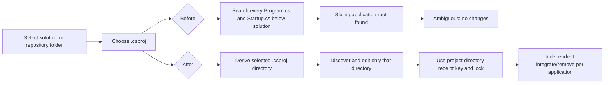

# Per-project .NET integration in multi-project solutions

## Goal

Allow the user to choose one application `.csproj` from a repository or solution folder and integrate that application without scanning or mutating sibling projects. The existing bounded, reversible .NET `HttpClient` strategy remains unchanged inside the selected project.

## Confirmed findings

- The selected `Sample.Mobile.Wspm.API.csproj` is a supported `net10.0` web application. Its own `Startup.cs` contains two central `AddHttpClient` registration chains.
- Its surrounding solution folder also contains `Sample.Mobile.API/Startup.cs`, which has its own `AddHttpClient` registrations.
- `pre-run.sh` correctly resolves the selected `.csproj`, but it previously passed the *original selected folder* to composition-root discovery. Selecting the WSPM project from the solution therefore found both `Startup.cs` files and failed before any mutation.
- The same broad folder was previously used for the external state key and cleanup baseline. That would have prevented independent integrations for two app projects in one solution even after discovery succeeded.

## Before and after

## Implementation steps

1. Keep the initial folder only as a safe boundary for resolving `--project-file`.
2. After resolving the selected `.csproj`, derive its canonical parent directory as the integration root.
3. Restrict `Program.cs`/`Startup.cs` discovery to that integration root. Retain fail-closed behavior when that single project directory itself contains zero or multiple candidate composition roots.
4. Use the integration root for the lock, receipt/project key, artifact baseline, cleanup, returned active record, and catalog identity so two selected app projects do not collide.
5. Preserve the original selection folder in the in-memory UI preview state only, because a relative `.csproj` choice must still be resolved against that folder at apply time. Display the integration root in the review UI.
6. Update the adapter/specification contracts with this project-scoping rule and add the solution-selection happy path to the TDD conformance document.

## Checkpoints

- [x] Confirm the reported ambiguity against the real `Sample.Mobile` solution layout.
- [x] Scope composition discovery and lifecycle state to the selected `.csproj` directory.
- [x] Preserve UI apply behavior while displaying the actual application integration root.
- [x] Update the adapter README, protocol specification, and TDD scenarios.
- [x] Verify both real API project previews and a disposable integrate/remove lifecycle.
- [x] Rebuild the standalone macOS app with the corrected embedded payload and immutable adapter package `1.2.1`.

## Verification criteria

- Selecting either `Sample.Mobile.API.csproj` or `Sample.Mobile.Wspm.API.csproj` from the shared solution folder returns that project's `Startup.cs` rather than an ambiguity caused by the sibling project.
- A dry run does not write project or state bytes.
- A real lifecycle against a disposable copy injects only the selected `.csproj` and its composition root, creates a project-directory-scoped receipt, then restores the files exactly after post-run.

## Todos

- [x] Derive a selected-project integration root.
- [x] Scope discovery, state, receipt, and cleanup to that root.
- [x] Preserve solution-folder selection for resolving relative project choices.
- [x] Document and specify independent application integrations.
- [x] Run real-project previews and a reversible disposable lifecycle.
- [x] Package the fixed standalone macOS application.
