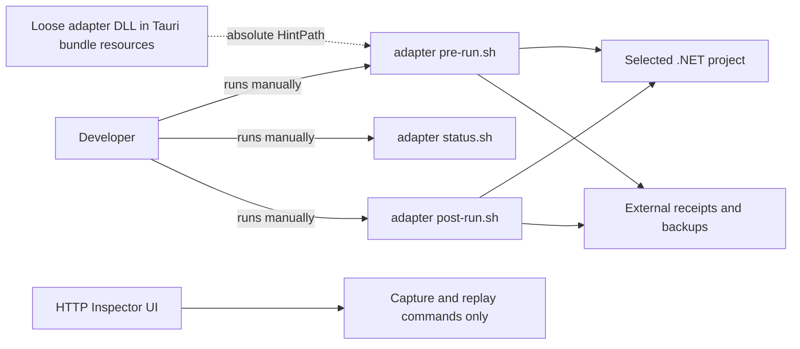
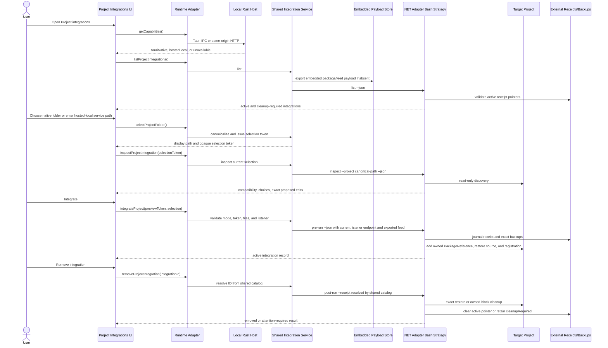

# Standalone and Hosted-Local Project Integration UI Plan

## Outcome

Add a local-runtime Project Integrations workspace to HTTP Inspector. From the top toolbar, a developer will be able to choose a compatible project folder, inspect the exact proposed integration, apply the existing reversible adapter integration, see every project currently integrated by the local HTTP Inspector runtime, and remove or recover an integration later.

The feature has two supported presentation/runtime combinations and one explicit unavailable state:

- A standalone Tauri `.exe`/`.app` uses typed Tauri IPC, a Tauri-owned native folder picker, and the shared Rust integration application service compiled into the native binary.
- A browser UI backed by HTTP Inspector's same-machine, loopback-only Rust service uses typed same-origin HTTP endpoints and the same shared Rust integration application service. Because a browser cannot reveal a trustworthy absolute local path to the service, this mode uses a service-local absolute-path field validated/canonicalized by Rust rather than pretending the browser directory picker is equivalent to a native picker.
- A static-only, remotely hosted, LAN-exposed, or integration-disabled service reports the capability as unavailable. It can still capture and replay, but it cannot mutate a project on the browser user's computer.

The packaging build will run `dotnet pack` once and compile the resulting versioned `HttpInspector.Adapter.<version>.nupkg`, adapter manifest, Bash entrypoints, library modules, and insertion templates as bytes into each runnable Rust host binary. On first use, either supported local host exports the already-built package and scripts into the same versioned HTTP Inspector application-data directory. Neither runtime compiles, rebuilds, restores, or repacks the adapter during integration.

“One standalone app” means there are no adapter files, shell scripts, NuGet feeds, or sidecar executables beside the distributed `.exe`/`.app`. It does not mean the application can avoid all runtime files:

- Bash cannot execute a script from the middle of a PE or Mach-O image, and NuGet restore needs a filesystem package source. The app must export its embedded `.nupkg` and Bash payload into its internal application-data directory before integration.
- Reversible integration needs persistent receipts, exact backups, locks, and historical payload versions after the UI closes. Those files remain under the operating system's HTTP Inspector data/state directories, never beside the executable and never in the consuming project's source tree.
- The target project is necessarily modified while integration is active. The new .NET strategy adds one marked `PackageReference`, one marked project-scoped additional restore-source property pointing at HTTP Inspector's exported local feed, plus the existing marked import and central `IHttpClientFactory` registration. De-integration removes only those recorded, adapter-owned changes.
- The active restore-source property contains a machine-local application-data path. The confirmation view must label the integration as temporary and tell the developer not to commit the marked changes; another machine will not have the same exported local feed.
- Windows integration continues to require Git Bash, as already required by the adapter specification. The integration operation does not require the .NET SDK and never invokes `dotnet pack`, `dotnet build`, `dotnet restore`, `dotnet add package`, or `nuget.exe`. The target developer's later normal build/Visual Studio workflow uses its existing NuGet restore support to unpack the already-built local package.

## Scope and Decisions

### Included

- A `Project integrations` button in the existing top toolbar.
- A runtime-aware dialog/workspace listing active, cleanup-required, missing-project, and incompatible integrations.
- A native Tauri folder picker in standalone mode and a validated server-local absolute-path field in hosted-local mode.
- Explicit capability discovery distinguishing `tauriNative`, `hostedLocal`, and `unavailable` runtimes before showing mutation controls.
- A shared Rust integration application service used by both the Tauri command facade and the hosted-local HTTP facade.
- Read-only discovery and preview before any mutation.
- Explicit selection when a folder contains more than one `.csproj`.
- Apply, remove, refresh, and recover operations.
- Persistent integration discovery after HTTP Inspector restarts.
- An immutable, versioned `.nupkg` plus the .NET adapter integration assets embedded in both portable Windows and macOS builds.
- Exact listener endpoint handoff, using the currently running local listener rather than a stale hardcoded endpoint.
- Structured, typed JSON between the adapter-owned Bash commands, Rust, and TypeScript.
- Safe retention and garbage collection of exported local-feed/package payload versions.
- Clear progress, success, no-op, unsupported, ambiguous, and cleanup-required UI states.
- Focused model/contract checks plus real reversible-integration smoke verification.

### Deliberately excluded

- No NuGet package creation, adapter compilation, or package restore during the Integrate operation on the developer's computer; package creation occurs only while building the Tauri or hosted-service artifact.
- No public/remote/private-server feed, user/global `NuGet.Config` mutation, `dotnet add package`, or project-specific adapter source copy. The only source added is a reversible property inside the already-selected `.csproj`, pointing at HTTP Inspector's application-data local feed.
- No C# integration executable and no PowerShell replacement for the existing Bash lifecycle.
- No automatic edits to individual HTTP request methods, services, repositories, controllers, generated clients, or existing handlers.
- No automatic de-integration when HTTP Inspector closes. An integration remains available for later use and remains listed until explicitly removed.
- No new Flutter or other ecosystem adapter in this increment. The native orchestration is manifest-driven so another adapter can be added later without changing this .NET plan.
- No background scan of arbitrary folders or machine-wide source-code indexing. The list is derived only from HTTP Inspector's external receipts.
- No remote/LAN project mutation, authentication token, pairing token, or integration security workflow. This remains a local developer tool.
- No direct browser filesystem mutation and no claim that an HTML directory picker can replace native/server filesystem access.
- No project integration from a remotely hosted/static UI or a server exposed beyond loopback. Supporting remote project mutation would require a separately installed local companion/control plane and a security model, both outside this local-tool scope.
- No broad UI unit-test suite. Automated additions stay limited to integration models/contracts and the existing adapter lifecycle verification boundary.

## Code Findings and Gaps

### Existing reversible engine to preserve

- [HttpInspector.Adapter.csproj](/Users/jovi/Documents/ChatGPT/http-inspector/adapters/dotnet/HttpInspector.Adapter/HttpInspector.Adapter.csproj:3) is already NuGet-packable: it declares `PackageId` `HttpInspector.Adapter`, version `1.2.0`, authors, description, tags, README, and its package dependencies. The artifact packaging build can produce the reusable `.nupkg` without introducing another project or package specification.
- [build-bundle.sh](/Users/jovi/Documents/ChatGPT/http-inspector/adapters/dotnet/HttpInspector.Adapter/build-bundle.sh:14) currently builds the adapter and copies only `HttpInspector.Adapter.dll`. It must instead run `dotnet pack` on the packaging machine and place the immutable `.nupkg` in the bundle input directory; this command is never run by the installed app.
- [adapter.json](/Users/jovi/Documents/ChatGPT/http-inspector/adapters/dotnet/adapter.json:1) already identifies the `.NET HttpClient` adapter, its `1.2.0` version, Bash lifecycle entrypoints, and port `53662` endpoint. Its runtime artifact must change from a loose DLL path to package ID, exact package version, `.nupkg` path, and local-feed strategy metadata.
- [pre-run.sh](/Users/jovi/Documents/ChatGPT/http-inspector/adapters/dotnet/HttpInspector.Adapter.Integration/pre-run.sh:73) already canonicalizes the project, selects a `.csproj`, validates the target framework, finds the central `AddHttpClient` composition root, and rejects existing/ambiguous integration before mutation. Its current loose-DLL validation/insertion must become prebuilt-package/local-feed validation/insertion without invoking NuGet or .NET tooling.
- [pre-run.sh](/Users/jovi/Documents/ChatGPT/http-inspector/adapters/dotnet/HttpInspector.Adapter.Integration/pre-run.sh:86) already has a read-only dry-run path, but the preview is human-oriented stderr rather than a stable JSON contract the UI can render.
- [pre-run.sh](/Users/jovi/Documents/ChatGPT/http-inspector/adapters/dotnet/HttpInspector.Adapter.Integration/pre-run.sh:139) already writes exact backups, ownership blocks, hashes, an artifact baseline, an external receipt, and an active-receipt pointer before applying atomic file changes.
- [post-run.sh](/Users/jovi/Documents/ChatGPT/http-inspector/adapters/dotnet/HttpInspector.Adapter.Integration/post-run.sh:54) already resolves an integration by receipt or project and delegates to the conflict-aware cleanup engine.
- [cleanup-engine.sh](/Users/jovi/Documents/ChatGPT/http-inspector/adapters/dotnet/HttpInspector.Adapter.Integration/lib/cleanup-engine.sh:15) restores an exact backup when the project is untouched, removes only intact adapter-owned blocks when unrelated developer changes exist, and retains `cleanupRequired` state rather than overwriting ambiguous edits.
- [common.sh](/Users/jovi/Documents/ChatGPT/http-inspector/adapters/dotnet/HttpInspector.Adapter.Integration/lib/common.sh:32) already keeps receipts/backups outside the consuming project under OS-appropriate HTTP Inspector state and prevents the state root from being the project or its ancestor.
- [project-discovery.sh](/Users/jovi/Documents/ChatGPT/http-inspector/adapters/dotnet/HttpInspector.Adapter.Integration/lib/project-discovery.sh:18) already skips `bin`, `obj`, and `.git`, but it stops on multiple project files instead of returning choices to a UI.
- [project-discovery.sh](/Users/jovi/Documents/ChatGPT/http-inspector/adapters/dotnet/HttpInspector.Adapter.Integration/lib/project-discovery.sh:29) currently supports only SDK-style projects containing `net10.0`; the UI must present this as a compatibility result, not silently attempt a different strategy.
- [assembly-reference.xml](/Users/jovi/Documents/ChatGPT/http-inspector/adapters/dotnet/HttpInspector.Adapter.Integration/templates/assembly-reference.xml:1) currently inserts a loose `<Reference>` with an absolute `<HintPath>`. Replace this template for new integrations with one owned block containing an exact `PackageReference` using `PrivateAssets="all"` and an appended project-scoped restore source pointing at the exported feed. Retain cleanup compatibility for receipts created by the loose-DLL strategy.
- [receipt-manager.sh](/Users/jovi/Documents/ChatGPT/http-inspector/adapters/dotnet/HttpInspector.Adapter.Integration/lib/receipt-manager.sh:92) currently verifies that the exact recorded adapter DLL still exists even before cleanup. New receipts must record package ID/version/file/feed/digest instead, and cleanup validation must be split from active-runtime validation so a missing old DLL or `.nupkg` never prevents safe removal of recorded ownership blocks/backups.
- [status.sh](/Users/jovi/Documents/ChatGPT/http-inspector/adapters/dotnet/HttpInspector.Adapter.Integration/status.sh:39) reports one known project's active state as JSON, but there is no adapter-owned command that enumerates all receipt-backed integrations.

### Runtime, native, hosted-service, and packaging gaps

- [bootstrap](/Users/jovi/Documents/ChatGPT/http-inspector/src/app/bootstrap.ts:12) already calls `isTauri()` once and composes Tauri versus hosted capture data sources. Project integration must reuse this composition root instead of re-detecting the runtime inside React components.
- [BrowserCaptureDataSource](/Users/jovi/Documents/ChatGPT/http-inspector/src/data/adapters/browser/BrowserCaptureDataSource.ts:21) already proves hosted mode uses same-origin `/api` and `/ws` requests through the local service. A separate `BrowserProjectIntegrationService` can follow that transport pattern without coupling project integration to capture state.
- [inspector-server routing](/Users/jovi/Documents/ChatGPT/http-inspector/crates/inspector-server/src/ingress/server.rs:132) exposes capture/status/exchange/replay/UI routes but no runtime capability or project-integration API. The route set is currently assembled on one listener, so project-mutation endpoints must be registered only when the server is explicitly configured for loopback-only hosted-local integration.
- [Cargo workspace](/Users/jovi/Documents/ChatGPT/http-inspector/Cargo.toml:1) has only core, server, and Tauri members. Putting the application service/payload exclusively under `src-tauri` would make hosted-local parity impossible; add one focused shared integration crate consumed by the Tauri and server facades.
- [src-tauri/src/lib.rs](/Users/jovi/Documents/ChatGPT/http-inspector/src-tauri/src/lib.rs:43) currently exposes only capture, replay, subscription, and listener commands. It has no project-integration application service or command contract.
- [src-tauri/src/lib.rs](/Users/jovi/Documents/ChatGPT/http-inspector/src-tauri/src/lib.rs:189) is already 223 lines and is the Tauri composition root. New integration logic must live in focused Rust modules rather than extending this file into a manager/dumping ground.
- [src-tauri/tauri.conf.json](/Users/jovi/Documents/ChatGPT/http-inspector/src-tauri/tauri.conf.json:31) currently declares the loose adapter DLL and integration files as Tauri bundle resources. Tauri resources are copied into an application bundle resource directory; that is suitable for an installed bundle, but it does not satisfy a single raw portable `.exe` with no adjacent resource directory. The prebuilt `.nupkg` and integration payload must instead be compiled into the Rust binary.
- [src-tauri/build.rs](/Users/jovi/Documents/ChatGPT/http-inspector/src-tauri/build.rs:1) currently only runs `tauri_build::build()`. Payload generation/embedding cannot remain Tauri-only; move deterministic payload validation/generation to the new shared integration crate and leave this file as the Tauri build hook.
- [src-tauri/Cargo.toml](/Users/jovi/Documents/ChatGPT/http-inspector/src-tauri/Cargo.toml:11) has no archive/hash/dialog dependencies for payload generation, materialization, or native project selection.
- [src-tauri/capabilities/main.json](/Users/jovi/Documents/ChatGPT/http-inspector/src-tauri/capabilities/main.json:1) grants no plugin permissions. Keep it that way for this feature: the webview invokes only the typed `pick_project_folder` application command, and Rust calls the dialog plugin directly.
- [Tauri's resource documentation](https://v2.tauri.app/develop/resources/) explicitly describes resources as files placed in `$RESOURCE`; [Rust `include_bytes!`](https://doc.rust-lang.org/std/macro.include_bytes.html) is the appropriate primitive for placing the generated payload inside the native binary itself.

### Frontend gaps

- [bootstrap](/Users/jovi/Documents/ChatGPT/http-inspector/src/app/bootstrap.ts:17) currently composes only `CaptureDataSource`. Extend the application dependency object with an independent `ProjectIntegrationService`: Tauri, hosted-capability-aware HTTP, and unavailable fixture/static implementations.
- [App.tsx](/Users/jovi/Documents/ChatGPT/http-inspector/src/app/App.tsx:29) currently owns only capture/recompose application coordination. It has no project-integration controller or desktop capability check.
- [CaptureToolbar.tsx](/Users/jovi/Documents/ChatGPT/http-inspector/src/features/capture/CaptureToolbar.tsx:13) has the suitable top-level action area. Add one Project integrations action and count badge here instead of introducing a platform-specific native menu for the first increment.
- [AppShell.tsx](/Users/jovi/Documents/ChatGPT/http-inspector/src/app/AppShell.tsx:16) composes the main capture workspace but has no application-level overlay slot. The integration workspace should be mounted beside `AppShell` from `App.tsx` so it does not affect capture pane sizing or selection.
- [main.tsx](/Users/jovi/Documents/ChatGPT/http-inspector/src/main.tsx:1) imports only shared shell/inspector styles. Integration styles need their own focused stylesheet rather than extending the already large inspector stylesheet.
- [src-tauri/Cargo.toml](/Users/jovi/Documents/ChatGPT/http-inspector/src-tauri/Cargo.toml:14) does not include `tauri-plugin-dialog`. Tauri's [official dialog plugin](https://v2.tauri.app/plugin/dialog/) supports a desktop directory picker and returns native filesystem paths on macOS, Windows, and Linux. This plan invokes the picker from Rust, so no frontend dialog package or webview dialog permission is required.
- [check-file-budgets.mjs](/Users/jovi/Documents/ChatGPT/http-inspector/scripts/check-file-budgets.mjs:8) warns above 200 React lines or 300 Rust/TypeScript lines and fails above 400. The implementation must be split by responsibility from the start.

## Architecture Before

Current limitations:

- The developer must locate and run scripts manually.
- The UI cannot choose a project, preview changes, list integrations, remove one, or explain cleanup conflicts.
- A raw portable Windows executable does not receive Tauri bundle-resource files beside it.
- The scripts do not expose a complete structured discovery/list/apply/remove protocol.

## Architecture After

```mermaid
flowchart LR
    developer["Developer"] --> toolbar["Project integrations toolbar action"]
    toolbar --> dialog["Integration workspace"]
    dialog --> port["ProjectIntegrationService port"]
    port --> runtimeCheck{"Runtime adapter"}
    runtimeCheck --> tauriAdapter["Tauri IPC adapter"]
    runtimeCheck --> hostedAdapter["Hosted same-origin HTTP adapter"]
    runtimeCheck --> unavailableAdapter["Unavailable adapter"]

    tauriAdapter --> tauriFacade["Tauri command facade and native picker"]
    hostedAdapter --> capabilityApi["Loopback hosted capability and integration API"]
    unavailableAdapter --> unavailableUi["Capture and replay only"]

    subgraph localRustHosts["Supported local Rust hosts"]
        tauriFacade
        capabilityApi
        sharedService["Shared project-integration application service"]
        payload["Embedded immutable .nupkg and Bash payload"]
    end

    tauriFacade --> sharedService
    capabilityApi --> sharedService
    sharedService --> materializer["Payload materializer and retention policy"]
    materializer --> appdata["Application-data local NuGet feed"]
    sharedService --> runner["Bash process runner"]
    runner --> manifest["Materialized adapter manifest"]
    manifest --> inspect["inspect/list/status Bash JSON commands"]
    manifest --> mutate["pre/post/recover Bash JSON commands"]
    inspect --> receipts["External receipt-backed catalog"]
    mutate --> receipts
    mutate --> packageRef["Owned PackageReference and restore-source block"]
    packageRef --> target["Selected compatible .NET project"]
    receipts --> dialog
```

The dependency direction is deliberate:

- React depends on a small TypeScript integration port, never on Bash or filesystem details.
- The composition root selects the Tauri IPC adapter, hosted HTTP adapter, or unavailable adapter once. Components do not call `isTauri()` or inspect URLs.
- Tauri IPC and loopback hosted HTTP are thin facades over one shared Rust integration application service; they cannot drift into different edit behavior.
- The Tauri facade owns the native picker. Hosted-local mode accepts a visibly labelled absolute path on the service machine, then Rust canonicalizes it and returns an opaque selection/preview token. Static or remote hosted mode never receives mutation controls.
- Shared Rust owns path validation, payload materialization, operation serialization, cross-process project locking, process execution, and error translation.
- The `.NET HttpClient` adapter owns .NET discovery, edit planning, mutation, receipts, cleanup, and recovery through its Bash entrypoints.
- The consuming project never receives the integration engine or adapter source.

## User Workflow After Implementation

## Runtime Modes and Capability Detection

Do not infer project-mutation support from UI appearance, hostname text, or the presence of browser APIs. The runtime host is authoritative.

- `tauriNative`: [bootstrap](/Users/jovi/Documents/ChatGPT/http-inspector/src/app/bootstrap.ts:12) sees `isTauri() === true` and composes `TauriProjectIntegrationService`. Its `getCapabilities` call uses typed IPC, the Tauri facade supplies a native directory picker, and all operations run in the bundled Rust process.
- `hostedLocal`: `isTauri() === false`, so bootstrap composes `BrowserProjectIntegrationService`. It calls `GET /api/project-integrations/capabilities`; the Rust service advertises `available: true` only when configured with `--project-integration local` or `HTTP_INSPECTOR_PROJECT_INTEGRATION=local`, bound to loopback, holding a valid embedded payload, able to write the shared state root, and able to resolve Bash/Git Bash. The standard `pnpm dev` service command supplies the CLI mode explicitly; direct/custom service launches remain disabled unless configured. Project selection is a labelled absolute path on the service machine, not a browser directory handle.
- `unavailable`: fixture/static hosting, a missing/404 capability endpoint, an integration-disabled service, a non-loopback/LAN service, invalid payload, unwritable state root, or missing Bash returns `available: false` with a stable reason code. Capture and replay stay usable; Integrate/Remove are hidden or disabled with the exact reason.

Use one capability contract in both transports:

- `runtimeKind`: `tauriNative`, `hostedLocal`, or `unavailable`
- `transport`: `tauriIpc`, `sameOriginHttp`, or `none`
- `available`, `reasonCode`, and user-facing `message`
- `folderSelection`: `nativeDialog`, `serviceAbsolutePath`, or `none`
- adapter/package/payload identity and digest
- Bash/Git Bash, state-root, and listener readiness

The hosted service must refuse local project-integration mode when its control listener is not loopback. Do not expose the mutation API on the capture listener's optional LAN address. If future remote project integration is required, it needs a separately installed local companion and security design rather than weakening this capability check.

## Domain and Command Contracts

### Integration identity

Use one stable UI/host `integrationId` derived from adapter ID, canonical project key, receipt run ID, and receipt strategy version. The frontend must never submit an arbitrary receipt path for deletion. The shared Rust service resolves the ID against the current validated catalog and supplies the recorded receipt to the adapter command.

Each listed record includes:

- `integrationId`
- `adapterId`, adapter display name, package ID, exact package version, package digest, and strategy version
- canonical project root
- selected project file and composition file
- receipt run ID and creation timestamp
- listener endpoint recorded at integration time
- state: `active`, `cleanupRequired`, `missingProject`, `missingPayload`, `invalidReceipt`, or `removing`
- compatibility/diagnostic messages
- exact receipt-referenced local-feed/package directory, retained only in the local Rust host layer

### Preview contract

The read-only inspect command returns one of these outcomes:

- `ready`: exactly one supported project and one supported composition root were found.
- `choiceRequired`: multiple `.csproj` files were found; return canonical relative choices without mutating.
- `alreadyIntegrated`: a validated active receipt or owned marker already exists.
- `unsupported`: no `.csproj`, unsupported target framework, missing `AddHttpClient`, or another known unsupported layout.
- `ambiguous`: multiple composition roots, raw-string constraint, unsafe path, or uncertain edit seam.
- `prerequisiteMissing`: embedded payload could not materialize or Bash/Git Bash is unavailable.

A ready preview includes the canonical project/project-file/composition paths, runtime kind, package ID/exact version/digest, exported local-feed path, adapter strategy version, listener endpoint, and an ordered list of intended operations. Those operations explicitly show the owned `PackageReference`, appended additional restore source, import, and handler registration. It does not expose a reusable receipt path or accept a mutation token invented by the browser. Rust creates a short-lived in-memory preview token bound to the selected runtime, canonical paths, current file hashes, package payload digest, exported feed path, and listener endpoint. Apply rejects a stale or cross-runtime token and requires a new preview when files, runtime, or listener settings changed.

### Shared application service and transport facades

Add one focused shared Rust application service with these transport-neutral operations:

- `capabilities`: report runtime/transport/folder-selection kind, adapter manifests, exported package ID/version/digest/feed path, Bash availability/path, state-root writability, listener status, and any prerequisite error.
- `select_project_folder`: accept only a path produced by Tauri's native picker or the hosted-local labelled service-path field; canonicalize it, require an existing directory, reject unsafe roots/state overlap, and issue a short-lived opaque selection token. Later calls use that token, not a new raw path.
- `inspect_project_integration`: resolve the selection token, run read-only discovery, and issue the in-memory preview token.
- `list_project_integrations`: enumerate receipt-backed records from every currently embedded adapter manifest.
- `integrate_project`: validate runtime availability, preview token, current listener endpoint, unchanged file hashes, package digest, and exported feed; then invoke the manifest's `preRun` entrypoint. It never invokes restore, build, pack, or package-install commands.
- `remove_project_integration`: resolve a catalog ID to its validated receipt and invoke the recorded strategy's `postRun` entrypoint.
- `recover_project_integration`: invoke `recover` only for a structurally validated `cleanupRequired` or interrupted record. Cleanup validation requires the exact receipt/backups/ownership data but not a still-present legacy DLL, `.nupkg`, or exported feed.
- `refresh_project_integration`: invoke `status` for one record without mutation.

Expose that service through two thin facades:

- Tauri commands: `project_integration_capabilities`, `pick_project_folder`, `inspect_project_integration`, `list_project_integrations`, `integrate_project`, `remove_project_integration`, `recover_project_integration`, and `refresh_project_integration`. `pick_project_folder` uses `tauri-plugin-dialog` in Rust and immediately exchanges the result for an opaque selection token.
- Hosted-local endpoints: `GET /api/project-integrations/capabilities`, `POST /api/project-integrations/selections`, `POST /api/project-integrations/previews`, `GET /api/project-integrations`, `POST /api/project-integrations`, `DELETE /api/project-integrations/{integrationId}`, `POST /api/project-integrations/{integrationId}/recover`, and `GET /api/project-integrations/{integrationId}`. Every endpoint returns the same versioned JSON models as IPC and returns unavailable before reading a submitted path when local mode is disabled.

All filesystem/process operations run outside the async event-loop thread. Use `spawn_blocking` or an equivalent bounded local-host worker, capture stdout/stderr separately, impose an operation timeout, and prevent concurrent integrate/remove actions for the same canonical project. Existing Bash project locks remain the cross-process authority when Tauri and hosted-local service instances are both running; the in-process operation guard prevents duplicate submissions within one host.

### Structured Bash protocol

Keep human CLI output as the default for backwards compatibility and add `--json` for app orchestration:

- Add `inspect.sh` as a read-only adapter-owned entrypoint. It returns project choices, compatibility, exact target files, strategy/version, intended operations, and precondition diagnostics. It must never create the state root, lock, receipt, backup, or temporary project file.
- Add `list.sh` as an adapter-owned entrypoint. It scans only the adapter's external integration-state directory, loads active receipt pointers, validates receipt structure/path ownership, and returns records plus diagnostics. It does not scan source folders.
- Extend `pre-run.sh --json` to accept the native-validated package ID/version/file/feed values, confirm the `.nupkg` exists and matches the manifest digest, inject the marked `PackageReference`/additional-source/import/registration blocks, and return one active integration record on success. Preserve the existing write-ahead receipt and rollback behavior.
- Extend `post-run.sh --json` and `recover.sh --json` to return `removed`, `noOp`, or `cleanupRequired` with exact affected paths and diagnostics.
- Extend `status.sh` to return the same versioned record shape used by list/apply/remove.
- Update `adapter.json` with `payloadSpecVersion`, `integrationProtocolVersion`, `inspect`, `list`, `packageId`, `packageVersion`, `packageFile`, and the named NuGet integration strategy. Do not hardcode package names/versions/paths in Rust after manifest parsing.
- New integration must not create or edit `NuGet.Config`, register a user/global source, call a package-manager executable, or extract package contents itself. It only exposes the prebuilt `.nupkg` as a local folder source; the target's later ordinary MSBuild/Visual Studio restore performs normal package extraction.
- Put machine JSON only on stdout in JSON mode; route progress/diagnostic text to stderr. Every command returns documented exit codes for success, unsupported, ambiguous, stale preview, busy/locked, cleanup required, invalid receipt, and internal failure.

The JSON models are the only additional automated unit-test boundary required for this feature: valid command output must deserialize, unknown additive fields must not break compatible readers, missing required fields must fail, and invalid path/state combinations must be rejected before mutation.

## Embedded Local-Host Payload Design

### Build-time assembly

Build the NuGet package once on the HTTP Inspector artifact-building machine, then embed the same immutable payload in every local Rust host:

1. Change [build-bundle.sh](/Users/jovi/Documents/ChatGPT/http-inspector/adapters/dotnet/HttpInspector.Adapter/build-bundle.sh:14) to run `dotnet pack --configuration Release --output <bundle-directory>` against the existing SDK-style adapter project. Microsoft's [`dotnet pack` documentation](https://learn.microsoft.com/en-us/dotnet/core/tools/dotnet-pack) defines the output as a ready-to-consume `.nupkg`; no packaging command runs on the eventual developer machine.
2. Keep [tauri.conf.json](/Users/jovi/Documents/ChatGPT/http-inspector/src-tauri/tauri.conf.json:9) calling that packaging script as a Tauri source-build prerequisite, and update [package.json](/Users/jovi/Documents/ChatGPT/http-inspector/package.json:8) so the hosted-service source-build path performs the same prerequisite before Cargo builds `inspector-dev-server`. Distributed `.app`, `.exe`, and hosted-service binaries never call it at runtime.
3. Validate that the generated package ID/version match `adapter.json`, the package contains the expected `net10.0` adapter assembly, and the package has exactly the declared SHA-256 digest. Package versions are immutable: changing package bytes requires incrementing the adapter/package version so NuGet's global cache can never reuse different bytes under the same ID/version.
4. Add `crates/inspector-project-integration/build.rs` to walk only the declared `.nupkg`, manifest, Bash entrypoints/modules, templates, and README; reject symlinks/out-of-root paths; sort paths deterministically; calculate per-file SHA-256 values; and build one deterministic uncompressed ZIP payload in Cargo `OUT_DIR`. Normalize ZIP timestamps and Unix permissions so identical inputs produce identical bytes.
5. Emit Cargo `rerun-if-changed` directives for every payload input and generate one sorted file-set manifest/digest whose exact files are linked with `include_bytes!`. Both `src-tauri` and `inspector-server` depend on that crate, so native and hosted-local modes cannot ship different adapter bytes.
6. Remove the adapter mappings from `bundle.resources` once binary embedding is verified so `.app` and installer builds do not ship a second adjacent copy. The frontend assets remain handled by normal Tauri embedding.
7. Fail either host build when the `.nupkg` is absent, its ID/version/content validation fails, a manifest entrypoint is absent, or a payload file hash cannot be reproduced. A runnable host must never advertise integration while lacking its prebuilt package.

### Runtime materialization

On Tauri or hosted-local service startup, or the first integration command:

- Use the adapter's existing application-data state root as the single native/Bash integration-data root: `$HOME/Library/Application Support/HTTP Inspector` on macOS and `%LOCALAPPDATA%\HTTP Inspector` on Windows. This keeps UI-created integrations discoverable by the existing CLI scripts and avoids a second bundle-identifier-based store.
- Rust resolves/canonicalizes that platform path and passes it through the existing `--state-root` argument; the frontend can never supply or override it. Existing CLI integrations already stored below the same root remain listable.
- Export through a staging directory and atomic rename to `<state-root>/adapter-payloads/<adapter-id>/<package-version>/<payload-digest>/`, with the package placed at `nuget-feed/HttpInspector.Adapter.<package-version>.nupkg` and the Bash integration files kept beside that feed under the same immutable payload root. Receipts/backups remain under `<state-root>/integrations/`.
- Verify every extracted relative path and hash against the embedded manifest; reject path traversal, absolute paths, and symlinks.
- Mark `.sh` files executable on Unix. On Windows invoke Git Bash with the script path as a separate argument; do not depend on the executable bit.
- Never overwrite an existing digest directory in place. If verification fails, create/repair through a new staging directory and replace only an unreferenced corrupt directory.
- Pass the current payload's integration script path, exact package ID/version/file/digest, local-feed directory, and existing external state defaults to Bash. No target-language compiler, NuGet executable, restore, or package build is involved in this export/integration step.
- The pre-run Bash edit appends the exported feed through a marked `RestoreAdditionalProjectSources` property and adds a marked exact `PackageReference` with `PrivateAssets="all"`; it does not create `NuGet.Config` or replace the project's existing sources. The project's later normal restore sees both its existing sources and this local folder.

### Version retention and cleanup

Do not treat the exported package/feed payload as cache that can always be deleted:

- The active `.csproj` contains an additional restore-source path pointing at the exported feed and an exact package version.
- The receipt records package ID/version/file/feed/digest plus the exact owned project/composition blocks.
- `list.sh` returns each active receipt's package/feed/payload identity.
- At startup and after successful de-integration, Rust may remove a historical payload directory only if it is not the current embedded digest and no valid active or cleanup-required receipt references it.
- Invalid/unreadable receipt state blocks automatic deletion of potentially referenced payloads and appears as an actionable catalog diagnostic.
- Split receipt validation into structural cleanup validation and active-runtime validation. A missing feed/package marks the integration `missingPayload` and may break the target's next restore/build, but it does not block exact backup/marker-based de-integration because cleanup does not execute or restore the package.
- NuGet may retain `HttpInspector.Adapter` in its normal global package cache after a target build. Post-run removes the project reference and local source but never deletes or mutates the developer's shared NuGet cache; the absence of an active reference is the cleanup boundary.
- App exit stops the capture listener but does not delete payloads, receipts, backups, or project integration.
- App uninstall cannot automatically de-integrate a project. Documentation and the UI must advise removing integrations before uninstalling; if the binary is gone, the external exact backups/receipt still provide a manual recovery path.

## Bash Discovery on Supported Desktops

### macOS and Linux

- Resolve `/bin/bash` first on macOS and `bash` from `PATH` on Linux, then validate that the command can run the payload's read-only capability probe.
- Do not rely on shell string interpolation. Pass script/options/paths as an argument array.

### Windows

Resolve Git Bash in this order:

1. Explicit `HTTP_INSPECTOR_BASH` override.
2. `bash.exe` discoverable on `PATH`.
3. `%ProgramFiles%\Git\bin\bash.exe`.
4. `%LocalAppData%\Programs\Git\bin\bash.exe`.
5. Other documented Git for Windows locations only after file validation.

If Git Bash is missing, keep capture/replay usable and disable only Integrate/Remove with an exact prerequisite message. Do not download or install Git Bash, .NET, NuGet, or another executable from the app.

The typed host boundary must translate selected native paths to Git Bash syntax before script execution. This includes state, payload, package, receipt, project, and absolute project-file values; Windows extended-length `\\?\\` values from a native folder picker must be reduced to their normal drive/UNC form before conversion. It must translate absolute `/c/...` fields returned in script JSON back to normal native paths before native hashing, receipt-catalog persistence, UI display, garbage collection, or a later remove/recover operation. Passing an unmodified `\\?\\C:\\...` path to Git Bash is invalid even though the native folder exists.

## Frontend Structure

### New frontend modules

Create small, responsibility-specific files:

- `src/domain/integrations/projectIntegration.ts`: readonly UI/domain types and state predicates.
- `src/data/ports/ProjectIntegrationService.ts`: segregated list/inspect/apply/remove/recover capability.
- `src/data/adapters/tauri/TauriProjectIntegrationService.ts`: typed Tauri invoke adapter and error translation.
- `src/data/adapters/browser/BrowserProjectIntegrationService.ts`: same-origin hosted capability/integration HTTP adapter with 404/disabled-to-unavailable mapping.
- `src/data/adapters/fixture/UnavailableProjectIntegrationService.ts`: explicit unavailable capability for fixtures/static hosting.
- `src/features/integrations/useProjectIntegrations.ts`: dialog controller state, refresh, preview, operation serialization, and cancellation guards.
- `src/features/integrations/ProjectIntegrationsDialog.tsx`: accessible dialog shell and mode switching.
- `src/features/integrations/ProjectIntegrationList.tsx`: persistent catalog rows and actions.
- `src/features/integrations/ProjectIntegrationPreview.tsx`: selected path, project choice, compatibility, exact planned files/operations, and confirm action.
- `src/features/integrations/ProjectIntegrationStatus.tsx`: active/unsupported/attention states and diagnostics.
- `src/styles/integrations.css`: light/dark token-based layout without adding integration rules to `inspector.css`.

Do not create a generic `manager`, `helpers`, or `utils` module. Keep React files below the project's 200-line review budget and Rust/TypeScript modules below 300 where practical.

### UI behavior

- Add `Project integrations` to [CaptureToolbar.tsx](/Users/jovi/Documents/ChatGPT/http-inspector/src/features/capture/CaptureToolbar.tsx:20), with an active-integration count when capabilities are available.
- Mount the dialog beside `AppShell` in [App.tsx](/Users/jovi/Documents/ChatGPT/http-inspector/src/app/App.tsx:99) so capture selection, panes, and live recording continue unchanged underneath.
- On open, show the catalog immediately, then refresh statuses without losing prior rows.
- The empty state explains that no projects are integrated and offers `Choose project folder` in Tauri or `Use service-local project path` in hosted-local mode.
- Tauri selection opens the native picker. Hosted-local selection presents a labelled absolute-path field explaining that the path is resolved on the same machine running `inspector-dev-server`; it must never imply that a browser upload/directory handle is being used.
- Folder/path selection always creates a backend-issued selection token and runs Inspect first. Never put a one-click mutation directly after the picker/path field.
- If multiple `.csproj` files are found, render the returned list and inspect again with the chosen relative project file.
- The confirmation view names the project file, composition root, strategy, adapter version, listener endpoint, and every planned edit. It explicitly warns that the marked machine-local edits are temporary and must not be committed. `Integrate` stays disabled when the listener is stopped or the endpoint/preview became stale.
- On success, retain the project in the catalog, close or reset only the preview, and show the active receipt-backed status.
- `Remove integration` opens a confirmation naming the exact project and recorded files. It does not imply deleting project data or capture history.
- When cleanup is safe, remove the row after a catalog refresh. When cleanup requires attention, keep the row with an Attention badge, preserved receipt path display/copy action, exact conflicting file names, and a Recover/Retry action.
- Missing project or missing package/feed records remain visible because hiding them would destroy the only in-app route to diagnosis/recovery. A missing package blocks the target's next reliable restore/build but not structurally safe de-integration.
- Closing the dialog or entire app never removes integration.
- Hosted-local browser development uses the same catalog/preview/mutation UI over same-origin HTTP. Static/remote/disabled hosted mode uses the unavailable service; the toolbar action is disabled with the capability's exact reason rather than failing after click.

## Shared Rust and Host-Facade Structure

Add a focused `crates/inspector-project-integration/` workspace crate:

- `build.rs`: deterministic manifest/package validation and embedded file-set generation from the already-packed adapter payload.
- `src/lib.rs`: public feature surface only.
- `src/model.rs`: versioned capability/request/response/error types shared by IPC and HTTP facades.
- `src/catalog.rs`: validates adapter list/status results and maps stable integration IDs.
- `src/payload.rs`: embedded `.nupkg`/script file-set metadata, atomic local-feed export, hash/package-identity verification, and referenced-version retention.
- `src/bash.rs`: platform Bash discovery and prerequisite probe.
- `src/runner.rs`: bounded child-process execution, timeout, stdout/stderr capture, and JSON parsing.
- `src/selection.rs`: canonical project-path validation and opaque selection-token ownership.
- `src/preview.rs`: in-memory preview token/hash/runtime binding and stale-preview validation.
- `src/service.rs`: transport-neutral use-case orchestration; no UI or .NET parsing rules.

Add thin host facades:

- `src-tauri/src/integration/commands.rs`: Tauri IPC mapping plus native folder picker; no catalog, payload, runner, or edit logic.
- `crates/inspector-server/src/project_integration_api.rs`: hosted-local capability and operation routes mapping HTTP JSON to the shared service.
- `crates/inspector-server/src/config.rs`: explicit `disabled`/`local` project-integration mode; reject `local` when the control bind is non-loopback.

[src-tauri/src/lib.rs](/Users/jovi/Documents/ChatGPT/http-inspector/src-tauri/src/lib.rs:189) will only initialize the shared `ProjectIntegrationService`, register the Tauri commands, initialize the folder-dialog facility, and keep existing capture shutdown behavior. [inspector-server](/Users/jovi/Documents/ChatGPT/http-inspector/crates/inspector-server/src/ingress/server.rs:132) will initialize the same service only in loopback `local` mode and conditionally add its HTTP facade. Neither host de-integrates projects during shutdown.

## Error and Recovery Behavior

- User cancels folder picker: return cancellation, not an error toast.
- Hosted capability endpoint missing/disabled: return `unavailable`; do not show a raw network-error toast or attempt a filesystem command.
- Hosted service configured for local integration on a non-loopback bind: fail startup/configuration and advertise no mutation endpoints.
- Hosted-local path is relative, missing, a filesystem root, or overlaps the state root: reject selection before Bash discovery and create no token/state.
- Selected directory does not exist or becomes unavailable: inspect returns `unsupported`/missing path with no mutation.
- Multiple projects: return `choiceRequired`; do not guess.
- Multiple/unsupported composition roots: return `ambiguous`; do not guess or partially edit.
- Listener stopped: preview may display the project, but Integrate is blocked until Start/Restart provides a current endpoint.
- Listener endpoint changes after preview: apply rejects the stale token and requests a refreshed preview.
- Runtime/capability changes after preview: apply rejects the cross-runtime/stale token; Tauri and hosted preview tokens are never interchangeable.
- Bash missing: integration controls are unavailable but capture/replay remain operational.
- Package/payload hash or export failure: disable new integration, retain existing historical feed versions, and display the expected package ID/version/digest.
- Pre-run failure before receipt activation: preserve the script's current rollback and return the structured diagnostic.
- App/process crash during pre-run: the next catalog refresh identifies the external active/interrupted receipt and offers Recover.
- Target files changed after preview: apply refuses and reruns inspect; it never applies based on old line numbers/hashes.
- Target files changed after integration: post-run removes only intact owned blocks or returns `cleanupRequired`; it never overwrites ambiguous developer work.
- Project folder moved: retain the receipt-backed row as missing. Recovery is not attempted against a different path without an explicit future relocation workflow.
- Old app/payload strategy: retain legacy `dotnet-ihttpclientfactory-bash-v2` cleanup for direct-DLL receipts and use the new NuGet strategy for new receipts. Do not reinterpret a loose-DLL receipt as a package receipt or use a newer cleanup strategy unless it explicitly declares receipt compatibility.
- Invalid receipt: show it as invalid and preserve both state and historical payload. Do not offer a destructive Remove button; expose diagnostic/recovery documentation.
- Repeated Integrate or Remove click: coalesce/disable in UI, reject duplicate host operations, and rely on the Bash lock as the final cross-process guard when Tauri and hosted-local service overlap.

## Target Areas

### Existing files to update

- [HttpInspector.Adapter.csproj](/Users/jovi/Documents/ChatGPT/http-inspector/adapters/dotnet/HttpInspector.Adapter/HttpInspector.Adapter.csproj:3): keep package ID/version/dependencies as the package metadata authority and replace the placeholder repository metadata before release packaging.
- [build-bundle.sh](/Users/jovi/Documents/ChatGPT/http-inspector/adapters/dotnet/HttpInspector.Adapter/build-bundle.sh:14): replace loose-DLL copying with deterministic Release `dotnet pack` output and package ID/version/content validation on the artifact-building machine.
- [adapters/dotnet/adapter.json](/Users/jovi/Documents/ChatGPT/http-inspector/adapters/dotnet/adapter.json:1): declare inspect/list commands, payload/integration protocol versions, exact NuGet package identity/file, and new package-based strategy ID/version.
- [adapters/dotnet/HttpInspector.Adapter.Integration/pre-run.sh](/Users/jovi/Documents/ChatGPT/http-inspector/adapters/dotnet/HttpInspector.Adapter.Integration/pre-run.sh:22): add stable JSON mode and package/feed arguments, inject the reversible local-source/PackageReference block, and never call restore/build/pack/package-manager commands.
- [adapters/dotnet/HttpInspector.Adapter.Integration/post-run.sh](/Users/jovi/Documents/ChatGPT/http-inspector/adapters/dotnet/HttpInspector.Adapter.Integration/post-run.sh:16): add structured remove/no-op/attention results.
- [adapters/dotnet/HttpInspector.Adapter.Integration/status.sh](/Users/jovi/Documents/ChatGPT/http-inspector/adapters/dotnet/HttpInspector.Adapter.Integration/status.sh:12): align status output to the shared integration-record contract.
- [adapters/dotnet/HttpInspector.Adapter.Integration/lib/project-discovery.sh](/Users/jovi/Documents/ChatGPT/http-inspector/adapters/dotnet/HttpInspector.Adapter.Integration/lib/project-discovery.sh:3): expose choices/read-only discovery without weakening bounded refusal behavior.
- [adapters/dotnet/HttpInspector.Adapter.Integration/lib/receipt-manager.sh](/Users/jovi/Documents/ChatGPT/http-inspector/adapters/dotnet/HttpInspector.Adapter.Integration/lib/receipt-manager.sh:28): record package ID/version/file/feed/digest and strategy identity, preserve legacy receipt cleanup, and separate package availability from structural cleanup validation.
- [assembly-reference.xml](/Users/jovi/Documents/ChatGPT/http-inspector/adapters/dotnet/HttpInspector.Adapter.Integration/templates/assembly-reference.xml:1): stop using the loose-DLL insertion for new runs; replace it with the new package/local-source template while retaining only the cleanup compatibility needed for legacy v2 receipts.
- [adapters/dotnet/HttpInspector.Adapter.Integration/README.md](/Users/jovi/Documents/ChatGPT/http-inspector/adapters/dotnet/HttpInspector.Adapter.Integration/README.md:29): document build-time packing, runtime feed export, no host rebuild, UI lifecycle, retained package versions, global-cache boundary, and manual recovery.
- [Cargo.toml](/Users/jovi/Documents/ChatGPT/http-inspector/Cargo.toml:1): register the new shared `inspector-project-integration` crate.
- [package.json](/Users/jovi/Documents/ChatGPT/http-inspector/package.json:8): make hosted-service source builds prepare the same prebuilt package payload before Cargo starts and launch the standard loopback `pnpm dev` service with `--project-integration local`; runtime HTTP operations never invoke this packaging script. Direct/custom launches may use the equivalent `HTTP_INSPECTOR_PROJECT_INTEGRATION=local` setting.
- [crates/inspector-server/Cargo.toml](/Users/jovi/Documents/ChatGPT/http-inspector/crates/inspector-server/Cargo.toml:1): depend on the shared integration crate and keep HTTP facade dependencies here.
- [crates/inspector-server/src/config.rs](/Users/jovi/Documents/ChatGPT/http-inspector/crates/inspector-server/src/config.rs:1): parse explicit disabled/local integration mode and refuse local mode for non-loopback control binding.
- [crates/inspector-server/src/ingress/server.rs](/Users/jovi/Documents/ChatGPT/http-inspector/crates/inspector-server/src/ingress/server.rs:132): conditionally compose the hosted-local integration API and shared service without exposing it on LAN capture ingress.
- [src-tauri/Cargo.toml](/Users/jovi/Documents/ChatGPT/http-inspector/src-tauri/Cargo.toml:11): depend on the shared integration crate and add only `tauri-plugin-dialog` for the Rust-side folder picker.
- [src-tauri/src/lib.rs](/Users/jovi/Documents/ChatGPT/http-inspector/src-tauri/src/lib.rs:189): compose the new native service and commands without placing integration behavior here.
- [src-tauri/tauri.conf.json](/Users/jovi/Documents/ChatGPT/http-inspector/src-tauri/tauri.conf.json:28): stop distributing adapter assets as external bundle resources after embedded-payload verification.
- [src-tauri/capabilities/main.json](/Users/jovi/Documents/ChatGPT/http-inspector/src-tauri/capabilities/main.json:1): keep the webview capability narrow. The Rust-side picker and Rust-owned Bash runner require no broad frontend filesystem, dialog, or shell permission.
- [src/app/bootstrap.ts](/Users/jovi/Documents/ChatGPT/http-inspector/src/app/bootstrap.ts:12): compose Tauri IPC, hosted capability-aware HTTP, or unavailable fixture/static implementations at the existing runtime boundary.
- [src/app/App.tsx](/Users/jovi/Documents/ChatGPT/http-inspector/src/app/App.tsx:18): accept/use the project-integration port and mount the dialog.
- [src/features/capture/CaptureToolbar.tsx](/Users/jovi/Documents/ChatGPT/http-inspector/src/features/capture/CaptureToolbar.tsx:3): add the integration action/count without coupling the capture feature to Tauri.
- [src/main.tsx](/Users/jovi/Documents/ChatGPT/http-inspector/src/main.tsx:1): import the dedicated integration stylesheet.
- [README.md](/Users/jovi/Documents/ChatGPT/http-inspector/README.md:13): document standalone Tauri, hosted-local, and unavailable remote/static behavior; prebuilt embedded `.nupkg`; exported local-feed path; Git Bash prerequisite; state locations; and remove-before-uninstall guidance.
- [http_inspector_adapter.spec.md](/Users/jovi/Documents/ChatGPT/http-inspector/http_inspector_adapter.spec.md:1396): extend the lifecycle contract with inspect/list JSON entrypoints, build-time package creation/runtime export, package/feed receipt retention, no host rebuild, runtime capability semantics, and UI-driven persistent integration without changing the Bash requirement.
- [http_inspector_implementation_plan.md](/Users/jovi/Documents/ChatGPT/http-inspector/http_inspector_implementation_plan.md:1267): link this focused plan and track its checkpoints in the master plan.

### New adapter files

- `adapters/dotnet/HttpInspector.Adapter.Integration/inspect.sh`
- `adapters/dotnet/HttpInspector.Adapter.Integration/list.sh`
- `adapters/dotnet/HttpInspector.Adapter.Integration/lib/json-output.sh`
- `adapters/dotnet/HttpInspector.Adapter.Integration/templates/nuget-package-reference.xml`

If JSON serialization begins to make an existing lifecycle script exceed its responsibility/file budget, keep JSON construction in `json-output.sh`; do not move integration logic out of Bash.

### New native/frontend files

Create the shared Rust, thin host-facade, and TypeScript modules listed in Shared Rust and Host-Facade Structure and Frontend Structure. Do not introduce a second integration engine under Tauri/server, place tooling in the consumer project, or add a sidecar executable.

## Changes

Implement the following work in dependency order.

### 1. Freeze the integration protocol, runtime capability, and payload identity

- Define versioned Rust/TypeScript/Bash JSON models for runtime/transport/folder-selection capabilities, selection tokens, preview, catalog records, operation results, and structured errors.
- Add adapter manifest fields for protocol, inspect/list entrypoints, receipt strategy compatibility, and payload content version.
- Extend new receipts with adapter ID/version, strategy ID/version, integration protocol version, payload digest/root, package ID/version/file/digest, and exported local-feed path while retaining compatibility with current `2.1.0` receipts.
- Introduce the package-based `dotnet-ihttpclientfactory-nuget-bash-v3` strategy for new integrations. Keep current `dotnet-ihttpclientfactory-bash-v2` loose-DLL receipts listable/removable through their original cleanup rules; never reinterpret a legacy receipt as a package receipt.
- Separate cleanup validation from active dependency validation so a missing legacy DLL, exported `.nupkg`, or feed directory cannot make recorded ownership blocks/backups permanently unrecoverable.

### 2. Add read-only adapter discovery and listing

- Extract the non-mutating portion of pre-run discovery into reusable Bash functions without changing matching semantics.
- Implement `inspect.sh --json` and prove it creates no integration state or target diff.
- Implement `list.sh --json` over external active-receipt pointers, including invalid/missing project, payload, package, and feed diagnostics.
- Align status to the same record type.
- Add JSON modes to pre/post/recover while preserving human CLI output.

### 3. Build and embed one immutable NuGet payload for both hosts

- Run Release `dotnet pack` only as part of building a Tauri/hosted-service artifact from source, producing the exact manifest-declared `.nupkg` before Cargo packages the payload.
- Validate the `.nupkg` package ID, version, expected `net10.0` adapter assembly, and digest; changing package bytes requires a new package version.
- Produce the deterministic embedded file-set manifest in the shared integration crate from the prebuilt `.nupkg`, adapter manifest, Bash entrypoints/modules, templates, and README; link the same bytes/digest/metadata into Tauri and `inspector-dev-server`/hosted-service binaries.
- Replace Tauri resource-based adapter delivery only after matching `.app` and portable `.exe` payload verification.
- Add a diagnostic capability in both host facades that reports runtime kind, embedded adapter ID/version, package ID/version, package digest, and payload digest so packaging can be checked without integrating a real project.

### 4. Export and retain versioned local-feed payloads

- Implement atomic verified export into `adapter-payloads/<adapter-id>/<package-version>/<payload-digest>/`, placing the unchanged `.nupkg` in its `nuget-feed/` child and the Bash payload beside it.
- Pass the exact exported feed/package identity to Bash. The installed app and integration scripts must never invoke `dotnet pack`, `dotnet build`, `dotnet restore`, `dotnet add package`, `nuget.exe`, or another adapter compiler/package builder.
- Implement Git Bash/macOS Bash resolution and the capability probe.
- Implement catalog-aware package/feed retention; never delete a receipt-referenced payload. Do not delete or mutate NuGet's shared global package cache.
- Prove cross-host restart behavior: integrate from Tauri, list/remove from hosted-local mode and vice versa using the same receipt/payload root and Bash cross-process lock.

### 5. Add the shared application service and runtime facades

- Implement the shared Rust service with capabilities, selection/preview tokens, process timeout, per-project operation guard, manifest-driven entrypoint resolution, and transport-neutral error mapping.
- Always resolve integration IDs through the current catalog before remove/recover.
- For this same-machine integration, derive `ws://127.0.0.1:<current-listener-port>/v1/capture` from the live listener status even when the listener also accepts LAN traffic; pass it to inspect/apply and reject a stopped/stale listener.
- Add thin Tauri IPC commands plus native picker and thin hosted-local HTTP endpoints plus explicit disabled/local configuration. Hosted local mode must refuse non-loopback operation; remote/static mode never reaches the shared mutation service.
- Keep listener shutdown and project integration lifecycle independent.

### 6. Add the frontend port and runtime composition

- Define the segregated TypeScript service.
- Extend the existing `isTauri()` composition root: Tauri uses IPC, non-Tauri uses the hosted HTTP capability adapter, and fixture/static/404/disabled responses normalize to unavailable.
- Add the toolbar action/count and accessible application-level dialog.
- Build list, native-picker/service-path choice, preview, confirmation, busy, success, no-op, unsupported, unavailable-runtime, and cleanup-required states.
- Preserve active dialog/list state across operation errors; refresh from receipts after every mutation.

### 7. Update documentation/specification

- Document that the distribution is one app but uses internal persistent application data.
- Document the three runtime outcomes: full Tauri, full explicitly enabled loopback hosted-local service, and capture/replay-only unavailable remote/static hosting.
- State clearly that the .NET strategy consumes an already-built embedded `.nupkg` through an application-data local folder source. Packaging happens once while building HTTP Inspector; the installed app only exports identical bytes and edits the selected project.
- Document that integration appends a project-scoped `RestoreAdditionalProjectSources` value plus an exact `PackageReference` with `PrivateAssets="all"`; it never creates/edits `NuGet.Config`, registers a user/global source, publishes to a remote feed, or invokes a host-side build/restore/package command.
- Document Git Bash on Windows, supported `net10.0`/`IHttpClientFactory` seam, listener endpoint behavior, remove-before-uninstall, recovery, and historical payload retention.
- Extend the adapter spec so every future adapter that advertises UI integration provides compatible inspect/list/pre/post/status/recover Bash JSON commands inside its own adapter family.

### 8. Verify the complete reversible flow

- Run architecture, build, Cargo, contract, and diff checks.
- Inspect the installed integration process invocation and prove the host-side Integrate operation executes only exported Bash entrypoints, with no `dotnet`/NuGet/package-manager process.
- Verify the adapter scripts directly against the real C# example or a disposable exact copy before invoking them through Tauri.
- Verify the same flow through the macOS UI: choose, preview, integrate, confirm the exact `PackageReference`/additional-source edits, perform the target project's ordinary build to prove it restores the prebuilt local package, observe listed state, restart Inspector, de-integrate, and compare target bytes/status.
- Verify the hosted-local browser flow over the loopback service, including capability discovery, service-local path validation, preview/apply/list/remove, and exact parity with the Tauri result models.
- Verify hosted static/404, disabled, non-loopback, and missing-prerequisite cases never expose or execute mutation endpoints while capture/replay remain usable.
- Build the portable Windows executable and prove its embedded payload capability from the `.exe` without an adjacent adapter directory.
- Perform the Windows UI/Git Bash mutation smoke on an actual Windows host when available; cross-compilation on macOS proves packaging, not execution.

## Verification Plan

### Automated model/contract boundary

- Bash JSON output for inspect/list/status/pre/post/recover parses into the Rust model.
- Rust IPC and HTTP responses serialize into the same TypeScript contract without losing runtime kind, folder-selection kind, paths, states, versions, or diagnostics.
- Valid/invalid model cases cover required fields, additive unknown fields, invalid runtime/transport combinations, invalid enum/state, unsafe/relative hosted path, stale or cross-runtime token, duplicate integration ID, and legacy receipt normalization.
- No broad frontend component test suite is introduced.

### Static/build checks

- `pnpm check:architecture`
- `pnpm build`
- `pnpm contracts:check` as an existing capture-contract regression check; the project-integration IPC types remain feature-local and are checked by their focused model fixtures.
- `cargo check --workspace`
- `cargo clippy --workspace --all-targets -- -D warnings`
- `git diff --check`
- Hosted-service build with the shared embedded payload and integration mode disabled by default.
- Debug/release macOS Tauri build.
- Portable Windows `x86_64-pc-windows-msvc --no-bundle` build.
- Packaging diagnostic confirms adapter ID/version, package ID/version/digest, and payload digest from both native artifacts with no companion adapter directory or feed.
- Packaging fails if the manifest and `.nupkg` identity differ, the expected adapter assembly is absent, or identical package ID/version points at changed bytes.

### Real reversible-integration scenarios

- Ready single-project folder: preview identifies only the `.csproj` and central composition root; no preview diff/state writes.
- Tauri runtime detection: bootstrap composes IPC without calling hosted integration endpoints, and native selection returns an opaque selection token.
- Hosted-local runtime detection: non-Tauri bootstrap calls the capability endpoint, receives `hostedLocal`, accepts only a validated absolute service-local path, and uses same-origin HTTP thereafter.
- Hosted unavailable detection: missing endpoint, disabled flag, non-loopback bind, static fixtures, invalid payload, unwritable state root, and missing Bash each produce the documented unavailable reason without project mutation.
- Multiple `.csproj`: UI requires an explicit choice and never guesses.
- Unsupported framework: UI explains `net10.0` compatibility and target remains byte-identical.
- No/multiple `AddHttpClient` roots: UI reports unsupported/ambiguous and target remains byte-identical.
- Active integration: exact marked `RestoreAdditionalProjectSources`, `PackageReference`, import, and registration edits appear; receipt/backups remain outside target; `NuGet.Config` and user/global sources are unchanged; the target's ordinary build restores the already-built package from the exported local feed; and the catalog shows Active.
- Host process boundary: preview/integrate/list/remove invoke only the exported adapter Bash entrypoints; no adapter build, pack, restore, package-manager command, or package-source registration runs on the developer's computer.
- App restart: active record remains and can be removed without choosing the folder again.
- Listener restart before apply: stale preview is rejected and refreshed with the new endpoint.
- Normal removal: original files are restored byte-for-byte, active pointer removed, and unreferenced payload becomes eligible for cleanup.
- Unrelated developer edits after integration: owned blocks are removed and unrelated edits survive.
- Developer edits inside owned block: no overwrite; row remains `cleanupRequired` with recovery guidance.
- Missing project: row remains visible and mutation is not redirected to another folder.
- Missing/corrupt package or feed: row remains visible, the exact embedded payload is re-exported when its receipt identity is compatible, and structurally validated receipt cleanup remains available even when the package cannot be repaired.
- Repeated clicks/concurrent app instances: one operation wins the project lock; the other receives Busy without partial mutation.
- App close while integrated: project remains integrated, receipts/payload persist, and reopening lists it.
- Tauri/hosted parity: equivalent previews and operations produce the same shared models, receipts, owned project blocks, and cleanup result.
- Cross-host locking: simultaneous Tauri and hosted-local operations on one project are serialized by the Bash project lock without partial mutation.

## Acceptance Criteria

### Implementation checkpoint — 2026-08-15

- Implemented the v3 private-local-feed Bash path, JSON inspect/list/apply/remove/recover/status contracts, package/payload receipt identity, and legacy `2.1.0` receipt loading/removal semantics.
- Implemented `crates/inspector-project-integration`, build-time payload validation/embedding, runtime materialization, Bash discovery/timeout runner, receipt catalog, selection/preview tokens, and stale file-hash rejection.
- Implemented Tauri typed commands with a Rust-owned native directory chooser and same-origin hosted-local endpoints registered only for explicit loopback opt-in.
- Implemented runtime-composed Tauri/hosted/unavailable frontend services plus the toolbar count, accessible dialog, read-only preview, `.csproj` choice, apply, refresh, remove, recover, error, and light/dark states.
- Verified byte-stable repeated package builds, manifest-locked package ID/version/content/SHA-256, a fresh checkout-style missing-bundle Cargo build, `pnpm build`, `pnpm check:architecture`, `pnpm contracts:check`, focused Rust tests, `cargo check --workspace`, focused Clippy with warnings denied, and `git diff --check`.
- Verified direct inspect/apply/status/list/remove/recover Bash flow, exact target-file restoration, unchanged `NuGet.Config`, and cleanup-required preservation after a developer edit inside an owned block.
- Verified a hosted-local select/preview/apply flow, service restart, receipt-backed list, remove without folder reselection, and exact restoration against a disposable `net10.0` target.
- Rebuilt `target/release/bundle/macos/HTTP Inspector.app`; it contains only its native executable and `Info.plist`, with the manifest-locked package, digest, and Bash strategy embedded in the executable and no loose adapter payload.
- Still open: the remaining legacy/adverse-state contract matrix, real native picker/app-restart mutation smoke, unavailable-host fault matrix, and Windows portable `.exe`/Git Bash runtime proof.

### Windows path-bridge correction — 2026-08-16

- Real Windows native-picker evidence exposed the extended-length directory form `\\?\\C:\\Users\\...` being handed directly to Git Bash, which correctly rejected it as nonexistent.
- The shared Rust runner now converts native lifecycle arguments to Git Bash paths via the selected Git Bash `cygpath`, strips extended-length drive prefixes while preserving UNC semantics, and translates script JSON path results back before Rust hashes, catalogs, garbage-collects, or removes project state.
- Focused integration-crate tests and strict Clippy pass. A rebuilt portable `.exe` must be smoke-tested on the reported Windows folder before this checkpoint becomes complete.

- One distributed `.exe` or `.app` contains the immutable `.nupkg` and every integration asset; no adapter directory, DLL, script, archive, NuGet feed, or integration executable is shipped beside it.
- A locally run hosted-service binary contains the same payload and exposes integration only when explicitly enabled on loopback; a remote/static/non-loopback host exposes capture/replay only.
- The frontend detects Tauri once at bootstrap and otherwise negotiates hosted capabilities from the service; React feature components contain no runtime or URL heuristics.
- Selecting a folder cannot mutate until the UI has displayed a successful, current preview and the user confirms Integrate.
- The current .NET adapter integration continues to be implemented by adapter-owned Bash `.sh` files and a reusable prebuilt `.nupkg`; Rust exports/orchestrates the payload but does not contain .NET edit rules.
- The application lists integrations solely from validated external receipt state and still lists them after restart.
- Remove uses the exact catalog-resolved receipt/strategy and restores safely, including preservation of unrelated developer edits.
- Historical payload versions remain available while referenced and are removed only when provably unreferenced.
- The consuming project contains no integration tooling or adapter source; while active it contains only recorded dependency/central-registration changes.
- Integration never builds, packs, recompiles, or restores the adapter on the host. It exports the exact embedded `.nupkg` into a private application-data local feed and adds only reversible project-scoped source/reference edits; it does not mutate global NuGet configuration.
- Capture/replay remain usable when Git Bash is missing; only project integration is unavailable.
- The portable Windows binary contains the adapter payload even when built with `--no-bundle`; the macOS app works without a companion adapter folder.
- Cross-compilation is not represented as Windows runtime proof; final Windows folder-picker/Git Bash/mutation behavior is explicitly smoke-tested on Windows.

## Todos

- [x] `integration-contract`: Define versioned runtime/transport/folder-selection capability, selection-token, preview, catalog, operation-result, error, legacy-receipt, payload-identity, package-identity, and local-feed contracts across Bash, Rust, and TypeScript.
- [x] `integration-receipt-compatibility`: Extend new receipts with adapter/strategy/protocol/payload plus package ID/version/file/digest/feed identity; add `dotnet-ihttpclientfactory-nuget-bash-v3` without losing list/remove support for existing `2.1.0`/direct-DLL receipts.
- [x] `integration-inspect-script`: Add read-only `inspect.sh --json`, including multiple-project choices and exact proposed operations, with zero project/state mutation.
- [x] `integration-list-script`: Add receipt-backed `list.sh --json` that reports active, cleanup-required, missing-project, missing-payload, and invalid-receipt records without scanning source directories.
- [x] `integration-json-lifecycle`: Add structured JSON modes to pre-run, post-run, recover, and status while preserving current human CLI output and rollback behavior.
- [x] `integration-manifest-entrypoints`: Declare inspect/list, payload/integration/strategy versions, exact package ID/version/file, and package digest in `adapters/dotnet/adapter.json`; validate every declared payload file during packaging.
- [x] `adapter-nuget-pack`: Change the Tauri/hosted-service source-build prerequisites to run Release `dotnet pack` once, validate package identity/content/digest, and enforce immutable package versions; never expose this command to either runtime integration path.
- [x] `integration-shared-crate`: Add `crates/inspector-project-integration` with transport-neutral models, selection/preview tokens, catalog, payload, Bash discovery/runner, retention, and application service responsibilities.
- [x] `embedded-payload-build`: Generate a deterministic adapter payload file set/digest in the shared integration crate from the prebuilt `.nupkg`, Bash assets, templates, manifest, and README, then link identical bytes into Tauri and hosted-service binaries.
- [ ] `embedded-payload-config`: Remove adapter `bundle.resources` mappings only after `.app` and portable `.exe` diagnostics prove binary embedding.
- [x] `payload-materializer`: Atomically export and hash-verify the embedded payload under application-local data, placing the unchanged `.nupkg` in its versioned `nuget-feed/` directory with traversal/symlink rejection and Unix script permissions.
- [x] `payload-retention`: Retain all receipt-referenced payload/package/feed versions, preserve uncertain versions, garbage-collect only current-unreferenced application-owned digests after a validated catalog scan, and never mutate NuGet's shared global cache.
- [x] `bash-capabilities`: Implement macOS/Linux Bash and Windows Git Bash discovery with an explicit override and a non-mutating capability probe.
- [x] `integration-shared-model`: Add focused Rust integration models, structured errors, runtime capabilities, canonical integration IDs, and stale-preview tokens bound to runtime/path/file hashes/payload/endpoint.
- [x] `integration-shared-runner`: Add bounded blocking Bash execution with argument arrays, separate stdout/stderr, timeout, process status, and JSON parsing.
- [x] `integration-shared-catalog`: Resolve list/status results, legacy receipts, missing projects/payloads, and ID-to-receipt lookups without accepting arbitrary frontend receipt paths.
- [x] `integration-shared-service`: Orchestrate capabilities, selection, inspect, apply, remove, recover, per-project concurrency, listener endpoint checks, and catalog refresh without embedding .NET edit logic.
- [x] `integration-tauri-commands`: Register the thin command facade and native directory picker while keeping `src-tauri/src/lib.rs` within its composition-root responsibility.
- [x] `integration-hosted-config`: Add explicit `HTTP_INSPECTOR_PROJECT_INTEGRATION=local`, disabled-by-default custom-service behavior, standard loopback `pnpm dev` opt-in, loopback enforcement, and stable unavailable reason codes.
- [x] `integration-hosted-api`: Add same-origin capability/selection/preview/list/apply/remove/recover/status endpoints as thin mappings to the shared service; do not register them for static, disabled, or non-loopback service modes.
- [x] `integration-permissions`: Keep the Rust-side picker/runner behind typed commands and confirm the webview receives no broad filesystem, dialog, or shell permission.
- [x] `integration-frontend-port`: Add the project-integration service interface plus Tauri IPC, hosted capability-aware HTTP, and fixture/static unavailable adapters at the existing `isTauri()` composition root.
- [x] `integration-toolbar`: Add the Project integrations action and active count without coupling capture controls to Tauri internals.
- [x] `integration-dialog-shell`: Add the accessible application-level dialog, catalog empty/loading/error states, runtime/prerequisite display, hosted-unavailable reason, and Tauri/hosted-local mode labels.
- [x] `integration-preview-ui`: Add Tauri native folder choice, hosted-local service-path selection, multiple-project selection, exact planned edits, endpoint/payload/version display, stale/cross-runtime preview handling, and explicit confirmation.
- [x] `integration-list-ui`: Add active/attention/missing/invalid rows with Refresh, Remove, and bounded Recover actions plus persistent status after app restart.
- [x] `integration-operation-ux`: Disable duplicate operations, retain actionable errors, refresh from receipts after every result, and never auto-remove on dialog/app close.
- [x] `integration-styles`: Add token-based light/dark integration styles in a dedicated stylesheet within existing file budgets.
- [x] `integration-spec-docs`: Update the adapter spec and READMEs with UI inspect/list contracts, build-time `.nupkg` creation, runtime private local-feed export, exact project-scoped PackageReference/source edits, no host rebuild/global NuGet mutation, Git Bash prerequisite, retention, recovery, and remove-before-uninstall guidance.
- [ ] `integration-contract-checks`: Add only the permitted Bash/Rust/TypeScript model-conformance checks for valid, invalid, legacy, additive, runtime/transport mismatch, unsafe/relative hosted path, and stale/cross-runtime preview cases.
- [x] `integration-script-smoke`: Prove inspect/apply/status/remove/recover directly against a real disposable C# target, including package/feed identity, no host-side build/pack/restore command, unchanged `NuGet.Config`, exact restoration, and cleanup-required preservation.
- [ ] `integration-macos-ui-smoke`: Through the compiled `.app`, choose, preview, integrate, list, restart, remove, and confirm byte-for-byte restoration with no companion adapter folder.
- [x] `integration-hosted-local-smoke`: Through the loopback browser/service mode, negotiate capabilities, select a service-local path, preview, integrate, list, restart, remove, and prove shared model/receipt/project-byte behavior. Cross-host Tauri parity remains covered by the shared service boundary and awaits the native UI smoke.
- [ ] `integration-hosted-unavailable-smoke`: Prove static/404, disabled, non-loopback, invalid-payload, unwritable-state, and missing-Bash modes keep capture/replay working and never expose/execute mutation operations.
- [ ] `integration-windows-payload-smoke`: Build the portable `.exe` and prove the embedded adapter/package identity/digests plus successful internal local-feed export with no adjacent payload files.
- [ ] `integration-windows-ui-smoke`: On a Windows host with Git Bash, run folder choice, preview, integration, app restart, removal, and exact restoration; do not substitute macOS cross-build evidence.
- [ ] `integration-final-verification`: Run architecture, TypeScript build, contract check, Cargo check/Clippy, diff check, standalone packaging, and the real reversible-flow matrix before marking the feature complete.
